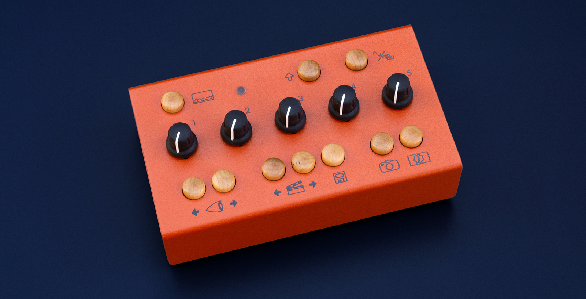
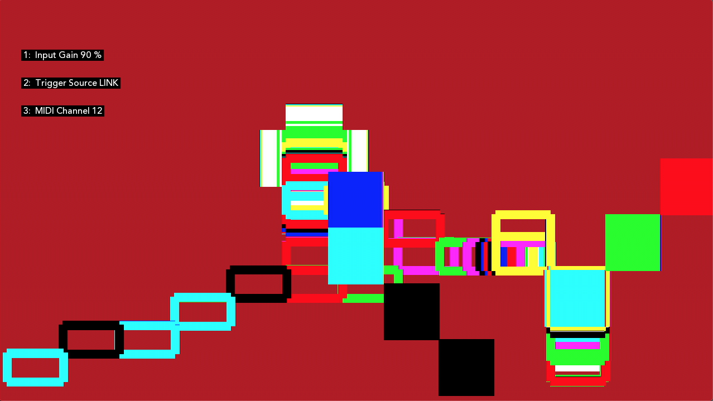
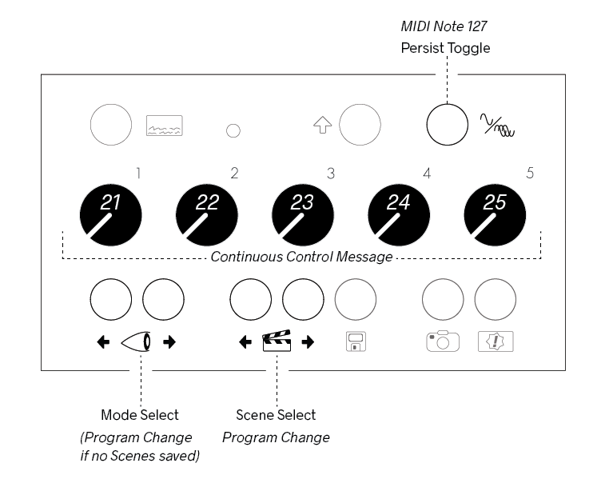
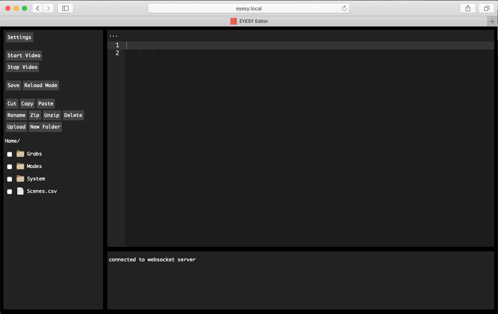

# EYESY User Manual OS v2 

Original edition by Dave Linnenbank. This edition updated for EYESY™ - June 2020

For EYESY OS version 2.3. 

©2021 Critter & Guitari. All Rights Reserved.

## Getting Started

Welcome to **EYESY**! Time is money so let’s get you up and running…

### Package Manifest

There are four items in the box you just opened:

- **Quickstart Guide & Warranty**. 
- **Your EYESY**. Ready to go!
- **A USB-WiFi Adapter**. It is inserted in the corrugated cardboard on the left side of the box.
- **A Power Adapter**. This power adapter has prongs for US-style wall sockets, but it will work with input voltages from 100 to 240VAC at 50/60Hz. You may need an adapter for the shape of your wall socket.

### Let there be visuals!

Follow these steps to make your sound visual.

1. Connect EYESY’s `HDMI®` or `Composite` port to a powered-up monitor, projector (beamer), video mixer, video capture device or other display.
2. Connect a 1/4” mono or stereo audio cable to the `Audio In` port. 
3. Connect the power adapter to a power outlet, and then connect its plug to the `9VDC` power port, the leftmost port on the back of EYESY. 
4. Set `Power Switch` to *On* position. The top row’s `Status LED` will shine light green and then flash blue during boot up. Your connected display will also show the boot up process.
3.  Press the top row’s `On Screen Display` button (its icon suggests a screen with writing on the bottom). Your display should now show an overlay of current system information. You can press the button once more to toggle off this display.
4.  To transmute audio to video, send audio from the device connected to the connect a 1/4" audio cable to the `Audio In`. If you need to adjust the amplitude of the signal, you can increase volume on your sound source and/or you can adjust gain with the `Shift` button. See Chapter 2 for more info. 
5.  When you have had enough fun for now, slide the `Power Switch` to the *Off* position. Allow `Status LED` to turn off before disconnecting power. 

### Warnings

1. Heed all warnings and cautions in this user guide and printed warranty.
2. Unit is not user serviceable. Contact manufacturer if damaged
3. *This device may generate imagery which can trigger photosensitive seizures. Immediately stop use and consult a doctor if you experience any form of discomfort, disorientation, or adverse physical reaction.*

## 1. EYESY Concepts

#### What is this box with the curious icons?!

Again, welcome to the world of **EYESY**! As this video instrument has an inherent range and can work for different people in different ways, let us start by talking about what it is and where on Earth (or beyond!) it came from. We’ll then look at some of the basic concepts in play and make sure we are speaking the same language. Then we’ll close with a word on using this guide, preparing you to go forth and visually multiply. So back to our origin story…

### 1.1 Where did the EYESY come from?

We at Critter & Guitari (hello!) have released video synthesizers before, and we are still rather fond of those devices. Their intended use was simple:

1.  Plug in an audio input, feeding live sound to the box.
2.  Plug in a live video output for a projector or other display.
3.  Set a couple knobs.
4.  Go back to playing music, and live visuals will accompany you.

While EYESY preserves this “self-service” approach, a number of other modes and options are present.

##### Is EYESY ready to go out of the box?

Yes! Once EYESY is connected and powered up (see Chapter Zero), it will
automatically begin creating visuals with the factory modes.

##### Does EYESY have different methods of creating video?

Yes! You can cycle forwards and backwards through EYESY’s current visual *modes* by pressing the two `Mode Selector` buttons on the bottom left of the front panel (around the eyeball icon). The preloaded factory modes provide a survey of unique visual effects. If you prefer one type of visuals over another, you can curate which modes are on your EYESY - more on that in Chapter 4.

##### Can I play EYESY as a video instrument?

Yes! The knobs and buttons on EYESY’s top panel provide direct access to the inner workings of EYESY and each available visual mode. To expand your control options, you can connect a MIDI controller to the `MIDI In` port or use a USB-MIDI device. 

##### Can I just plug in EYESY and go back to playing bass?

Yes! If audio is running into EYESY, a couple of knob tweaks should get you a steady stream of responsive visuals.

##### Can I control EYESY with MIDI?

Yes! EYESY can respond to MIDI notes and clock. If you use a digital audio workstation (DAW) or performance software, like **Ableton Live**...Gib mir fünf!...You can send MIDI to EYESY from your DAW, both to directly control EYESY’s parameters in an automated way and to create synchronized changes that match your music. In other words, you can now use EYESY to take the music you are playing and create a generated, beat-driven video accompaniment. Your audience will thank you (and we hope you are getting a cut of the bar).

##### Can I capture still images generating by EYESY?

Yes! The bottom row of EYESY has a dedicated *Screenshot button* (with a camera icon). Pressing this button will save the current imagery of EYESY as an image file. And if you are a hacker-type, you could even craft a mode that injects the most recently captured screenshot back into the current output. Think feedback, recursion, or something less imaginable.

##### Can I feed still images into EYESY as source material?

Yes! Modes can be made to use still images from within the mode’s file structure.

##### Hold up. Can I edit EYESY’s modes?

Yes! All of EYESY’s modes are written in **Python** using the graphics library of **Pygame**. This means that for the brave, every mode could be edited. And the truly bold can create their own modes.

##### So, there is no “right” way to use EYESY?

Exactly! EYESY is a vehicle for creating visuals. You may want that in a live performance environment, or you might wish to capture and edit the output. Perhaps you want someone to operate EYESY throughout your set, or maybe you yourself just lean over and switch *scene* presets ever song or two. You might want to get out a text editor and code a custom mode, but you can just as easily download new modes that others have written. Any of these choices are valid as long as they serve your purposes!

### 1.2 EYESY Concepts

Our introduction and the sticker on the back of EYESY have already hinted at certain ideas and the terms we are using to express them. Let’s take a moment to be clear about the concepts in play, specifically **Modes** and **Scenes**.

An EYESY **Mode** is a method for creating visuals. In audio terms, you could think of each *mode* as a *patch*. The mode can be switched instantaneously from the front panel. Each available mode lives in the microSD card along with any support files it may need.

In building the initial factory modes, we have considered modes as falling into two broad categories:

-   A *scope mode* directly visualizes the incoming audio signal. This could take the form of a classic “oscilloscope” signal representation or something far different. Either way, animation is continuously updated with the received audio.
-   A *trigger mode* also visualizes the incoming audio signal, but it doesn’t draw continually as an oscilloscope mode would. Instead, if the audio input’s volume crosses a certain threshold (for example, imagine a snare drum popping), it will trigger a visual. Other events, such as MIDI notes or clocking messages, may trigger visualizations as well. And you can always press the `Trigger` button to generate a trigger too.

To make things easy to read, a factory mode whose name start with `S - ` is a scope mode, and one beginning with `T - ` is a trigger mode. But as the descriptions above may suggest, there is plenty of wiggle room as modes can readily blend these ideas or go off in completely new directions. Thinking in the scope/trigger paradigm to start is a good way to both help you understand the factory modes and organize your own ideas for new modes or new even categories.

As for the controls of EYESY, we think of them as falling into a couple of categories.

-   **Visual Controls** change parameters of the local mode. Consisting of the five numbered knobs on the top panel, these controls affect settings defined within the currently loaded mode.
-   **Global Controls** function at a level above the Visual Controls so even when you change modes, these parameters are persistent. These include the *On Screen Display*, *Persist Toggle*, *Shift* Button, and the *Screenshot* button.

An EYESY **Scene** is essentially a preset. Each Scene stores which mode
was being used along with the values of all five knobs and whether
the *Persist Toggle* button is enabled or disabled. 

The next chapter will explore how to put all of these ideas into action, but understanding modes versus scenes will let us hit the ground running.

### 1.3 How to Use This Manual

Certain chapters (such as this one!) are relevant to everyone. But depending on how you plan to use EYESY, some information may prove more valuable to you.

-   Regardless of your intentions, the quick-start (Chapter Zero) and concepts information in Chapter One will benefit you.
-   For out-of-the-box usage, the information on operating the hardware found in Chapter Two will be a central guide, walking you through the functions of the various panel controls and ports. 
-   If you are looking to load additional modes into EYESY, then Chapter Four will also be useful to you.
-   If you want to edit modes or even create some of your own, Chapter Five will help you prepare your work for EYESY.

Just realize that how you use EYESY today may be very different from how you use it a week from now. This is to say feel free to skip information that isn’t of use to you today; you may find that later chapters appreciate in value over time.

## 2. General Operation of EYESY

#### Knowing the knobs and buttons is worth more than a thousand words.

Up to this point, we have talked about getting EYESY plugged in and running, we have discussed some ways to use the device, and we have covered the concepts that underpin the system. So now we should get on with it and make some pictures.

In this chapter, we will walk through EYESY from the user’s perspective, with hands fixed on the hardware controllers and eyes on the back panel’s ports. This will naturally address the role and relation of each control within EYESY’s structure. Taken as a whole, we will be painting our own picture of EYESY’s functions and general operation.

So let’s turn the knobs, push the buttons, and watch what happens!...

### 2.1 System Controls

The top row of EYESY has system-level controls. We will discuss these items from left to right.

**The `On Screen Display` button** (or `OSD`) is a toggle that calls up an overlay of current system information. The image below is an example of the `OSD`.

Information is displayed in two columns. On the left side are:

-   The current mode.
-   The most recently loaded scene (if applicable).
-   An indicator for incoming MIDI notes.
-   The current positions of the knobs.
-   An indicator of whether the threshold trigger is currently engaged.
-   A level meter for incoming audio signal.
-   An indicator of whether the `Persist Toggle` or background clearing function is
    currently enabled.
-   How much of EYESY’s memory (RAM) is currently being used.
-   The incoming MIDI channel that EYESY is listening to.
-   EYESY’s current IP address, in case the `USB-WiFi Adapter` is in use. (For more information, see Chapter Four.)
-   The name of the network the EYESY is currently connected to. 

The right column includes:

-   Thumbnails of several most recent screen grabs.

 
Pressing the `On Screen Display` button a second time will toggle the `OSD` off.

**The `Status LED`** is a light that illuminates in various colors to reflect either the state of the EYESY hardware, or to indicate that a particular action is being taken or a type of message was just received.

When the `Status LED` is glowing in one of these colors, it is indicating the following hardware state:

-   Dim: When the `LED` is not illuminated, then EYESY is not running. Either you haven’t powered it on yet, or you have already shut down the device.
-   Flashing Green / Light blue: EYESY is currently starting up. 
-   White: EYESY is currently running normally.
-   Yellow: A Screenshot has just been taken. (You likely just pressed the *Screenshot* button.)
-   Green: When the `LED` flashes green, a MIDI message (such as a note or continuous controller message) was just received by EYESY. When the light stays a solid green, a steady stream of MIDI messages (likely clock messages) is arriving at EYESY.

**The `Shift` Button** allows access to other system level settings. By pressing and holding `Shift` and turning a knob you can select more options. Releasing `Shift` will save the current selection. This is what the `Shift` menu looks like on screen:

The available settings are: 

- Knob1: *Audio Input Gain* - adjusts the gain for the incoming audio. This is useful to get the level 'just right' for when using oscilloscope modes. It is also helpful to make sure that your incoming audio sets the trigger in Trigger modes. does nothing to affect the internal video system or change the audio that you hear, but it is probably the most consequential control for EYESY. This knob scales the incoming audio level before it is processed by EYESY for use in the current visual mode. The purpose of this knob is to adjust the strength of the audio signal and scale it into an appropriate range for visualization.

The appropriate setting for this knob will depend on the type of signal you are connecting and the mode you are using. For example:

-   Are you connecting a guitar or microphone directly to EYESY’s `Audio In` port? Then you will probably need a higher gain setting for this relatively weak signal.
-   Are you connecting a powered instrument (such as a synthesizer) output, or even the full band’s output from a mixer? Then the *Audio Input Gain* setting can probably be a bit lower.
-   Are you doing something we can’t imagine? Good job! Adjust the gain setting until you find an appropriate setting for the modes you are using.

- Knob2: *Trig Select* - sets where a Mode is going to get the trigger from. The options are
	- Audio Input - 'listening' to the `Audio Input` port for audio that goes above the trigger threshold.
	- Ableton LINK Quarter Note - a trigger will be set with each quarter note of the LINK sessions current tempo. Your EYESY must be connected to a network (see Chapter 4) with an existing Link session. The `OSD` will say `LINK Connected: Yes` if you are part of a LINK session. 
	- Ableton LINK Eighth Note - same as above but for the LINK session's eighth notes. 
	- MIDI Clock Quarter Note - Triggers on quarter notes from MIDI clock coming in on the `TRS-MIDI` port or from a `USB-MIDI` adapter.	
	- MIDI Clock Eighth Note - same as above but for eighth notes.
	- MIDI Notes - Notes can be coming in from the `TRS-MIDI` port or from a `USB-MIDI` adapter. The EYESY must be set to receive on the same MIDI channel that the notes are being sent on. 
- Knob3: *MIDI Channel Select* - goes from 1-16. If the number is between `1` and `16`, then EYESY will listen only to that specified MIDI channel for incoming MIDI messages, and all other channels will be ignored
- Knob4: No Shift parameter assigned.
- Knob5: No Shift parameter assigned.

Incoming Continuous Controller (CC) MIDI Messages for the respective knobs do not affect the `Shift` parameters. (More on MIDI in Chapter Three.)

**The `Persist Toggle` button** is a nice toggle effect available in all situations. This is easier explained with a brief word on how EYESY carries out its drawing functions.

Each EYESY mode contains one `draw` function, which is triggered each frame of video. The default behavior for EYESY is to clear the screen right before the `draw` function is run. (This clearing results in the color set by the modes with a background control to cover the screen.) But breaking the rules can be interesting.

The `Persist Toggle` allows us to disable this clearing function. When `Persist` has been toggled *On* each new frame of video draws on top of the previous frame, which can creates a new kind of imagery. This is especially fun as you change modes. Hitting `Persist` again toggles it *Off* and restores the normal clear function.

There is a dependent relationship between the `Persist` and modes that have a knob (or other method) for controlling the background color. When clearing has been toggled *Off*, the changes to the the background color will not be visible. When the button is toggled back to normal clearing behavior, any changes to the background color will be visible again.

### 2.2 Mode Parameter Controls

The middle row of controls features five knobs. The role of the knobs is dependent on the current mode. Knobs can control mode parameters such as element size, position, quantity, color, rate of change, etc. A knob could be a single parameter that controls one discrete element of the mode, or it could be several parameters wrapped into a true “macro” function. While you may not know the specifics for each mode ahead of using a particular mode, it is good to keep in mind that a 'factory' mode will have five controls. 

We spoke in chapter one about the difference between modes and scenes, but an additional word is appropriate here on how the foreground knobs behave when moving between modes and scenes.

*When you load a different* **mode***, the current values of the knobs are maintained for the new mode that is loaded.* In other words, if you just turned knob `1` to 3 o’clock and knob `3` is set to 10 o’clock, EYESY will supply those exact same settings to any successive modes that you load.

If the knobs are assigned consistently across different modes you are using, this can offer more stable transitions between modes. For example, if you have loaded several modes that use knob `4` as a uniform color selection parameter, then that setting would be interpreted similarly as you switch from mode to mode, using that same color value across successive modes. And even if your modes assign their knobs in completely different ways, EYESY’s behavior will at least preserve your settings when you switch over to another mode and then back to your original selection.

*When you load a different* **scene***, the current values of the foreground knobs are ignored in favor of the settings stored in the scene.* In other words, loading a scene will load the scene’s stored knob values into EYESY, leaving no connection (for the moment) between the values currently used by the software engine and the physical position of the knobs.

As we discussed in the concepts portion of chapter one, each scene is a snapshot of EYESY’s mode state at the time of the scene's creation. This state includes the mode that is being used as well as the value of each of the knobs and the state of the *Persist Toggle* button. While turning the knobs and switching between modes offers an “organic” experience, loading a scene is a relatively abrupt act, jumping directly to settings that were stored at another time, in another place. This is by design.

Turning a knob is always an absolute gesture: as soon as a change in the knob’s value is detected, it will be applied to EYESY’s video engine. This holds true after a scene has been loaded. By turning a knob, the new value there will take over, replacing the scene’s stored value and restoring the connection between the physical control and the software. Again, this may be an abrupt gesture at first — particularly if the stored value and the current knob position are on opposite sides of the control range. But once the knob is turned, all successive tweaks will create smooth value transitions.

And as for how to switch between different modes and scenes (and store new scenes), well it’s funny that you ask…

### 2.3 Functional Controls

The bottom row of EYESY has a number of navigation and action-based options, all in the form of maple buttons. We will look at each one, going from left to right.

**The *Mode Selector* buttons** are first up. This pair of buttons on the far left around the eyeball icon allow you to step backward (left) or forward (right) through the modes that are currently stored in the `Modes` folder of your EYESY's microSD card.

**The *Scene Selector* buttons** are next. This pair of buttons around the clapperboard icon allow you to step backward (left) or forward (right) through all stored scenes.

**The *Scene Save* button** follows the *Scene Selector* buttons. This button with the floppy disk icon (remember those?) takes various performance values — your current mode selection, the values of all five knobs and the state of the *Persist Toggle* button — and stores them to a new scene. This new scene is placed at the end of the scene list.

Additionally, pressing and holding the *Scene Save* button for about two seconds will delete the most recently loaded scene. So if you called up a scene and wanted to re-save it with some adjustments, first hold the *Scene Save* button down for a couple seconds to delete the original scene. Once you have found settings you are happy with, then press and release the *Scene Save* button as usual to write the new scene into memory. (Just know that the new scene will be placed at the end of the current scene list.)

**The *Screenshot* button** is a button with a camera icon. When pressed, the output of the current video mode is captured to a still image file in your EYESY’s `Grabs` folder. Screenshots will not include the *On Screen Display*, even if this overlay is currently visible on your video display.

Output files are numbered from zero (`0`), are saved as JPEG files (for example, `0.jpg`, `1.jpg`, and so forth), and share the specs of EYESY’s video output: 1280 pixels wide, 720 pixels high, and a resolution of 72 pixels per inch (PPI).

To access these files, please use the EYESY Editor. More on this in Chapter 4.

**The *Trigger* button** is on the bottom right of the panel, and its icon is a rectangle containing an exclamation mark surrounded by a star. Pressing this button produces a trigger event. This trigger event is the equivalent of a trigger event from external sources (one of those selected using `Shift + Trigger Select knob`, see Chapter Two). It is most commonly used in *trigger modes* (as discussed in Chapter One).

Pressing the *Trigger* button will also fill EYESY’s buffer of recently received samples with a sine wave. Together with the trigger behavior described above, these two functions make the *Trigger* button a useful substitute when you do not have audio flowing into EYESY. With that being said, many modes can also make use of these trigger messages to supplement incoming audio signals so do try it with all kinds of modes.

This manual trigger will happen immediately. Pressing it will cause a trigger to occur at a different point in time other than what may be set with the `Shift + Trigger Select knob`.

### 2.4 The Rear Panel

Most of the ports are on the back of EYESY, and many of them have already come up in our conversation, but we’ll take a moment to touch on each of them with any information relevant to this conversation of general functionality. As we look from left to right: 

**The `Power Switch`** is an on / off switch. Please note that when you turn the switch to the `Off` position, the EYESY needs a few seconds to power itself down. Please remove the power cable only after the `LED` has gone dim. 

**The `9VDC` power port** is made for the power supply included with EYESY. The power supply’s output specifications are as follows: 9VDC, 1000mA, and a tip with center-positive polarity. If you are uncertain whether a power supply will work with EYESY, do *not* plug it in to find out.

**The `Composite Out` port** serves as the video output for EYESY. During power up the EYESY will check it is connected to a powered HDMI display. If it does not find a powered HDMI display it will automatically choose the `Composite Out` port to output video. This port can send an NTSC or PAL formatted signal. To select your format, see the last section of Chapter Four. 

**The `HDMI Out` port** serves as the video output for EYESY. During power up the EYESY will check it is connected to a powered HDMI display. If it is, it will automatically choose this port to output video. 

> Note: The `HDMI Out` port only sends video. It does not send any audio from the EYESY. 

> Note: Both `Composite Out` and `HDMI Out` ports cannot be used simultaneously.  

**MicroSD card slot** Next is an unlabeled microSD card slot. This slot houses a preloaded card that serves as the location of internal microcomputer’s operating system and mode storage. The contents of this card are not readable by your computer so we do not recommend ejecting or otherwise manipulating this card unless you are going to 'burn' a new disk image onto it. Please see Chapter 4 for information about accessing the card's storage via WiFi and Chapter 6 for information about burning the OS (as to perform a 'factory reset'). 

**The `MIDI In` port** is for connecting an external MIDI controller. This port is a TRS-MIDI *Type A* port. Type B cables will not work. Information on EYESY’s MIDI implementation is found in Chapter Three.

**The `Audio In` port** is a stereophonic 1/4" input for audio signal. 

#### The Left Side Panel

Finally, **the `USB` port** resides on the left side panel. This port is for connecting the USB-WiFi adapter or a class-compliant USB-MIDI adapter. 

If you need more USB ports, you could connect a hub to this port. That hub and any other devices you connect should be class-compliant, meaning that it doesn’t require a special software driver to be installed. This will help to ensure compatibility with EYESY. 

If you will be using the USB port to power other devices like a class-compliant MIDI controller, you should be aware that the EYESY can only supply a maximum of 500 milliamps (0.5A). If you need more amperage, please use a powered USB hub. 

##### An Epilogue on Basic Controls

Note that we aren’t discussing how to produce certain types of images or effects. While the controls offered by EYESY are generally similar, each mode is unique its own right and can be used in ways that even we can’t imagine. And if those provided options aren’t enough, then continue with us to the next chapter.

## 3. EYESY’s MIDI Configuration

Let's look at EYESY’s MIDI implementation. This will be useful if you want to connect external MIDI — including USB-MIDI — controllers to EYESY, or even if you pair EYESY with an external sequencer.

There are two ways to get MIDI from external MIDI controllers into the EYESY: through the dedicated `MIDI In` port and with the `USB` port. 

Before proceeding further, we should take a minute to discuss some important characteristics of both ports: 

> The `MIDI In` port is a TRS-MIDI *Type A* port. *Type A* refers to the order of connections of the 3.5mm (⅛") Tip-Ring-Sleeve (TRS) plug & jack. In order to connect to external devices with the larger, older, five-pin DIN connectors you will need a Type A Male 3.5mm (⅛") TRS to Female 5-pin DIN adapter. *Type A* connections are the adopted standard set by the MIDI Manufacturers Association. There is a *Type B* but these will not work with EYESY! There are no obvious physical differences between the *Type A* and *B* - both 3.5mm (⅛") plugs look exactly the same. Please be sure you have the correct adapter. 
> 
> Many instruments and controllers now have TRS-MIDI outputs too. These can be connected to the EYESY with a sole 3.5mm (⅛") Male-to-Male TRS cable. Again, you should be sure that the device you want to connect to the EYESY has a *Type A* connection. If not, there are *Type A-to-B* adapters available. 

> USB-MIDI devices can also be used with EYESY's USB port. To ensure compatibility, we suggest that you select a class-compliant USB-MIDI controller or adapter. Any USB-MIDI device that requires the installation of a driver may, at best, not work as expected. It is important to know that the EYESY is a Linux computer and that many manufacturers develop their USB-MIDI devices *only* for Windows and Mac OSes. Please check with the manufacturer of your USB-MIDI device that it is compatible with Linux/UNIX OSes. If it is not, it is best to use your device with the EYESY's TRS-MIDI port instead of the USB port.

Now that we have gone over the intricacies of TRS-MIDI and USB-MIDI, we can get back to the EYESY! To properly interact with EYESY, we need to know the MIDI implementation of this device. To begin with, EYESY only listens to incoming MIDI messages that are on the specified channel (by default, MIDI channel 1, you can change it with `Shift + MIDI Channel Select knob`). And only a small subset of MIDI messages has an actual effect on EYESY’s operating modes.

In other words, your controller may send some messages that EYESY doesn’t recognize, and that’s okay. These messages won’t produce any effect on EYESY, but they won’t create any problems either so don’t worry with “disabling active sensing,” etc.

Let’s start by examining the different type of messages that EYESY uses.

##### Control Change Messages

Incoming control change messages using controller numbers `21` through `25` are mapped to the corresponding knobs:

-   Controller Number `21` &gt; *Knob 1*
-   Controller Number `22` &gt; *Knob 2*
-   Controller Number `23` &gt; *Knob 3*
-   Controller Number `24` &gt; *Knob 4*
-   Controller Number `25` &gt; *Knob 5*

Each incoming message’s value replaces the current value of the respective knob. So even if `Knob 2` is turned all the way to the right, an incoming controller message of number `22` with a value `0` will change controller 2’s value to zero. Once you move `Knob 2` again, its control will be restored.

##### Note Messages

All incoming note messages (again, on the global MIDI channel) are received by EYESY. It provides information on these note messages in two ways:

-   EYESY tracks all incoming note messages, keeping tabs on which pitches are on or off at any given time.
-   A lot like a flag on a mailbox, EYESY provides a notification whenever a MIDI note on message(s) has been received since the previous video frame. This can be very handy for creating a “note trigger” effect in your modes.

Any mode can use either or both of these status data.

Additionally, the last MIDI note (pitch `127`) is used to toggle that state of the auto clear function, acting in the same manner as each press of the *Persist Toggle* button. So any 'Note On' message with pitch `127` toggles the current state (if it was on, it switches off, and vice versa).

To recap here is a diagram of the hardware that can be overridden by MIDI and their respective commands:

##### MIDI Clock Messages

EYESY also understands a couple of MIDI system real-time messages. Many sequencers support this clocking method, but it is simple enough that you could build it into other environments as well (such as Pure Data \[read: for **Organelle**\], Max, Reaktor, etc.).

MIDI’s concept for system real-time messages is that a *timing clock* message is received 24 times per quarter note for the purposes of synchronization. Accordingly, each time EYESY receives a timing clock message, an internal counter is increased by one step. After the 24th step, the counter returns to its low position and counts upward again. Additionally, any real-time *start* message that is received triggers also causes the counter to be reset on the next clock beat.

The 24 ticks-per-quater-note clock can be used as a trigger source.  Using `Shift + Trigger Select knob` you can select a trigger event to fire on the quarter note or eighth note (every 24 or 12 ticks).

Please note that MIDI clock messages are *system* MIDI messages. That means that these messages will be received and used regardless of EYESY’s current selected MIDI channel.

##### Program Change Messages

Incoming program change messages will select scenes. If there are no scenes stored, the program change messages select modes. 

##### Changing the Selected MIDI Channel

To change the channel on which the EYESY receives MIDI messages, please see the `Shift` menu section in Chapter Two. 

## 4. Accessing EYESY from Elsewhere 

#### WiFi, WiFi, WiFi.

First, we are glad you made it this far! And just in case you skipped straight to this chapter, be sure to go back and read chapter two! We are assuming that general operation of EYESY is fairly clear at this point. So with that out of the way, let’s proceed.

In this chapter, we are going outside of EYESY itself to focus on how it interacts with the wider world. While EYESY can be run successfully with its factory modes and its own on-board controls, you can definitely expand this performance device with new and/or modified modes. Here we will see ways to grow EYESY’s range in each of these dimensions.

In short, this chapter covers what you can do with the provided `USB-WiFi Adapter` including: 

- Create a WiFi 'Access Point' or Join an Existing WiFi Network.
- File Manage: Add & remove modes, upload images, download screen grabs, etc.
- Program Modes: Create new modes and customize existing ones. 

Most of the above will be done through the EYESY's `Editor` page and your computer. 

We will start with getting connected to EYESY with WiFi, then discussing the parts of the `Editor`, and then a bit about Ableton Link.

> **NOTE:**  The included `USB-WiFi Adapter` uses the Ralink 5370 chipset. This adapter will only connect to 2.4 GHz WiFi networks.  We have experimented with other WiFi adapters but we don't have a conclusive list of what works and what doesn't.  Please consult the [forum](https://forum.critterandguitari.com) to discuss other possible adapters.  When in doubt, stick with the included adapter which has been proven to work very well.

### 4.1 Access Point vs. Joining Existing Networks

The EYESY has two modes of WiFi operation: the *Access Point* (*AP*) and *normal* modes.  With *AP* mode the EYESY uses the `USB-WiFi Adapter` to create its own network (Access Point, or hot-spot). In *normal* mode the EYESY uses the `USB-WiFi Adapter` to connect to an existing WiFi network. File management and programming are done in the same manner regardless of WiFi mode. Said another way, the EYESY is agnostic about which method you choose. 

The one caveat is that the *first* time you want use WiFi, you will need to use the *Access Point* mode.  This allows you to connect your computer directly to the EYESY (a separate wireless router is not needed).  After your computer is connected via *AP* you can access the EYESY's `Editor` page to enter credentials of an existing WiFi network so that the EYESY can join it. (This eliminates a 'chicken and egg' problem of trying join an existing network for the purpose of entering the password for the very same network!)

##### Getting Connected

Let's walk through the steps needed to get to the `Editor` page via *Access Point* mode:

1. With the EYESY turned off connect the `USB-WiFi Adapter` to the EYESY's `USB Port`. 
2. Hold down the `Shift` key and turn the EYESY on. This initiates the *Access Point*. You must hold down `Shift` until your display says 'EYESY'.
3. In your computer's WiFi network settings, choose the `EYESY` network and enter `'coolmusic'` in the password field.
4. In your computer's browser's address bar, enter *eyesy.local* or the IP address. The IP address can be found on the `OSD`. If *AP* is in use, the IP address will always be `http://192.168.12.1`. Please note: If you have issues with connecting to *eyesy.local*, please try using a private / incognito browser window to connect. The private window helps avoid issues with browser cache.
5. You will now see the Editor. It looks like this:

There's a lot to cover in the `Editor`, but for now we'll focus on entering credentials for and using an existing network:

1. Click on `Settings` in the top left corner.
2. Enter the details of the network you would like to join and select save. (See screenshot below)
3. Slide the EYESY's `Power Switch` to *Off*. After `LED` goes out, slide `Power Switch` back to *On* (without holding `Shift`).
4. If you entered network credentials correctly, EYESY will have automatically joined the existing network after boot up. Viewing the `OSD` will show the name of the network the EYESY is connected to and the IP address. The IP address may change from one connection session to the next so it's good to check the `OSD` before proceeding to the next step. 
5. In your computer's browser's address bar, enter *eyesy.local* or the IP address shown on the `OSD`. Please note: If you have issues with connecting to *eyesy.local*, please try using a private / incognito browser window to connect. The private window helps avoid issues with browser cache.
5. You will now be back at the `Editor` page.

You can change an existing network's details at any time. You can also change the name and password of the *AP* that your EYESY generates. This may be useful if you are touring, etc. where you would like to keep things more secure. Any change to the WiFi settings will not take effect until the next time the EYESY boots up. The screenshot below shows the network and *AP* fields: 

Now that we know both ways to connect to EYESY via WiFi, we can get into the nitty gritty: 

### 4.2 Explanation of the Editor

The `Editor` is a way to look into and modify the EYESY in real time. You can move, add, delete, and copy files and folders just like you can with your computer's Finder/File Explorer. You can also view, edit, and reload the code for a given mode. To assist with with programming, the `Editor` has a `Console` so you can debug your modes. With these functions in mind, it should be no surprise that it is divided into three sections:

On the left side, there's a narrow `Control` pane with buttons for controlling video output and file browser and management. If you click through the file browser and end up in, say: `Home/Modes/Python/T - Bits H/main.py`, you would see the code for `main.py` in the `Code` pane (the largest pane). This code is editable! Below the code is the `Console` pane which shows the terminal output of the EYESY and is useful as a window into what is going on in your code - a `print` command in your code will print a variable's value, etc. here. Let's break these down:

##### The Control Pane

From top to bottom, the commands are:

- *Settings*: Takes you to the EYESY's network settings page as discussed above. 
- *Start Video*: This button relaunches the video 'engine.' During boot up, the video output has already been started, so if you press this again with the video currently running, it will stop the video output and restart it. On your display you will see the  boot up screen again and then display the first mode in your `Modes` folder. The `Console` will display the terminal output of the video engine starting up.
- *Stop Video*: This button stops the video 'engine' and your display will go to a black screen. The `Console` will say "Exiting". This button is helpful if you need to stop a mode from running because of a programming error. 
- *Save*: Saves the mode you are currently editing. 
- *Reload Mode*: Reloads the mode currently *displayed* on your display. While programming, you should make sure to use the wooden `Mode Selector` buttons to display the same mode you are editing, otherwise, you will me making changes on a mode you are are not looking at! 
- *Cut, Copy, Paste, Rename, Zip, Unzip, Delete, Upload, New Folder*: the usual file management commands to apply to the *File Browser*. 
	- There is a white box to the left of each item in the *File Browser*. You need to 'check' a box before choosing a command. (This does not apply to *Paste*, *New Folder* or *Upload*.)
	- To copy a folder to/from the EYESY, you will need to zip it first. Folders cannot be uploaded or downloaded without zipping first. 
- *File Browser*: At boot up, *Home/* will be displayed above three folders and a file called 'Scenes.csv'. The *Home* folder contains these folders and file. You can click into the folders (e.g. *Home/Modes/*) or click a file to be displayed in the `Code` pane. More about the file browser and file management below.

### 4.3 Folder & File Management in the MicroSD Card

As has been mentioned, EYESY needs a microSD card to run. The card that ships with EYESY has two partitions: one for the OS and one for storage. It's best to pretend that the OS partition does not exist - there's not much there to customize, and you can't access it from the `Editor`. The storage partition's *Home* folder is where everything we want to use is. The only way to access *Home* is via WiFi. Modes are stored and run directly from *Home*. (While not mission-critical, scenes and screenshots are also stored here to.) Some rules apply:

-  The *Home* folder must contain a folder called *Modes*. (This name is case-sensitive.) All modes to be loaded must live inside  *Modes* as detailed below.
-   *Home* may also contain a folder called *Grabs* for housing screenshots that are taken, and a file called `Scenes.csv` for recording all scenes that are stored.  If absent, these items may be automatically created when needed.

The following is an example directory listing of *Home*. You can see four modes here, each with a required `main.py` file, as well as the `Grabs` folder and a `Scenes.csv` file.

    Grabs/
        0.jpg
        1.jpg
        2.jpg
    Modes/Python
        S - Circle Scope Connected/
            main.py
        S - Feynman/
            main.py
            main.pyc
        T - Density Cloud/
            main.py
            main.pyc
        T - Spanish Flash Cards/
            font.ttf
            main.py
            main.pyc
            spanish.py
    System/
    	  ap.txt
    	  wpa_supplicant.conf
    Scenes.csv

A few items worth noting here about the modes:

-   In the four mode folders shown above, all of them have the required `main.py` file. As long as these Python script files contain the minimum requirements for an EYESY mode, they will all be treated as valid modes and loaded when the device starts up. (For information on programming or editing modes, see Chapter Four.)
-   These mode folders may also include `main.pyc` files. These intermediary files are automatically created by the Python compiler in EYESY. These files can speed up future interpretations of their script, but the PYC files are not required or needed. (The first mode listed here has no `main.pyc` file, suggesting that it is a new mode which has not yet been run by EYESY.)
-   Other files necessary for your mode should also be included in the mode folder. This could include images, additional Python scripts, font files, or anything else that might make sense.
-   Also note that mode folders can contain subfolders, which can be recognized by contained mode.

Inside of the `Modes` folder, the four modes are selected, and their contents are exposed. So in the example shown above, the four modes available on EYESY would be `S - Circle Scope Connected`, `S - Feynman`, `T - Density Cloud`, and `T - Spanish Flash Cards`. And once more, the practice with factory modes is that a leading `S - ` indicates a scope mode while a leading `T - ` signifies a trigger mode (see chapter one).

Also at the top level is the `Scenes.csv` file. This file of comma-separated values is readable if you open it in the `Code` pane or in a text editor on your computer. Each line looks something like this:

    bouncing-ball,0.0,0.2668621700879765,0.5141739980449658,0.7526881720430108,1.0,False

These values represent:

    Mode, Knob 1, Knob 2, Knob 3, Knob 4, Knob 5, Persist Toggle button

If you are brave and interested, you could try editing these scenes values or simply reordering the lines. But you might want to make a local copy of the file first, just in case. (If things get out of hand, you can always just delete the `Scenes.csv`. When a new file is needed, EYESY will create it.)

When working with modes, you will most likely want to work with their folders rather than handling the files within each folder. For example:

-   If you want to **add a new mode to EYESY** from an external source, make sure to zip the full folder before uploading. Once uploaded, select the check box and use the *Unzip* command.
-   If you want to **back up a mode** to your computer, zip copy the folder over to your computer.
-   If you want to **rename a mode,** rename the folder (and leave *main.py* alone).
-   If you want to **duplicate a mode and make changes to the new copy,** copy and paste the mode folder and name the copy something different.
-   If you want to **delete a mode,** make sure to delete the entire mode folder.

Finally, note that any other folders or files located in *Home* will be ignored by EYESY in its normal operation. This means you could keep a backup folder of working modes in *Home* while editing the “live” versions. Or this could be handy for having different “set lists” of modes or even different scene files. The set list idea would be to duplicate either your `Modes` folder or `Scenes.csv` file, and then rename the version that you would like to save for future use. Just make sure that the proper files and folders have the proper names before you hit the stage!

##### The Code Pane

The `Code` pane is indeed a code editor, complete with line numbers and syntax highlighting/coloring. You can edit/program as you would with any basic text editor. In practice, editing/programming will use the `Code` pane in tandem with commands located in the `Control` pane and any syntax or runtime errors displayed in the `Console`.

To display a mode's code, use the *File Browser* to select a file to edit (such as a mode's *main.py* file). After making changes, we will need the *Save*, *Reload* commands (and perhaps the *Start Video*, and *Stop Video* commands) in the `Control` pane. So after altering the mode script in the code editor, click *Save* to commit those changes. Then click *Reload* to refresh  the visual output on your display. If there are any syntax or runtime errors, they will show up in the `Console` or on your display if you have turned on the `OSD`.

Please see the next chapter for more information about programming!

##### WiFi is great and all, but what about good ol' USB Drives?

Great question! Our experience with the EYESY's predecessor (the ETC) and sibling (the [Organelle](http://www.critterandguitari.com/organelle)) has taught us that having *only* one way of managing files and programming is better than having many ways. To that end, the EYESY will *not* read from or write to a USB drive if you connect one. All file management and programming happens through the `USB-WiFi Adapter`. 

##### Composite Video Formats

There is one choice in the `Settings` page that is not related to WiFi, file management or programming. It is the setting for the composite video format:

Any saved changes to this setting will take effect after reboot. (Please remember that during boot up, EYESY will first check if it is connected to a powered HDMI display. If does not find one, it will automatically use the composite port to output video. So you must not have an HDMI cable connected to EYESY to use the composite output. Don't forget to set the correct input on your display too!)

## 5. Programming for EYESY

#### For those with a text editor and a dream.

Well, here we are. The place where dreams and/or EYESY modes are made.
Now that you know about file management, let's start programming!

First of all, this chapter may not be for you. If we may say so ourselves, EYESY is rather functional and expressive without getting into coding. So if you are comfortable with using EYESY and would rather stick with the audio/visual side of your brain, that is great. Focus on what is going to benefit you the most, and go in peace. If you ever want to come back, we will be here. Waiting.

This chapter assumes you are comfortable with using the `USB-WiFi Adapter` to get to the `Editor` on your computer. If not, please see the previous chapter (Chapter Four).

And while this chapter focuses on how EYESY works and the methods available to you within this framework, we are not going to teach you how to code. But don’t despair. Now more than ever, there is a bounty of resources available that will help you learn about programming in general and about particular languages (such as **Python**). Searching the internet, the library, or even local computer classes on offer will give you some good leads and help you find a way forward to start programming.

Now, if you enjoy coding already (or are considering it), or if you have some video ideas that you need to express, then let’s proceed. Just pull that lever to pop the hood.

In this chapter, we will start with the concepts and requirements for any EYESY mode. Each mode doesn’t require much, but talking about what does need to be there will give us a good picture of how EYESY operates. We will then outline EYESY’s application program interface (API). Beyond the required pieces, these are the available functions and properties that you can make use of in any mode. 

So this is the road before us. We have already seen how EYESY handles; now let’s change the oil and go for a spin...

### 5.1 How Mode Scripts Work

A word or two on how EYESY actually does its work will go a long way. We will spend a moment on the languages at play and the system behavior of EYESY, and then we will talk about the basic requirements of a mode.

##### Python, Pygame, and EYESY

As was said early on, EYESY’s modes are written in **Python** using the graphics library of **Pygame**. So **Python** is the programming language in use, and the graphics library executing the drawing comes from **Pygame**.

**Python** has a rich standard library with numerous modules, any of which can be used in your modes. A full list of modules can be found in [Python’s documentation](https://docs.python.org/2/library/). Going through the factory modes, you will see such modules as `glob`, `imp`, `math`, `random`, and `time` in use. To learn more about how any of the library modules work or more about **Python** itself, the documentation link above is a wonderful place to start.

**Pygame** is a set of **Python** modules that were originally written for video game development. EYESY is using the graphics library of **Pygame** to create our visuals. A full list of available modules can be found in [Pygame’s documentation](http://www.Pygame.org/docs/) under the *Reference* section a little ways down the page. Some of the factory modes make use of additional libraries such as `pygame.freetype` and `pygame.gfxdraw`, but other graphics-related modules could be used as well.

**Pygame** renders its graphical output to a *surface*. This is how we connect our **Python** scripts to our **Pygame** output, which we will see in the next section.

When EYESY starts up, it identifies all valid modes within the microSD card's `Modes` folder. And it then loads all of these modes simultaneously. This parallel behavior is what makes switching between modes so instantaneous and smooth, but it also adds a couple of things worth considering:

-   **A memory-intensive mode will always be running.** If you load a  mode that requires a significant amount of RAM (say, for loading numerous images during `setup()`), realize that this memory will be taken up even when another mode is called up and generating output. So if you encounter laggy performance of EYESY in general, realize that this could very well be one of your modes hogging memory. One way to troubleshoot this would be to load fewer modes (by moving additional modes out of the `Modes` folder) during testing.
-   **Keep your support files to a minimum.** Again, a good example would be a mode that loads images. We’d advise you to keep the images within a mode folder to 10MB or less. Your mileage will definitely vary, but that is our one-size-fits-all suggestion. Also note that the size of loaded image files could often be optimized. If you download a photo straight from your camera or phone, you’d do well to reduce the resolution to something closer to or below EYESY’s HDMI default output resolution (1280 by 720). As with all rules, there can be exceptions, but there you go.

##### Minimum Mode Requirements

Each mode has only four basic requirements for successfully being loaded
and to (hopefully) produce graphical output:

1.  **Load the “pygame” module.** As with any module in **Python**, this is done with a leading `import` statement. So any EYESY mode script should begin with…

        import pygame
                

2.  **Have a “setup” function (please).** This is actually optional but highly suggested. `setup()` will get called automatically when the mode is loaded. This is a clean way to run any operations that are only needed once, before video is being rendered.
3.  **Have a “draw” function.** `draw()` is the function that is run once per frame of video to paint each frame of video output. Common activities here including taking in any control changes since the last frame, redrawing with updated audio information, executing changes based on any trigger or other messages received, etc.
    Note that code in this block will get hammered so please be a bit parsimonious, only including actions that need to be taken for each and every frame.
4.  **Route your output to the “screen” surface.** EYESY creates a reserved **Pygame** surface called `screen`. This surface is what gets sent out for display via the HDMI port.

##### A Simple Mode Example

Taking all of these points into consideration, here is a very simple example EYESY mode…

    import pygame

    def setup(screen, etc):
        pass

    def draw(screen, etc):
        size = 640
        position = (510, 500)
        color = (255, 0, 0)
        pygame.draw.circle(screen, color, position, size, 0)

Walking through this basic `main.py` example, we start by loading the `pygame` module, as outlined above in step one. We then define a `setup()` function. This one is blank, but it is good to have as a placeholder for use when necessary.

Next comes the `draw()` function. The first three lines of the function are defining local variables that are used in calling the `pygame.draw.circle()` function. And as the first argument in the example indicates, this function is pointing at the `screen` surface, getting our draw messages out of EYESY through one of the video output ports.

That is about the simplest mode we could make, and its result is equally simple — a red circle is drawn near the middle of the screen, each and every frame, forever. This example offers the basic framework for examining the factory modes and for understanding how to structure your own modes. Our only suggestion is an obvious one: you should probably send different images out of EYESY from time to time.

### 5.2 EYESY’s API

Having walked through the general framework and requirements of EYESY’s modes, it’s time to take a look at the API (application programming interface) available when working with EYESY. The `etc` object contains a number of variables, all of which can be accessed from any mode:

-   `etc.audio_in` - A *list* of the 100 most recent audio levels registered by EYESY's audio input channel. The left and right input channels are merged into one mono channel. The 100 audio values are stored as 16-bit, signed integers, ranging from a minimum of -32,768 to a maximum of +32,767. Additionally, depressing the *Trigger* button populates this list with a sine wave, simulating audio input to EYESY.
-   `etc.audio_trig` - A *boolean* value indicating a trigger event.  The trigger source is selected with `Shift + Trigger Select Knob`.  When audio is selected as source a trigger is event fires when audio has exceeded the fixed threshold level (approximately 80% of maximum) since the last frame was drawn via the `draw()`function. Additionally, depressing the *Trigger* button sets `etc.audio_trig` to `true`.    
-	 `etc.xres` - A *float* of the horizontal component of the current output resolution. 
-	 `etc.yres` - A *float* of the vertical component of the current output resolution. 
-   `etc.knob1` - A *float* representing the current value of *Knob 1*. Additionally, an incoming MIDI control change message of number `21` on the current selected MIDI channel will replace the value of *Knob 1*, until the knob is moved again.
-   `etc.knob2` - A *float* representing the current value of *Knob 3*. Additionally, an incoming MIDI control change message of number `22` on the current selected MIDI channel will replace the value of *Knob 2*, until the knob is moved again.
-   `etc.knob3` - A *float* representing the current value of *Knob 3*. Additionally, an incoming MIDI control change message of number `23` on the current selected MIDI channel will replace the value of *Knob 3*, until the knob is moved again.
-   `etc.knob4` - A *float* representing the current value of *Knob 4*. Additionally, an incoming MIDI control change message of number `24` on the current selected MIDI channel will replace the value of *Knob 4*, until the knob is moved again.
-   `etc.knob5` - A *float* representing the current value of *Knob 5*. Additionally, an incoming MIDI control change message of number `25` on the current selected MIDI channel will replace the value of *Knob 5*, until the knob is moved again.
-   `etc.lastgrab` - A **Pygame** *surface* that contains an image of the last taken screenshot taken (via the *Screenshot* button). This surface has dimensions of 1280 by 720, matching the full size of the screenshot.
-   `etc.lastgrab_thumb` - A **Pygame** *surface* that contains a thumbnail image of the last taken screenshot taken (via the *Screenshot* button). This surface has dimensions of 128 by 72.
-   `etc.midi_notes` - A *list* representing the 128 various MIDI note pitches. Each value in this list indicates whether that note is current on or not. For example, you could create a threshold function that executes when “middle C” (MIDI note 60) is being held down with something like…

<!-- -->

    if etc.midi_notes[60] : yourFunctionHere()

-   `etc.midi_note_new` - A *boolean* value indicating whether or not at least one new MIDI note on message was received since the last frame was drawn (via the `draw()`function).

-   `etc.mode` - A *string* of the current mode’s name.
-   `etc.mode_root` - A *string* of the file path to the current mode’s folder. This will return something like `/sdcard/Modes/Python/CurrentModeFolder`. This can be useful when images, fonts, or other resources need to be loaded from the mode’s folder. (The `setup()` function would be an appropriate place to do this.)

Along with all of these variables, the `EYESY` object does have two functions worth mentioning as well:

-   `etc.bg_color()` - This sets the background color. It is usually specified as *"etc.color_picker_bg(etc.knob5)"* but any knob can be used to control the background color.  This function takes the knob value (from 0-1) and translates it to RGB values and uses that for the background color.

-   `etc.color_picker()` - This function translates the value of the specified knob into a color.  It is usually specified as *"etc.color_picker(etc.knob4)"* but any knob can be used to for the color picker. When called, this function returns a *tuple* of three integers representing the red, green, and blue components of this color. In the factory modes, you will often see a local variable (usually `color`) being set by this function, like so… 
	
	`color = etc.color_picker(etc.knob4)`

The idea here is that you can easily set an element color based on a given knob. 

As you program modes you might consider using the same knob for the color picker and background color selector across them. This is so that when you switch between modes using the same mapping, the foreground and background colors will be consistent, making transitions more fluid.

This represents the API components that are available to you, the aspiring EYESY mode editor/writer. Remember that for any variable whose value is based on a hardware controller, changing scenes may override the value in use for a time (for more information on scenes, see chapter two). And since the `draw()` function is called for each and every video frame produced, querying any of the variables within the `draw()` function is an effective way to dynamically update your mode’s output.

Finally, we are not telling you how to make modes. We aren’t telling you what makes a good idea. Even our mode categories admit to being limited (scope versus trigger). This is where you and your ideas come in.

We leave it to you to have a working knowledge of **Python**, to come up with some ideas for tweaks or completely new modes, and to try and make it work. Even if you don’t nail it the first time, chances are you will come across some happy accidents as you go. As always, it’s along the way that art gets made.

## 6. Appendix

### 6.1 Burning SD Card Disk Image 

In addition to storing modes, the microSD card also stores the EYESY's operating system.  

Burning a fresh disk image on the microSD card will reset your EYESY to the 'factory' state. It includes one partition for the OS and another for mode storage, etc. This is useful to update to the latest EYESY OS, or to fix a problem with the microSD card.  

This will completely wipe the microSD card clean, so make sure to backup anything on there that you need.  See Chapter Four for information on downloading your modes and screenshots and other files. You can also use a brand new card if you wanted to keep your old OS available. If you are looking to use a new card with the same specifications of the card that shipped with your EYESY, those specificaitons are: SanDisk Edge 8GB microSDHC C4 UHS-I.

Follow these steps to burn a new SD card:

1. Download the microSD card disk image to your computer: 

    - Current OS release: [EYESY-2.3](https://cgdiskimages.nyc3.digitaloceanspaces.com/EYESY-v2.3.img.zip). Requires 8GB or larger microSD card.
     
2. **Optional**: If you want to unzip the disk image please use one of the following programs: 

    - Windows: [7-Zip](http://www.7-zip.org)

    - Mac: [The Unarchiver](http://unarchiver.c3.cx/unarchiver)

    - Linux: [Unzip](https://linux.die.net/man/1/unzip) 

3. Download the flasher program to your computer: https://www.balena.io/etcher/  
4. Power down the EYESY.
5. Locate the thin slit in the rear of the enclosure (between the `MIDI In` and `HDMI` ports.)
6. Use a pin or paperclip to press in on the black microSD card to eject it and it will spring out gently.
7. Insert microSD into your computer (you may need an adapter or card reader)
8. Use the Etcher program to burn the unzipped OS to the mircoSD card. When Etcher is finished your computer may display a message similar to 'This disk is not readable.' This message is normal and you may click 'Eject' to proceed.
9. Remove the microSD card from your computer and reinsert it in EYESY. Make sure that the SD card is going into the socket on the circuit board, as it is easy to drop it into the device. If you can wiggle it a lot, it probably is not in socket. Use the same pin/paperclip to press it in until you hear/feel a 'click.'
10. Restart the EYESY.

### 6.2 Getting EYESY Video into Your Computer

Now that you're making great visuals, you may want to use a computer to record your work as a video, stream your visuals, or route your visuals into VJ software. In order to do any of these things you will need to capture EYESY's video output. Unfortunately, most computers do not have a video input. This process is therefore done with a video 'capture card.' 

Before choosing a capture card please be aware of the following options:

- Video Input: some capture cards only receive HDMI video. Other cards can receive HDMI and composite video - which would let you capture both of EYESY's output formats (but only one format at a time). 
- Software Compatibility: Your video feed may or may not available to other programs. Devices such as Elgato capture cards can only use Elgato software to record a video file. Alternatively, devices such as Blackmagic capture cards can be used with third-party software. This means that your EYESY video can be recorded by Adobe Premiere, Quicktime, etc., streamed with a program like OBS, or combined with other visuals in VJ software.

One last thing to consider: Most capture cards have both audio and video inputs. EYESY has no audio output. This requires an additional audio line be sent to your capture card to be recorded.

Here's a typical video capture workflow:

1. Connect a capture card to your computer. 
2. Connect EYESY's `Video Out` to the input of the capture card, but do not power on yet.
3. __Optional:__ Connect your setup's audio output to your capture card.
2. Open the compatible video software.
3. Configure the software to receive video and/or audio from your capture card. This is usually done in a 'Capture Settings' window.
4. Power up EYESY.
5. Confirm EYESY's video output is received in the video software.
6. Record video and/or audio, stream, or mix with other video in VJ software.

### 6.3 Setting up WiFi with SSH

The EYESY is running an SSH server so you can login and setup WiFi without having to use the web interface. First start EYESY in AP mode by holding down the shift key during boot up. Now on your computer join the EYESY network with the password "coolmusic" (see section 4.1 for more info). Once your computer is connected to the EYESY network you can use a terminal to login to the EYESY via SSH. These commands are for a unix based terminal, i.e. Mac or Linux OS. Run the follwing command:

    ssh music@eyesy.local
    
And then enter the password "music"

You should now be connected. To set up the WiFi network, use the wpa_passphrase command:

    wpa_passphrase "Network Name" "Password" >> /sdcard/System/wpa_supplicant.conf    

Replacing Network Name and Password with your network credentials. 

You can type "exit" to logout. Next time you turn the EYESY on it will attempt to join this network (unless you are holding down the shift key in which case it will start in AP mode).

