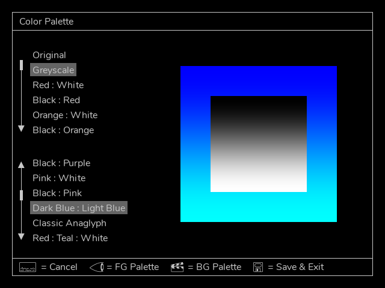
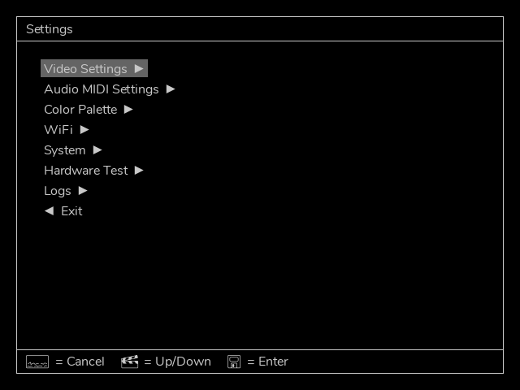
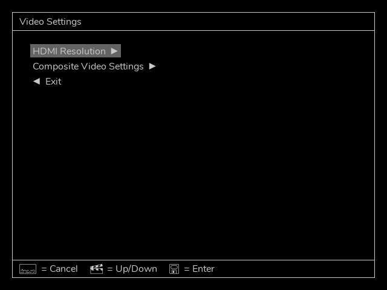
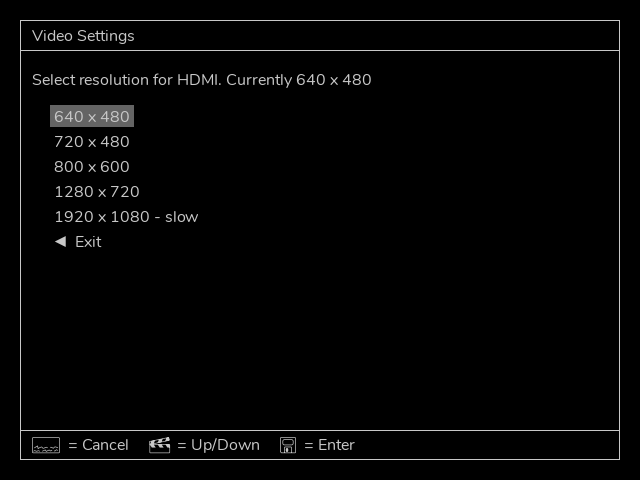
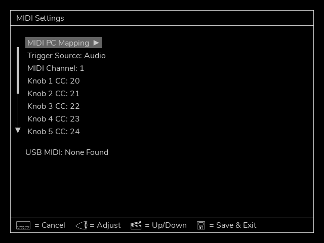
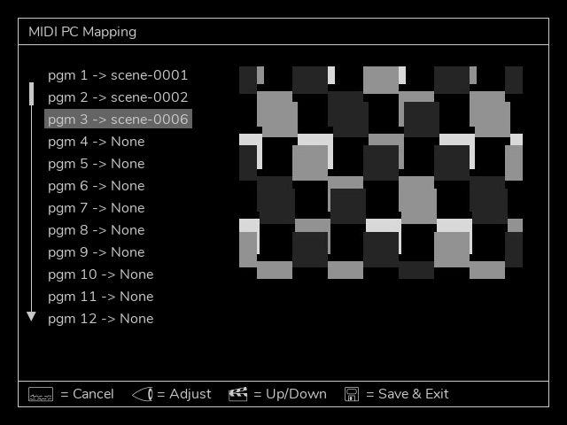
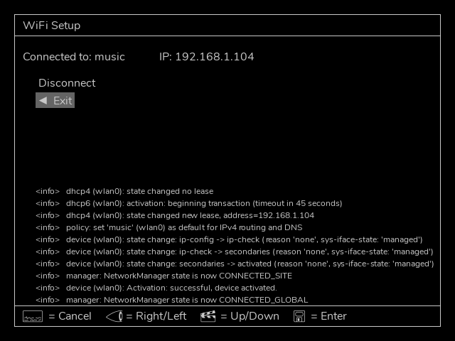
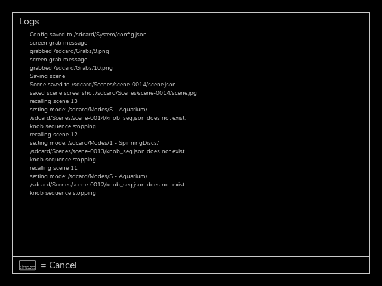

# EYESY User Manual OS v3 

Original edition by Dave Linnenbank. This edition updated for EYESY OS v3.0 - March 2025

For EYESY OS version 3.0 

©2025 Critter & Guitari. All Rights Reserved.

## Getting Started

Welcome to **EYESY**! Time is money so let’s get you up and running.

------------------------------------------------------------------------ 

## WAIT AM I IN THE RIGHT PLACE? 

The **EYESY** has had some major software updates in 2025. This manual is for the latest EYESY OS version 3 and higher. You can check the software version by pressing the top left On Screen Display button. If your EYESY is running version 2.3 you can upgrade to version 3 by flashing the micro SD card. See section 6.1 for instructions.

### Package Manifest

There are three items in the box you just opened:

- **Your EYESY**. Ready to go!
- **A USB-WiFi Adapter**. For connecting your EYESY to WiFi, not necessary for operation.
- **A Power Adapter**. This power adapter has prongs for US-style wall sockets, but it will work with input voltages from 100 to 240VAC at 50/60Hz. You may need an adapter for the shape of your wall socket.

### Warnings

1. Heed all warnings and cautions in this user guide and printed warranty.
2. Unit is not user serviceable. Contact manufacturer if damaged
3. *This device may generate imagery which can trigger photosensitive seizures. Immediately stop use and consult a doctor if you experience any form of discomfort, disorientation, or adverse physical reaction.*

### Let there be visuals!

Follow these steps to make your sound visual.

1. Connect EYESY’s `HDMI®` or `Composite` port to a powered-up monitor, projector (beamer), video mixer, video capture device or other display.
2. Connect a 1/4” mono or stereo audio cable to the `Audio In` port. 
3. Connect the power adapter to a power outlet, and then connect its plug to the `9VDC` power port, the leftmost port on the back of EYESY. 
4. Set `Power Switch` to *On* position. The top row’s `Status LED` will shine light green and then flash blue during boot up. Your connected display will also show the boot up process.
3.  Press the top row’s `On Screen Display` button (its icon suggests a screen with writing on the bottom). Your display should now show an overlay of current system information. You can press the button once more to toggle off this display.
4.  To transmute audio to video, send audio from the device connected to the connect a 1/4" audio cable to the `Audio In`. Change the pattern generating mode using the two bottom left buttons.
5.  When you have had enough fun for now, slide the `Power Switch` to the *Off* position. Allow `Status LED` to turn off before disconnecting power. 

## 1. EYESY Concepts

#### What is this box with the curious icons?!

Again, welcome to the world of **EYESY**! As this video instrument has an inherent range and can work for different people in different ways, let us start by talking about what it is and where on Earth (or beyond!) it came from. We’ll then look at some of the basic concepts in play and make sure we are speaking the same language. Then we’ll close with a word on using this guide, preparing you to go forth and visually multiply. So back to our origin story…

### 1.1 Where did the EYESY come from?

We at Critter & Guitari (hello!) have released video synthesizers before, and we are still rather fond of those devices. Their intended use was simple:

1.  Plug in an audio input, feeding live sound to the box.
2.  Plug in a live video output for a projector or other display.
3.  Set a couple knobs.
4.  Go back to playing music, and live visuals will accompany you.

While EYESY preserves this “self-service” approach, a number of other modes and options are present.

##### Is EYESY ready to go out of the box?

Yes! Once EYESY is connected and powered up (see Chapter Zero), it will
automatically begin creating visuals with the factory modes.

##### Does EYESY have different methods of creating video?

Yes! You can cycle forwards and backwards through EYESY’s pattern generating  *modes* by pressing the two `Mode Selector` buttons on the bottom left of the front panel (around the eyeball icon). The preloaded factory modes provide a survey of unique visual effects. If you prefer one type of visuals over another, you can curate which modes are on your EYESY - more on that in Chapter 4.

##### Can I play EYESY as a video instrument?

Yes! The knobs and buttons on EYESY’s top panel provide direct access to the inner workings of EYESY and each available visual mode. To expand your control options, you can connect a MIDI controller to the `MIDI In` port or use a USB-MIDI device. 

##### Can I make short sequences of knob movements to create small animations?

Yes! Using the built in knob sequencer you can automate knob movements for easier hands free operation.

##### Can I just plug in EYESY and go back to playing bass?

Yes! If audio is running into EYESY, a couple of knob tweaks should get you a steady stream of responsive visuals.

##### Can I control EYESY with MIDI?

Yes! EYESY can respond to MIDI notes and clock. If you use a digital audio workstation (DAW) or performance software, like **Ableton Live**...Gib mir fünf!...You can send MIDI to EYESY from your DAW, both to directly control EYESY’s parameters in an automated way and to create synchronized changes that match your music. Using the on screen menu you can map saved scenes to program change messages.

##### Can I capture still images generating by EYESY?

Yes! The bottom row of EYESY has a dedicated *Screenshot button* (with a camera icon). Pressing this button will save the current imagery of EYESY as an image file. And if you are a hacker-type, you could even craft a mode that injects the most recently captured screenshot back into the current output. Think feedback, recursion, or something less imaginable.

##### Can I feed still images into EYESY as source material?

Yes! Modes can be made to use still images from within the mode’s file structure.

##### Hold up. Can I edit EYESY’s modes?

Yes! All of EYESY’s modes are written in **Python** using the graphics library of **Pygame**. This means that for the brave, every mode could be edited. And the truly bold can create their own modes.

##### So, there is no “right” way to use EYESY?

Exactly! EYESY is a vehicle for creating visuals. You may want that in a live performance environment, or you might wish to capture and edit the output. Perhaps you want someone to operate EYESY throughout your set, or maybe you yourself just lean over and switch *scene* presets ever song or two. You might want to get out a text editor and code a custom mode, but you can just as easily download new modes that others have written. Any of these choices are valid as long as they serve your purposes!

### 1.2 EYESY Concepts

Our introduction and the sticker on the back of EYESY have already hinted at certain ideas and the terms we are using to express them. Let’s take a moment to be clear about the concepts in play, specifically **Modes** and **Scenes**.

An EYESY **Mode** is a method for creating visuals. In audio terms, you could think of each *mode* as a *patch*. The mode can be switched instantaneously from the front panel. Each available mode lives in the microSD card along with any support files it may need.

In building the initial factory modes, we have considered modes as falling into two broad categories:

-   A *scope mode* directly visualizes the incoming audio signal. This could take the form of a classic “oscilloscope” signal representation or something far different. Either way, animation is continuously updated with the received audio.
-   A *trigger mode* also visualizes the incoming audio signal, but it doesn’t draw continually as an oscilloscope mode would. Instead a trigger event will generate a visual. By default a trigger is generated when the audio crosses a threshold, around -5dB. You can also select a MIDI note or clock to generate a trigger, see Chapter 3.

To make things easy to read, a factory mode whose name start with `S - ` is a scope mode, and one beginning with `T - ` is a trigger mode. But as the descriptions above may suggest, there is plenty of wiggle room as modes can readily blend these ideas or go off in completely new directions. Thinking in the scope/trigger paradigm to start is a good way to both help you understand the factory modes and organize your own ideas for new modes or new even categories.

An EYESY **Scene** is essentially a preset. Each Scene stores which mode
was being used along with the values of all five knobs and whether
the *Persist Toggle* button is enabled or disabled. 

As for the controls of EYESY, we think of them as falling into a couple of categories.

-   **Visual Controls** change parameters of the local mode. Consisting of the five numbered knobs on the top panel, these controls affect settings defined within the currently loaded mode.
-   **Global Controls** function at a level above the Visual Controls so even when you change modes, these parameters are persistent. These include the *On Screen Display*, *Persist Toggle*, *Shift* Button, and the *Screenshot* button.

The next chapter will explore how to put all of these ideas into action, but understanding modes versus scenes will let us hit the ground running.

### 1.3 Color Palettes

In the same way that EYESY organizes modes into *Scopes* and *Triggers*, it also follows a convention for handling colors. While each mode is unique—like a patch on a synthesizer—the goal is to maintain a consistent experience across all of them. Typically, **Knob 4** controls the foreground color, and **Knob 5** controls the background color.  

Starting with **OS v3**, you can now select a **color palette** from which these colors are chosen, and all modes will share the same palette. Want black and white? Shades of blue? A full rainbow spectrum? Choose from a variety of palettes to set the overall look of your visuals.  

  
*Example of the palette selection screen*

Selecting color palettes is covered in the following chapter.

### 1.4 Video Output Options

EYESY provides two video output options: **HDMI** and **Composite**, but only one can be active at a time. During startup, EYESY checks if an **HDMI** display is connected—if so, it outputs video through HDMI. If no HDMI display is detected, it defaults to **Composite output**.  

- **HDMI** resolutions are selectable. See Chapter 3 for details on choosing a resolution.  
- **Composite** video format (NTSC or PAL) can be selected in the settings menu.  

This automatic switching ensures compatibility with a variety of display setups, whether you're using modern digital screens or classic analog video gear.  

### 1.5 How to Use This Manual

Certain chapters (such as this one!) are relevant to everyone. But depending on how you plan to use EYESY, some information may prove more valuable to you.

-   Regardless of your intentions, the quick-start (Chapter Zero) and concepts information in Chapter 1 will benefit you.
-   For out-of-the-box usage, the information on operating the hardware found in Chapter 2 will be a central guide, walking you through the functions of the various panel controls and ports. 
-   Chapter 3 covers additional settings and features.
-   If you want to add or remove modes or even create some of your own, Chapter 4 and Five will help you prepare your work for EYESY.

## 2. General Operation of EYESY

Up to this point, we have talked about getting EYESY plugged in and running, we have discussed some ways to use the device, and we have covered the concepts that underpin the system. So now we should get on with it and make some pictures.

In this chapter, we will walk through EYESY from the user’s perspective, with hands fixed on the hardware controllers and eyes on the back panel’s ports. This will naturally address the role and relation of each control within EYESY’s structure. Taken as a whole, we will be painting our own picture of EYESY’s functions and general operation.

So let’s turn the knobs, push the buttons, and watch what happens!...

### 2.1 System Controls

The top row of EYESY has system-level controls. We will discuss these items from left to right.

**The `On Screen Display` button** (or `OSD`) is a toggle that calls up an overlay of current system information. The image below is an example of the `OSD`.

Information displayed on the top:

-   The current mode.
-   A green `SD` or `USB` indicating the location of Modes, Scenes and configuration. `SD` using internal SD card, `USB` using plugged in USB drive. 
-   The most recently loaded scene (if applicable).
-   Screen size.
-   Current software OS version.

The bottom graphic displays the following from left to right:

-   The current positions of the knobs.
-   Status of incoming MIDI notes.
-   A bargraph indicating audio gain stetting and stereo VU meter
-   An indicator of whether the trigger is currently engaged.
-   A level meter for incoming audio signal.

On the right side are two gradients. These represent the current foreground and background color palette that the modes use for picking colors.

The on screen display also displays error messages from the current mode which is useful if you are programming your own modes.
 
Pressing the `On Screen Display` button a second time will toggle the `OSD` off.

**The `Status LED`** is a light that illuminates in various colors to reflect either the state of the EYESY hardware, or to indicate that a particular action is being taken or a type of message was just received.

When the `Status LED` is glowing in one of these colors, it is indicating the following hardware state:

-   Dim: When the `LED` is not illuminated, then EYESY is not running. Either you haven’t powered it on yet, or you have already shut down the device.
-   Flashing Green / Light blue: EYESY is currently starting up. 
-   White: EYESY is currently running normally.
-   Magenta: The knob sequencer is record enabled and will begin recording when a knob is moved.
-   Red: The knob sequencer is recording.
-   Green: The knob sequencer is playing.

**The `Shift` Button** allows access to additional functionality including an on screen menu. These functions are discussed later in this chapter and Chapter 3.

**The `Persist Toggle` button** is a nice toggle effect available in all situations. This is easier explained with a brief word on how EYESY carries out its drawing functions.

Each EYESY mode contains one `draw` function, which is triggered each frame of video. The default behavior for EYESY is to clear the screen right before the `draw` function is run. (This clearing results in the color set by the modes with a background control to cover the screen.) But breaking the rules can be interesting.

The `Persist Toggle` allows us to disable this clearing function. When `Persist` has been toggled *On* each new frame of video draws on top of the previous frame, which can creates a new kind of imagery. This is especially fun as you change modes. Hitting `Persist` again toggles it *Off* and restores the normal clear function.

There is a dependent relationship between the `Persist` and modes that have a knob (or other method) for controlling the background color. When clearing has been toggled *Off*, the changes to the the background color will not be visible. When the button is toggled back to normal clearing behavior, any changes to the background color will be visible again.

### 2.2 Mode Parameter Controls

The middle row of controls features five knobs. The role of the knobs is dependent on the current mode. Knobs can control mode parameters such as element size, position, quantity, color, rate of change, etc. A knob could be a single parameter that controls one discrete element of the mode, or it could be several parameters wrapped into a true “macro” function. While you may not know the specifics for each mode ahead of using a particular mode, it is good to keep in mind that a 'factory' mode will have five controls. 

We spoke in chapter one about the difference between modes and scenes, but an additional word is appropriate here on how the foreground knobs behave when moving between modes and scenes.

*When you load a different* **mode***, the current values of the knobs are maintained for the new mode that is loaded.* In other words, if you just turned knob `1` to 3 o’clock and knob `3` is set to 10 o’clock, EYESY will supply those exact same settings to any successive modes that you load.

*When you load a different* **scene***, the current values of the foreground knobs are ignored in favor of the settings stored in the scene.* In other words, loading a scene will load the scene’s stored knob values into EYESY, leaving no connection (for the moment) between the values currently used by the software engine and the physical position of the knobs.

As we discussed in the concepts portion of chapter one, each scene is a snapshot of EYESY’s mode state at the time of the scene's creation. This state includes the mode that is being used as well as the value of each of the knobs and the state of the *Persist Toggle* button. 

Turning a knob is always an absolute gesture: as soon as a change in the knob’s value is detected, it will be applied to EYESY’s video engine. This holds true after a scene has been loaded. By turning a knob, the new value there will take over, replacing the scene’s stored value and restoring the connection between the physical control and the software. Again, this may be an abrupt gesture at first — particularly if the stored value and the current knob position are on opposite sides of the control range. But once the knob is turned, all successive tweaks will create smooth value transitions.

And as for how to switch between different modes and scenes (and store new scenes), well it’s funny that you ask…

### 2.3 Functional Controls

The bottom row of EYESY has a number of navigation and action-based options, all in the form of maple buttons. We will look at each one, going from left to right.

**The *Mode Selector* buttons** are first up. This pair of buttons on the far left around the eyeball icon allow you to step backward (left) or forward (right) through the modes that are currently stored in the `Modes` folder of your EYESY's microSD card or USB drive. Holding the button will cycle quickly through the modes.

**The *Scene Selector* buttons** are next. This pair of buttons around the clapperboard icon allow you to step backward (left) or forward (right) through all stored scenes. Holding the button will cycle quickly through the scenes.

**The *Scene Save* button** follows the *Scene Selector* buttons. This button with the floppy disk icon takes various performance values — your current mode selection, the current foreground and background color palettes, the values of all five knobs and the state of the *Persist Toggle* button — and stores them to a new scene. This new scene is placed at the end of the scene list.

Additionally, pressing and holding the *Scene Save* button for about two seconds will delete the currently loaded scene. This will remove a scene completely and cannot be undone.

Pressing *Shift* + *Scene Save* will update the current scene. So if you liked a scene but wanted to make a fine adjustment, navigate to the scene, make the adjustment, then *Shift* + *Scene Save* to update that scene. 

**The *Screenshot* button** is a button with a camera icon. When pressed, the output of the current video mode is captured to a still image file in your EYESY’s `Grabs` folder. Screenshots will not include the *On Screen Display*, even if this overlay is currently visible on your video display.

Output files are numbered from zero (`0`), are saved as PNG files (for example, `0.png`, `1.png`, and so forth).

To access these files, please use the EYESY Editor. More on this in Chapter 4.

**The *Trigger* button** is on the bottom right of the panel, and its icon is a rectangle containing an exclamation mark surrounded by a star. Pressing this button produces a trigger event. This trigger event is the equivalent of a trigger event from external sources (See chapter ??? to set the trigger source). It is most commonly used in *trigger modes* (as discussed in Chapter 1).

Pressing the *Trigger* button will also fill EYESY’s audio buffer with an undulating sine wave. Together with the trigger behavior described above, these two functions make the *Trigger* button a useful substitute when you do not have audio flowing into EYESY. 

### 2.4 Shift + Button Shortcuts  

The **Shift** button unlocks additional functionality when used in combination with other buttons—similar to a keyboard shortcut. While holding **Shift**, press another button to access the following features:  

- **Shift + Mode Forward / Backward** – Selects the **Foreground Color Palette** used by the current mode. Enable the *On Screen Display* to see the active selection. Holding the button down cycles through palettes quickly.  

- **Shift + Scene Forward / Backward** – Selects the **Background Color Palette**. Like foreground palettes, you can view the selection on the *On Screen Display*, and holding the button will cycle through palettes faster.  

- **Shift + Save** – Updates the currently loaded **Scene**, overwriting it with the latest mode and knob settings.  

- **Shift + Screenshot / Trigger** – Controls the **Knob Sequencer**. See the next section for details.  

- **Shift + On Screen Display (OSD)** – Opens the **On-Screen Menu** for accessing additional settings. See the next chapter for details.  

- **Shift + Knob 1** – Holding shift while turning Knob 1 adjusts the **audio input gain**. The on screen display indicates the gain on the bar graph above the VU meters. The gain value is stored for the next time you start EYESY. This is useful to get the level 'just right' for when using oscilloscope modes. It is also helpful to make sure that your incoming audio sets the trigger in Trigger modes. does nothing to affect the internal video system or change the audio that you hear, but it is probably the most consequential control for EYESY. This knob scales the incoming audio level before it is processed by EYESY for use in the current visual mode. The purpose of this knob is to adjust the strength of the audio signal and scale it into an appropriate range for visualization.

The appropriate **audio input gain** setting will depend on the type of signal you are connecting and the mode you are using. For example:

-   Are you connecting a guitar or microphone directly to EYESY’s `Audio In` port? Then you will probably need a higher gain setting for this relatively weak signal.
-   Are you connecting a powered instrument (such as a synthesizer) output, or even the full band’s output from a mixer? Then the *Audio Input Gain* setting can probably be a bit lower.
-   Are you doing something we can’t imagine? Good job! Adjust the gain setting until you find an appropriate setting for the modes you are using.

### 2.5 Knob Sequencer  

#### Recording a Sequence

The **Knob Sequencer** allows you to record and replay knob movements, automating changes over time and allowing hands free operation. To begin recording, press **Shift + Trigger** to enable record mode. The *Status LED* will turn **magenta**, indicating it is waiting for movement. As soon as you turn any knob, recording starts, and the *LED* changes to **red**. The sequencer will continue capturing knob movements in real time until stopped. To stop recording and begin playback, press **Shift + Trigger** or **Shift + Screenshot**.  

The sequence can be started and stopped with **Shift + Screenshot**. When playback is active, the recorded knob movements will be applied automatically, allowing for hands-free control of parameters.  

The *On Screen Display* provides a visual indicator of sequencer activity. When a sequence is playing, the knobs are displayed in **green**. During recording, the knobs appear **red**. With no sequence playing or recording, they are shown in **white**.  

#### Saving a Sequence

If a **scene is saved** while a sequence is playing, the knob sequence is saved along with it. When that scene is recalled, playback will start automatically. If you decide you don’t want a scene to retain a sequence, simply stop playback (**Shift + Screenshot**) and update the scene (**Shift + Save**).   

### 2.6 File Structure and Storage

EYESY organizes its operation around four key folders:  

- **Modes** – Stores all available visual modes.  
- **Scenes** – Saves user-created scenes, including mode selections and knob settings.  
- **Grabs** – Contains screenshots captured using the *Screenshot* button.  
- **System** – Holds system configuration files.

These folders exist on either the **internal microSD card** or an inserted **USB drive**. When EYESY starts up, it will check for a **USB drive**. If one is inserted, EYESY will run from it—provided it contains at least a *Modes* folder. If no USB drive is present, EYESY will operate from its **internal SD card** instead.  

This structure allows for easy customization and expansion, letting you swap out modes, save new scenes, and manage files seamlessly. 

Configuration settings, including MIDI mappings and video settings, are stored in the **System** folder. When running from a USB drive, EYESY will use both the **Modes** and **System** folders from the USB instead of the internal SD card.  

This makes it easy to switch between different sets of settings by simply using a different USB drive. For example, you could have separate USB drives for different hardware setups, each with its own MIDI mappings, video preferences, and custom modes. This allows for quick changes without modifying the internal SD card.  

### 2.7 The Rear Panel

Most of the ports are on the back of EYESY, and many of them have already come up in our conversation, but we’ll take a moment to touch on each of them with any information relevant to this conversation of general functionality. As we look from left to right: 

**The `Power Switch`** is an on / off switch. Please note that when you turn the switch to the `Off` position, the EYESY needs a few seconds to power itself down. Please remove the power cable only after the `LED` has gone dim. 

**The `9VDC` power port** is made for the power supply included with EYESY. The power supply’s output specifications are as follows: 9VDC, 1000mA, and a tip with center-positive polarity. If you are uncertain whether a power supply will work with EYESY, do *not* plug it in to find out.

**The `Composite Out` port** serves as the video output for EYESY. During power up the EYESY will check it is connected to a powered HDMI display. If it does not find a powered HDMI display it will automatically choose the `Composite Out` port to output video. 

**The `HDMI Out` port** serves as the video output for EYESY. During power up the EYESY will check it is connected to a powered HDMI display. If it is, it will automatically choose this port to output video. 

> Note: The `HDMI Out` port only sends video. It does not send any audio from the EYESY. 

> Note: Both `Composite Out` and `HDMI Out` ports cannot be used simultaneously.  

**MicroSD card slot** Next is an unlabeled microSD card slot. This slot houses a preloaded card that serves as the location of internal microcomputer’s operating system and mode storage. The contents of this card are not readable by your computer so we do not recommend ejecting or otherwise manipulating this card unless you are going to 'flash' a new disk image onto it. Please see Chapter 4 for information about accessing the card's storage via WiFi and Chapter 6 for information about flashing the OS (as to perform a 'factory reset'). 

**The `MIDI In` port** is for connecting an external MIDI controller. This port is a TRS-MIDI *Type A* port. Type B cables will not work. Information on EYESY’s MIDI implementation is found in Chapter 3.

**The `Audio In` port** is a stereo 1/4" input for audio signal. 

#### The Left Side Panel

Finally, **the `USB` port** resides on the left side panel. This port is for connecting the USB-WiFi adapter or a class-compliant USB-MIDI adapter. 

If you need more USB ports, you could connect a hub to this port. That hub and any other devices you connect should be class-compliant, meaning that it doesn’t require a special software driver to be installed. This will help to ensure compatibility with EYESY. 

If you will be using the USB port to power other devices like a class-compliant MIDI controller, you should be aware that the EYESY can only supply a maximum of 500 milliamps (0.5A). If you need more amperage, please use a powered USB hub.  

## 3. On-Screen Menu & Advanced Settings  

EYESY features an **On-Screen Menu** that provides access to advanced settings and configuration options, including **MIDI settings**, video output adjustments, and other system preferences. This menu allows for deeper customization beyond the physical controls on the device.  

To open the menu, press **Shift + On-Screen Display (OSD) Button**.  

  

Navigation is straightforward. Use the **Scene Forward** and **Scene Back** buttons to move **up** and **down** through the menu, and press **Save** to select an option. A legend at the bottom of each menu screen provides reminders of these controls. If you need to exit the menu at any time, simply press the **OSD button** again.  

The following sections will cover each menu option in detail.  

### 3.1 Video Settings  

The **Video Settings** menu allows you to adjust the HDMI screen resolution and the composite video format.  

  

The first menu option lets you select an **HDMI resolution**. The following resolutions are available:  

  

If you select a new resolution, you will be prompted to restart the EYESY software for the change to take effect.  

The next menu option allows you to select the **composite video format** (NTSC or PAL) when using composite output.  

  

Changes to the composite video format will also require a restart before taking effect.  

### 3.2 Audio & MIDI Settings  

The **Audio & MIDI Settings** menu allows you to customize MIDI control mappings and adjust audio-related settings. 

  

Settings are adjusted using the **Mode Forward** and **Mode Backward** buttons. Below the menu, any connected **USB MIDI device** will be listed if detected.  

The first item in the menu is **MIDI Program Change Scene Mapping**—more on that in the next section.  

The remaining settings are adjustable:  

- **Trigger Source** – Sets the trigger source. Choices are 
  - **Audio** a trigger gets generated when audio exceeds about -5dB.
  - **MIDI Note** A trigger gets generated when a MIDI Note On is recieved. For example pressing a key will generate a trigger, but not releasing it.
  - **MIDI Note or Audio** Either will generate a trigger.
  - **MIDI Clock** The remaining options are for divisions of the beat when MIDI clock signal is present. These settings allow trigger modes to change with the tempo of the music.

> Please note that MIDI clock messages are *system* MIDI messages. That means that these messages will be received and used regardless of EYESY’s current selected MIDI channel.

- **MIDI Channel** – Sets the global MIDI receive channel (1-16).  

Several settings allow you to assign **MIDI Continuous Controller (CC) numbers** to control various EYESY functions. These can also be set to **None** if you don’t want MIDI control:  

- **Knob 1-5 CC Mapping** – Assigns a MIDI CC number to each knob.  
- **Screen Background Clear CC** – Functions like the *Persist Toggle* button (top-right).  
- **Foreground Palette Selection CC** – Selects the foreground palette.  
- **Background Palette Selection CC** – Selects the background palette.  
- **Mode Select CC** – Allows MIDI CC messages to cycle through modes.  

The last setting enables **MIDI Note Mode Selection**, allowing MIDI notes to select different modes. For example, if a MIDI keyboard is connected, each note would load a different mode, making it easy to create dynamic visual changes. This feature is **disabled by default**.  

Some additional information about using MIDI devices with the EYESY:

> The `MIDI In` port is a TRS-MIDI *Type A* port. *Type A* refers to the order of connections of the 3.5mm (⅛") Tip-Ring-Sleeve (TRS) plug & jack. In order to connect to external devices with the larger, older, five-pin DIN connectors you will need a Type A Male 3.5mm (⅛") TRS to Female 5-pin DIN adapter. *Type A* connections are the adopted standard set by the MIDI Manufacturers Association. There is a *Type B* but these will not work with EYESY! There are no obvious physical differences between the *Type A* and *B* - both 3.5mm (⅛") plugs look exactly the same. Please be sure you have the correct adapter. 

> Many instruments and controllers now have TRS-MIDI outputs too. These can be connected to the EYESY with a sole 3.5mm (⅛") Male-to-Male TRS cable. Again, you should be sure that the device you want to connect to the EYESY has a *Type A* connection. If not, there are *Type A-to-B* adapters available. 

> USB-MIDI devices can also be used with EYESY's USB port. To ensure compatibility, we suggest that you select a class-compliant USB-MIDI controller or adapter. Any USB-MIDI device that requires the installation of a driver may, at best, not work as expected. It is important to know that the EYESY is a Linux computer and that many manufacturers develop their USB-MIDI devices *only* for Windows and Mac OSes. Please check with the manufacturer of your USB-MIDI device that it is compatible with Linux/UNIX OSes. If it is not, it is best to use your device with the EYESY's TRS-MIDI port instead of the USB port.

### 3.3 MIDI Program Change Scene Mapping  

The **MIDI Program Change Scene Mapping** menu allows you to assign **MIDI Program Change (PC) messages** to recall specific scenes.  

  

Each **Program Change number (1-128)** can be assigned to a scene. Use the **Scene Forward** and **Scene Backward** buttons to select a program number, then choose the corresponding scene. A small **preview image** of the selected scene appears on the right for reference.  

Once all mappings are set, press **Save** to store them in the system configuration. These assignments persist across reboots.  

If a scene that is mapped to a **Program Change number** is deleted, it will also be removed from this list automatically.  

### 3.4 Color Palette  

The **Color Palette** menu allows you to select default foreground and background color palettes for all modes.  

  

The screen has two menus:  

- **Select Foreground Color Palette** – Sets the palette used for drawing elements in modes.  
- **Select Background Color Palette** – Sets the palette used for background colors.  

Use the **Mode Forward** and **Mode Backward** buttons to cycle through the available palettes. Once you have made your selections, press **Save** to store the settings and exit the menu.  

The first selection in the list is the original EYESY (OS v2.3)  color palette.

These selections are stored in the configuration and will be used every time EYESY starts up. However, keep in mind that **scenes also store palette selections**, so when a scene is recalled, it may override these default settings. The palette settings in this menu act as the **default** colors used when EYESY first powers on, before any scenes are loaded.  

### 3.5 WiFi and Network Setup

> **Note:** It is strongly recommended to use EYESY only on a **trusted network**, such as your home WiFi. Connecting it to a public or shared network could allow others to access its files and settings.   

The **WiFi Settings** menu allows you to connect EYESY to a WiFi network using the included USB WiFi adapter.  

  

If EYESY is already connected to a network, the **SSID (network name)** and **IP address** will be displayed. The **IP address** is important for accessing the **EYESY Editor**—see the next chapter for details.  

If not connected, a list of available **WiFi networks (SSIDs)** will appear. Select a network, and you will be prompted to enter the password using the **on-screen keyboard**.  

> **NOTE:**  The included `USB-WiFi Adapter` uses the RT5370 or RTL8192CU chipset. This adapter will only connect to 2.4 GHz WiFi networks.  We have experimented with other WiFi adapters but we don't have a conclusive list of what works and what doesn't.  Please consult the [forum](https://forum.critterandguitari.com) to discuss other possible adapters.  When in doubt, stick with the included adapter which has been proven to work very well.

The bottom half of the screen displays **network log messages**, which provide connection status updates.  

EYESY also supports **USB Ethernet adapters**. If an adapter is connected to a network with a **DHCP server**, the connection should establish automatically, and an **IP address** will be displayed.  

### 3.6 System Stuff  

The **System Settings** menu contains various utility functions for managing backups, WiFi settings, and restarting the EYESY software.  

  

The available options are:  

- **Backup to USB Drive** – Copies the current environment (Modes, Scenes, Grabs, and System folders) to the `backups` folder on an inserted USB drive. This **always** copies from the internal SD card, even if EYESY is currently running from a USB drive.  

- **Eject USB Drive** – Safely unmounts an attached USB drive. This is useful after performing a backup or if you want to switch back to running from the internal SD card.  

- **Forget Saved WiFi Data** – Deletes all stored WiFi connection settings. This is helpful if you need to reset or change networks.  

- **Restart Video** – Restarts the EYESY software without rebooting the entire device. If EYESY is running from a USB drive, you can eject the drive, remove it, and restart the video engine to switch back to running from the internal SD card—without needing a full system restart.  

These options provide quick ways to manage storage, reset network settings, and ensure smooth operation while switching between SD and USB environments.  

### 3.7 Logs  

The **Logs** menu displays system messages from the EYESY software. This can be useful for debugging issues, checking for errors, or understanding what’s happening under the hood.  

  

Log messages update in real time and may include information about **EYESY activity, network status, file operations, and system processes**. If you run into unexpected behavior, checking the logs can help identify the problem.  

For deeper troubleshooting, logs can also provide insight into **mode errors, script crashes, or missing files**.  

## 4. EYESY Editor

#### Customize your EYESY

First, we are glad you made it this far! And just in case you skipped straight to this chapter, be sure to go back and read chapter two! We are assuming that general operation of EYESY is fairly clear at this point. So with that out of the way, let’s proceed.

In this chapter, we are going outside of EYESY itself to focus on how it interacts with the wider world. While EYESY can be run successfully with its factory modes, you can definitely expand this performance device with new and/or modified modes. Here we will see how to do this using the EYESY Editor that runs in your web browser.

In short, this chapter covers what you can do with the EYESY Editor including: 

- File Manage: Add & remove modes, upload images, download screen grabs, etc.
- Program Modes: Create new modes and customize existing ones. 

### 4.1 Explanation of the Editor

Using the editor requires having your EYESY connected to the network. See chapter 3, WiFi setup to get connected. Once connected, find the IP address of your EYESY which is listed on the WiFi menu. In your browser paste the IP after the `http://`. It should read something like: `http://192.168.1.106` and you should be seeing the editor:

The editor is a way to look into and modify the EYESY in real time. You can move, add, delete, and copy files and folders just like you can with your computer's Finder/File Explorer. You can also view, edit, and reload the code for a given mode. To assist with with programming, the editor has a `Console` so you can debug your modes. With these functions in mind, it should be no surprise that it is divided into three sections:

On the left side, there's a narrow `Control` pane with buttons for controlling video output and file browser and management. If you click through the file browser and end up in, say: `sdcard/Modes/Python/T - Bits H/main.py`, you would see the code for `main.py` in the `Code` pane (the largest pane). This code is editable! Below the code is the `Console` pane which shows the terminal output of the EYESY and is useful as a window into what is going on in your code - a `print` command in your code will print a variable's value, etc. here. Let's break these down:

##### The Control Pane

From top to bottom, the commands are:

- *Start Video*: This button relaunches the video 'engine.' During boot up, the video output has already been started. The `Console` will display the terminal output of the video engine starting up.
- *Stop Video*: This button stops the video 'engine' and your display will go to a blank screen. This button is helpful if you added a new mode or have a problem with a mode. 
- *Save*: Saves the mode you are currently editing. 
- *Reload Mode*: Reloads the mode you are currently editing. The EYESY will start playing this mode, if it isn't already.
- *Cut, Copy, Paste, Rename, Zip, Unzip, Delete, Upload, New Folder*: the usual file management commands to apply to the *File Browser*. 
	- There is a white box to the left of each item in the *File Browser*. You need to 'check' a box before choosing a command. (This does not apply to *Paste*, *New Folder* or *Upload*.)
	- To copy a folder to/from the EYESY, you will need to zip it first. Folders cannot be uploaded or downloaded without zipping first. 
- *File Browser*: There are two root folders: **/sdcard** and **/usbdrive** When operating in **/sdcard** you are editing files on the internal SD card. If there is a USB drive connected, it is also possible to edit files there. Click the preceeding **/** to select **/sdcard**  or **/usbdrive**. You can edit files in both locations, and move files between the two. Remember the EYESY is only running from USB or SD card (check the on screen display to see), so you want to make sure you are editing from the correct location to see results.

##### The Code Pane

The `Code` pane is indeed a code editor, complete with line numbers and syntax highlighting/coloring. You can edit/program as you would with any basic text editor. In practice, editing/programming will use the `Code` pane in tandem with commands located in the `Control` pane and any syntax or runtime errors displayed in the `Console`.

### 4.2 Folder & File Management in the MicroSD Card

As has been mentioned, EYESY organizes its operation around four key folders:  

- **Modes** – Stores all available visual modes.  
- **Scenes** – Saves user-created scenes, including mode selections and knob settings.  
- **Grabs** – Contains screenshots captured using the *Screenshot* button.  
- **System** – Holds system configuration files.

The following is an example directory listing of either */sdcard* or */usbdrive*. You can see four modes here, each with a required `main.py` file, as well as the `Grabs` folder and a `Scenes.csv` file.

    Grabs/
        0.png
        1.png
        2.png
    Modes/
        S - Circle Scope Connected/
            main.py
        T - Density Cloud/
            main.py
    System/
    	  config.json
    	  gradients.json
    Scenes/
    	scene-0001
    	scene-0002

Inside of the `Modes` folder there are two modes. So in the example shown above, the two modes available on EYESY would be `S - Circle Scope Connected`, and `T - Density Cloud`. And once more, the practice with factory modes is that a leading `S - ` indicates a scope mode while a leading `T - ` signifies a trigger mode (see chapter one).

Scenes are stored as individual **folders** inside the **Scenes** directory. Each scene has its own folder, making it easier to organize, rename, and manage them.  

Scenes are **loaded alphabetically**, so you can rename them to change their order.  

Inside each scene folder, you will find: 
 
- A **thumbnail image** of the scene, used for previews.  
- A **scene.json** file, which stores all scene parameters (mode, knob positions, and settings).  
- An optional **knob_sequence.json** file, which contains recorded knob movements if a knob sequence was saved with the scene.  

This folder-based system makes it easy to back up, edit, or share scenes while keeping all related data together. 

Finally, note that any other folders or files located in */sdcard* or */usbdrive* will be ignored by EYESY in its normal operation. This means you could keep a backup folder of working modes while editing the “live” versions.  

### 4.3 Working with Modes

When working with modes, you will most likely want to work with their folders rather than handling the files within each folder. For example:

-   If you want to **add a new mode to EYESY** from an external source, make sure to zip the full folder before uploading. Once uploaded, select the check box and use the *Unzip* command.
-   If you want to **back up a mode** to your computer, zip copy the folder over to your computer.
-   If you want to **rename a mode,** rename the folder (and leave *main.py* alone).
-   If you want to **duplicate a mode and make changes to the new copy,** copy and paste the mode folder and name the copy something different.
-   If you want to **delete a mode,** make sure to delete the entire mode folder.

To display a mode's code, use the *File Browser* to select a file to edit (such as a mode's *main.py* file). After making changes, we will need the *Save*, *Reload* commands (and perhaps the *Start Video*, and *Stop Video* commands) in the `Control` pane. So after altering the mode script in the code editor, click *Save* to commit those changes. Then click *Reload* to refresh  the visual output on your display. If there are any syntax or runtime errors, they will show up in the `Console` or on your display if you have turned on the `OSD`.

A few additional items worth noting here about the modes:

-   In the mode folders shown above, all of them have the required `main.py` file. As long as these Python script files contain the minimum requirements for an EYESY mode, they will all be treated as valid modes and loaded when the device starts up. (For information on programming or editing modes, see Chapter 4.)
-   These two mode folders may also include `main.pyc` files. These intermediary files are automatically created by the Python compiler in EYESY. These files can speed up future interpretations of their script, but the PYC files are not required or needed. 
-   Other files necessary for your mode should also be included in the mode folder. This could include images, additional Python scripts, font files, or anything else that might make sense.
-   Also note that mode folders can contain subfolders, which can be recognized by contained mode.

Please see the next chapter for more information about programming!

## 5. Programming for EYESY

Well, here we are. The place where dreams and/or EYESY modes are made.
Now that you know about file management, let's start programming!

First of all, this chapter may not be for you. If we may say so ourselves, EYESY is rather functional and expressive without getting into coding. So if you are comfortable with using EYESY and would rather stick with the audio/visual side of your brain, that is great. Focus on what is going to benefit you the most, and go in peace. If you ever want to come back, we will be here. Waiting.

This chapter assumes you are comfortable with using the `USB-WiFi Adapter` to get to the `Editor` on your computer. If not, please see the previous chapter (Chapter 4).

And while this chapter focuses on how EYESY works and the methods available to you within this framework, we are not going to teach you how to code. But don’t despair. Now more than ever, there is a bounty of resources available that will help you learn about programming in general and about particular languages (such as **Python**). Searching the internet, the library, or even local computer classes on offer will give you some good leads and help you find a way forward to start programming.

Now, if you enjoy coding already (or are considering it), or if you have some video ideas that you need to express, then let’s proceed. Just pull that lever to pop the hood.

In this chapter, we will start with the concepts and requirements for any EYESY mode. Each mode doesn’t require much, but talking about what does need to be there will give us a good picture of how EYESY operates. We will then outline EYESY’s application program interface (API). Beyond the required pieces, these are the available functions and properties that you can make use of in any mode. 

So this is the road before us. We have already seen how EYESY handles; now let’s change the oil and go for a spin...

### 5.1 How Mode Scripts Work

A word or two on how EYESY actually does its work will go a long way. We will spend a moment on the languages at play and the system behavior of EYESY, and then we will talk about the basic requirements of a mode.

##### Python, Pygame, and EYESY

As was said early on, EYESY’s modes are written in **Python** using the graphics library of **Pygame**. So **Python** is the programming language in use, and the graphics library executing the drawing comes from **Pygame**.

**Python** has a rich standard library with numerous modules, any of which can be used in your modes. A full list of modules can be found in [Python’s documentation](https://docs.python.org/2/library/). Going through the factory modes, you will see such modules as `glob`, `imp`, `math`, `random`, and `time` in use. To learn more about how any of the library modules work or more about **Python** itself, the documentation link above is a wonderful place to start.

**Pygame** is a set of **Python** modules that were originally written for video game development. EYESY is using the graphics library of **Pygame** to create our visuals. A full list of available modules can be found in [Pygame’s documentation](http://www.Pygame.org/docs/) under the *Reference* section a little ways down the page. Some of the factory modes make use of additional libraries such as `pygame.freetype` and `pygame.gfxdraw`, but other graphics-related modules could be used as well.

**Pygame** renders its graphical output to a *surface*. This is how we connect our **Python** scripts to our **Pygame** output, which we will see in the next section.

When EYESY starts up, it identifies all valid modes within the microSD card's `Modes` folder. And it then loads all of these modes simultaneously. This parallel behavior is what makes switching between modes so instantaneous and smooth, but it also adds a couple of things worth considering:

-   **A memory-intensive mode will always be running.** If you load a  mode that requires a significant amount of RAM (say, for loading numerous images during `setup()`), realize that this memory will be taken up even when another mode is called up and generating output. So if you encounter laggy performance of EYESY in general, realize that this could very well be one of your modes hogging memory. One way to troubleshoot this would be to load fewer modes (by moving additional modes out of the `Modes` folder) during testing.
-   **Keep your support files to a minimum.** Again, a good example would be a mode that loads images. We’d advise you to keep the images within a mode folder to 10MB or less. Your mileage will definitely vary, but that is our one-size-fits-all suggestion. Also note that the size of loaded image files could often be optimized. If you download a photo straight from your camera or phone, you’d do well to reduce the resolution to something closer to or below EYESY’s HDMI default output resolution (1280 by 720). As with all rules, there can be exceptions, but there you go.

##### Minimum Mode Requirements

Each mode has only four basic requirements for successfully being loaded
and to (hopefully) produce graphical output:

1.  **Load the “pygame” module.** As with any module in **Python**, this is done with a leading `import` statement. So any EYESY mode script should begin with…

        import pygame
                

2.  **Have a “setup” function.**  `setup()` will get called automatically when the mode is loaded. This is a clean way to run any operations that are only needed once, before video is being rendered.
3.  **Have a “draw” function.** `draw()` is the function that is run once per frame of video to paint each frame of video output. Common activities here including taking in any control changes since the last frame, redrawing with updated audio information, executing changes based on any trigger or other messages received, etc.
    Note that code in this block will get hammered so please be a bit parsimonious, only including actions that need to be taken for each and every frame.
4.  **Route your output to the “screen” surface.** EYESY creates a reserved **Pygame** surface called `screen`. This surface is what gets sent out for display via the HDMI port.

##### A Simple Mode Example

Taking all of these points into consideration, here is a very simple example EYESY mode…

    import pygame

    def setup(screen, eyesy):
        pass

    def draw(screen, eyesy):
        size = 640
        position = (510, 500)
        color = (255, 0, 0)
        pygame.draw.circle(screen, color, position, size, 0)

Walking through this basic `main.py` example, we start by loading the `pygame` module, as outlined above in step one. We then define a `setup()` function. This one is blank, but it is good to have as a placeholder for use when necessary.

Next comes the `draw()` function. The first three lines of the function are defining local variables that are used in calling the `pygame.draw.circle()` function. And as the first argument in the example indicates, this function is pointing at the `screen` surface, getting our draw messages out of EYESY through one of the video output ports.

That is about the simplest mode we could make, and its result is equally simple — a red circle is drawn near the middle of the screen, each and every frame, forever. This example offers the basic framework for examining the factory modes and for understanding how to structure your own modes. Our only suggestion is an obvious one: you should probably send different images out of EYESY from time to time.

### 5.2 EYESY’s API

Having walked through the general framework and requirements of EYESY’s modes, it’s time to take a look at the API (application programming interface) available when working with EYESY. The `eyesy` object contains a number of variables, all of which can be accessed from any mode:

-   `eyesy.audio_in` - A *list* of the 100 most recent audio levels registered by EYESY's audio input channel. The left and right input channels are merged into one mono channel. The 100 audio values are stored as 16-bit, signed integers, ranging from a minimum of -32,768 to a maximum of +32,767. Additionally, depressing the *Trigger* button populates this list with a sine wave, simulating audio input to EYESY.
-   `eyesy.trig` - A *boolean* value indicating a trigger event.  When audio is selected as source a trigger is event fires when audio has exceeded the fixed threshold level (approximately 80% of maximum) since the last frame was drawn via the `draw()`function. Additionally, depressing the *Trigger* button sets `eyesy.trig` to `true`.    
-	 `eyesy.xres` - A *float* of the horizontal component of the current output resolution. 
-	 `eyesy.yres` - A *float* of the vertical component of the current output resolution. 
-   `eyesy.knob1` - A *float* representing the current value of *Knob 1*. Additionally, an incoming MIDI control change message of number `21` on the current selected MIDI channel will replace the value of *Knob 1*, until the knob is moved again.
-   `eyesy.knob2` - A *float* representing the current value of *Knob 3*. Additionally, an incoming MIDI control change message of number `22` on the current selected MIDI channel will replace the value of *Knob 2*, until the knob is moved again.
-   `eyesy.knob3` - A *float* representing the current value of *Knob 3*. Additionally, an incoming MIDI control change message of number `23` on the current selected MIDI channel will replace the value of *Knob 3*, until the knob is moved again.
-   `eyesy.knob4` - A *float* representing the current value of *Knob 4*. Additionally, an incoming MIDI control change message of number `24` on the current selected MIDI channel will replace the value of *Knob 4*, until the knob is moved again.
-   `eyesy.knob5` - A *float* representing the current value of *Knob 5*. Additionally, an incoming MIDI control change message of number `25` on the current selected MIDI channel will replace the value of *Knob 5*, until the knob is moved again.
-   `eyesy.lastgrab` - A **Pygame** *surface* that contains an image of the last taken screenshot taken (via the *Screenshot* button). This surface has dimensions of 1280 by 720, matching the full size of the screenshot.
-   `eyesy.lastgrab_thumb` - A **Pygame** *surface* that contains a thumbnail image of the last taken screenshot taken (via the *Screenshot* button). This surface has dimensions of 128 by 72.
-   `eyesy.midi_notes` - A *list* representing the 128 various MIDI note pitches. Each value in this list indicates whether that note is current on or not. For example, you could create a threshold function that executes when “middle C” (MIDI note 60) is being held down with something like…

    `if eyesy.midi_notes[60] : yourFunctionHere()`

-   `eyesy.midi_note_new` - A *boolean* value indicating whether or not at least one new MIDI note on message was received since the last frame was drawn (via the `draw()`function).

-   `eyesy.mode` - A *string* of the current mode’s name.
-   `eyesy.mode_root` - A *string* of the file path to the current mode’s folder. This will return something like `/sdcard/Modes/Python/CurrentModeFolder`. This can be useful when images, fonts, or other resources need to be loaded from the mode’s folder. (The `setup()` function would be an appropriate place to do this.)

Along with all of these variables, the `EYESY` object does have two functions worth mentioning as well:

-   `eyesy.bg_color()` - This sets the background color. It is usually specified as *"etc.color_picker_bg(etc.knob5)"* but any knob can be used to control the background color.  This function takes the knob value (from 0-1) and translates it to RGB values and uses that for the background color.

-   `eyesy.color_picker()` - This function translates the value of the specified knob into a color.  It is usually specified as *"etc.color_picker(etc.knob4)"* but any knob can be used to for the color picker. When called, this function returns a *tuple* of three integers representing the red, green, and blue components of this color. In the factory modes, you will often see a local variable (usually `color`) being set by this function, like so… 
	
	`color = eyesy.color_picker(etc.knob4)`

-   `eyesy.color_picker_lfo()` - This function is similar to *"etc.color_picker()"* but has a built-in LFO so the color changes automatically. The first half of the knob rotation (moving from maximum left to center) selects a static color. The second half of the knob rotation (moving from center to maximum right) selects the LFO rate. This function is usually associated with Knob 4: *"etc.color_picker_lfo(etc.knob4)"*, but any knob can be used to for this color picker. When the LFO is active, the color will bounce back and forth so as to avoid stark jumps in color. When called, this function returns a *tuple* of three integers representing the red, green, and blue components of this color. In the factory modes, you will often see a local variable (usually `color`) being set by this function, like so… 
	
	`color = eyesy.color_picker_lfo(etc.knob4)`

This function has an optional, second argument that controls the maximum LFO rate. the default value of this argument is 0.5. In the example below *1.1* is the optional argument:

	`color = eyesy.color_picker_lfo(etc.knob4, 1.1)`

Please note that the 'actual' LFO rate may vary from one mode to another depending on the quantity, size, etc. of elements needed to be drawn to the screen. 

The idea here is that you can easily set an element color based on a given knob. 

As you program modes you might consider using the same knob for the color picker and background color selector across them. This is so that when you switch between modes using the same mapping, the foreground and background colors will be consistent, making transitions more fluid.

This represents the API components that are available to you, the aspiring EYESY mode editor/writer. Remember that for any variable whose value is based on a hardware controller, changing scenes may override the value in use for a time (for more information on scenes, see chapter two). And since the `draw()` function is called for each and every video frame produced, querying any of the variables within the `draw()` function is an effective way to dynamically update your mode’s output.

Finally, we are not telling you how to make modes. We aren’t telling you what makes a good idea. Even our mode categories admit to being limited (scope versus trigger). This is where you and your ideas come in.

We leave it to you to have a working knowledge of **Python**, to come up with some ideas for tweaks or completely new modes, and to try and make it work. Even if you don’t nail it the first time, chances are you will come across some happy accidents as you go. As always, it’s along the way that art gets made.

## 6. Appendix

### 6.1 Burning SD Card Disk Image 

In addition to storing modes, the microSD card also stores the EYESY's operating system.  

Burning a fresh disk image on the microSD card will reset your EYESY to the 'factory' state. It includes one partition for the OS and another for mode storage, etc. This is useful to update to the latest EYESY OS, or to fix a problem with the microSD card.  

This will completely wipe the microSD card clean, so make sure to backup anything on there that you need.  See Chapter 4 for information on downloading your modes and screenshots and other files. You can also use a brand new card if you wanted to keep your old OS available. If you are looking to use a new card with the same specifications of the card that shipped with your EYESY, those specificaitons are: SanDisk Edge 8GB microSDHC C4 UHS-I.

Follow these steps to burn a new SD card:

1. Download the microSD card disk image to your computer: 

    - Current OS release: [EYESY-2.3](https://cgdiskimages.nyc3.digitaloceanspaces.com/EYESY-v3.0.img.zip). Requires 8GB or larger microSD card.
     
2. **Optional**: If you want to unzip the disk image please use one of the following programs: 

    - Windows: [7-Zip](http://www.7-zip.org)

    - Mac: [The Unarchiver](http://unarchiver.c3.cx/unarchiver)

    - Linux: [Unzip](https://linux.die.net/man/1/unzip) 

3. Download the flasher program to your computer: https://www.balena.io/etcher/  
4. Power down the EYESY.
5. Locate the thin slit in the rear of the enclosure (between the `MIDI In` and `HDMI` ports.)
6. Use a pin or paperclip to press in on the black microSD card to eject it and it will spring out gently.
7. Insert microSD into your computer (you may need an adapter or card reader)
8. Use the Etcher program to burn the unzipped OS to the mircoSD card. When Etcher is finished your computer may display a message similar to 'This disk is not readable.' This message is normal and you may click 'Eject' to proceed.
9. Remove the microSD card from your computer and reinsert it in EYESY. Make sure that the SD card is going into the socket on the circuit board, as it is easy to drop it into the device. If you can wiggle it a lot, it probably is not in socket. Use the same pin/paperclip to press it in until you hear/feel a 'click.'
10. Restart the EYESY.

### 6.2 Getting EYESY Video into Your Computer

Now that you're making great visuals, you may want to use a computer to record your work as a video, stream your visuals, or route your visuals into VJ software. In order to do any of these things you will need to capture EYESY's video output. Unfortunately, most computers do not have a video input. This process is therefore done with a video 'capture card.' 

Before choosing a capture card please be aware of the following options:

- Video Input: some capture cards only receive HDMI video. Other cards can receive HDMI and composite video - which would let you capture both of EYESY's output formats (but only one format at a time). 
- Software Compatibility: Your video feed may or may not available to other programs. Devices such as Elgato capture cards can only use Elgato software to record a video file. Alternatively, devices such as Blackmagic capture cards can be used with third-party software. This means that your EYESY video can be recorded by Adobe Premiere, Quicktime, etc., streamed with a program like OBS, or combined with other visuals in VJ software.

One last thing to consider: Most capture cards have both audio and video inputs. EYESY has no audio output. This requires an additional audio line be sent to your capture card to be recorded.

Here's a typical video capture workflow:

1. Connect a capture card to your computer. 
2. Connect EYESY's `Video Out` to the input of the capture card, but do not power on yet.
3. __Optional:__ Connect your setup's audio output to your capture card.
2. Open the compatible video software.
3. Configure the software to receive video and/or audio from your capture card. This is usually done in a 'Capture Settings' window.
4. Power up EYESY.
5. Confirm EYESY's video output is received in the video software.
6. Record video and/or audio, stream, or mix with other video in VJ software.

