# Organelle M / S / S2 User Manual  

First edition by Dave Linnenbank - October 2015    
  
Updated for Organelle OS 5.0 - 2026

OS version 5.0

------------------------------------------------------------------------ 

### WAIT AM I IN THE RIGHT PLACE? 

Before we get started, please note that this manual is for the Organelle models **M, S, and S2**.

This manual is for OS version 5.0.  You can check your OS version number from the Info menu item in the SYSTEM menu. 

### IMPORTANT NOTE 

The Organelle can make some very loud and startling sounds. Any patch that feeds audio from the input to the audio output, such as an effect processor, has the potential to feedback if there is an external speaker connected and the internal mic selected. For this reason it is **strongly recommended** to switch the input select switch to the line-in position when you start a patch for the first time.

It is also possible for an incorrectly configured patch to output very loud sounds. So if you are unsure of what a patch does, it is a good idea to turn the Organelle's volume down as well as the volume/gain of of any connected instruments, mixers, amps, etc.  Please see Chapter 2 for more information about the Organelle's hardware configuration.

------------------------------------------------------------------------ 

## Getting Started 

 For the simplest configuration, follow these steps. 

1.  **First, connect the power adapter.** Connect the adapter to a power outlet, and then connect its plug to the leftmost port on the back of the Organelle. When starting a patch for the first time, it is a good idea to set the input to line in using the small switch on the back (see Chapter 2 for more information).  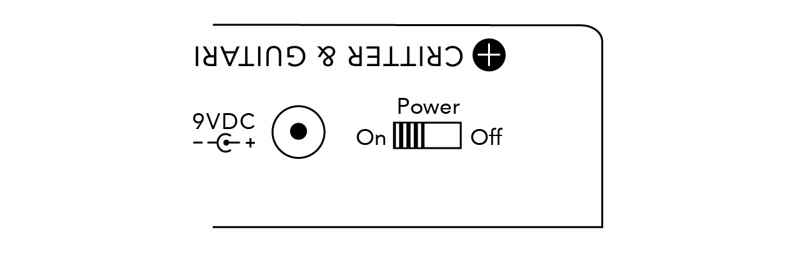 Once the Organelle is connected to power, move the **Power** switch to the **On** position. The OLED Screen will be blank at first. The LED will be steady pale green for a brief time and then blink on/off blue. The screen will display the **Patches** menu when this process is done. 

2.  **Set the volume.** The Vol knob on the top right of the Organelle controls output volume. Start with this knob all the way to the left (no sound). Connect either headphones or a 1/4" cable for your mixer, amp, etc. The leftmost 1/8" jack is for headphones, and the next 1/4" jack is stereo line out. 

3.  **Load a patch.**  Immediately to the left of the volume knob is the *Selector* encoder. Turn this encoder to select one of the listed patches, and then press down the top of the encoder to load the patch. Pick something from the PLAY category to start.      

4.  **Play!**  Play the keys, adjust some parameters (via the four knobs on the left), and enjoy! And if you want to try a different patch, simply turn the Selector encoder and select another patch.      

5.  **When you have had enough fun for now, shut down the Organelle.** This is achieved simply by moving the **Power** switch on the rear panel to the **OFF** position. Do not disconnect the cable until the OLED screen clears.

------------------------------------------------------------------------ 
## 1. Organelle Concepts 

Again, welcome to the world of the Organelle! As this instrument can work for people in many different ways and at multiple depths of operation, let us begin by getting a few ideas straight, starting with the most obvious question... 

### 1.1 What is this thing? 

We can (and will) talk about what the literal Organelle device *is*, but we'd do better to start with what it *can be*. 

#### Organelle is an instrument. 

As you may have already noticed in the getting-started section, the Organelle can be connected quickly and is ready for sound. Other than the Organelle itself, you only need a way to hear the Organelle in order to use it. 

#### Organelle is an effects processor. 

In addition to audio output ports, the Organelle also has an audio input port. Accordingly, patches can access and make use of incoming audio in various ways. This can range from a simple effect processor (like a filter or basic delay) to something more elaborate (like a sampler or vocoder or something else entirely). 

#### Organelle is a generator. 

There is no requirement that the patches you load into the Organelle are triggered by playing notes on the device. There are patches that simply drone and/or create evolving textures on their own over time. The audio input might be used as a source. As this definition is starting to become circular, let's cut to the chase... 

#### Organelle is whatever you want it to be. 

In truth, the Organelle is a vessel for your musical ideas, connecting your own desires for musical expression with customizable technology and portability. You may use the Organelle in a completely different way than someone else, and that is not just okay: it's the entire point. 

#### So is it hardware or software? 

In short, yes. The Organelle is a hardware device that comprises both controller elements (the ports, knobs, keys, etc.) and a modern microcomputer housed inside the case. The microcomputer itself is running a version of the Linux operating system. The microSD card included inside your Organelle is preloaded with the factory patches and ready to go. 

#### What are these "patches" you speak of? 

They are files configured with the program *Pure Data*. While the term "patch" often refers to the settings and parameter values that create one sound in a synthesizer (or some other predefined system), Pure Data patches are a bit more expansive. Each patch represents the entire software system for taking any/all input received by the Organelle, processing it as desired, and then delivering the output as audio, etc., via the Organelle's output ports. (So by analogy, these patches are closer to both the synthesizer structure itself *and* all the settings and parameters that define its initial sound.) 

Some patches require various support files (audio media, other support patches that are being referenced, "external" objects, etc.). Any time we discuss a particular patch, it is fair to assume that we are also referencing any necessary subsidiary files. 

#### What is Pure Data? And do I need to learn it to use the Organelle? 

*Pure Data* (often called *Pd* for short) is a **visual** multimedia programming environment, meaning that its software files (yes, those *patches*) are created by adding objects from its library and then interconnecting them with virtual *patch cords*. For example, here is a Pd patch that simply adds together 32 oscillators and applies tremolo: 

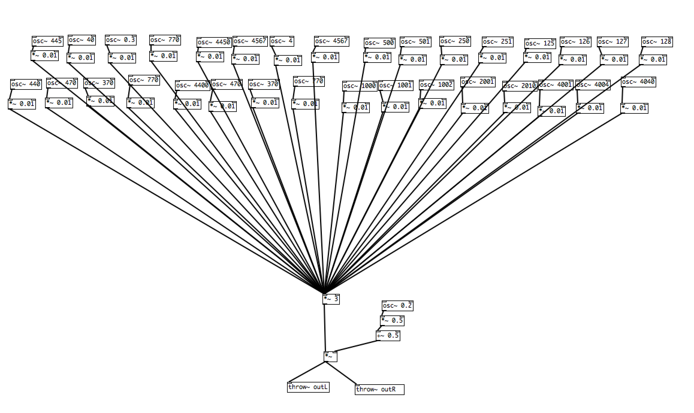 

And no, you do not need to learn Pure Data to use the Organelle. Aside from the patches that come loaded on the Organelle, new patches will be listed on [the patches page](https://www.critterandguitari.com/organelle-patches), and many users have contributed patches available on [Patch Storage](https://www.patchstorage.com). You *can* customize or create your own patches, Pure Data is **free** and available for all computer platforms, but "to code or not to code" is completely up to you. 

#### What other concepts may be useful to understand? 

A basic understanding of audio can only help. And MIDI (Musical Instrument Digital Interface) is the protocol for triggering *notes* and sending *control messages*. To use the Organelle as is, basics are enough. If you decide to create patches, a little bit more will be required, but we will get to all that in later chapters. 

### 1.2 How to Use This Manual 

 Certain chapters (such as this one!) are relevant to everyone. But depending on how you will start using the Organelle, some chapters may be more valuable to you than others. 

-   Regardless of your intentions, the getting-started section and concepts information Chapter 1 will benefit you. 

-   If you are satisfied with the included patches alone, the information on general hardware configuration Chapter 2, system operation Chapter 3, and the [patch listing](https://www.critterandguitari.com/organelle-patches) will all be relevant to you. 

-   If you are looking to load additional patches into the Organelle, then Chapter 4 will also be useful to you. 

-   If you want to edit patches or even create some patches of your own, Chapter 6 will be essential. 

Your uses of the Organelle are likely to change over time. If a chapter is not important to you today, don't feel bad about that: the chapters are happy to wait for you. 

------------------------------------------------------------------------ 
## 2. The Hardware Unit 

As we begin to explore the universe that the Organelle makes available to us, we should start with the Organelle's place in the physical universe: its hardware. 

### 2.1 Acquainting yourself with the box 

The Organelle is rectangular, with three of its six faces containing either controls, ports, or other interface items. We will start with the back and right-side panels (where all the ports are housed) before moving to the controls of the main face. 

##### Back Panel 

If you have turned on the Organelle, then you already have some familiarity with its ports, but there is a little more here than you realize (and a little more than is labeled). 

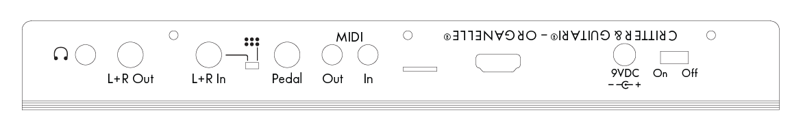

Again, our orientation would be upside down if you walked around to the back of the unit and directly faced the back panel. We are assuming that you are standing in front of the Organelle, just as you will be when operating it. From that position, you would access the back panel either by leaning your head forward or by tilting the Organelle upward. 

-   The headphone port is an 1/8" TRS (stereo) jack. It delivers the stereo audio output of your current patch, as scaled by the **Vol**(ume) knob. 

-   The **L + R**(left and right) **Out** port is a 1/4" TRS stereo line out jack. This delivers the left and right audio outputs of your current patch, as scaled by the **Vol**(ume) knob. This port exudes a line-level output. Connecting it to a mono balanced input (such as an amplifier or mixer channel) may yield a muted/cancelled signal.

-   The **L + R**(left and right) **In** port is a 1/4" TRS stereo line in jack. It receives any stereo audio input that you would like fed into your current patch. This port is expecting a line-level input. Connecting it to a mono balanced output may yield a muted/cancelled signal.

> **NOTE:** If a 1/4" TS (mono) cable is connected, any incoming signal will only be received by the left input. 

-	The **:::** input select switch sets the audio input for the Organelle. In the left position, only the sound from the 1/4" TRS input will be sent to the current patch. In the right position, only the sound of the built-in microphone on the front panel will be sent to the current patch.

-   The foot **Pedal** port is a 1/4" jack. It is intended to be connected to a keyboard sustain-/damper-style pedal, which will deliver on/off messages to your patch. 

> **NOTE:** The Organelle presumes that any sustain/damper pedal used has a "normally closed position" (negative polarity). 

> **NOTE:** If an expression pedal is connected, your patch should receive a continuous range of values. In our experience, various expression pedal models and settings tend to deliver different ranges of values. Please see Chapter 3.3 for more information about the **Pedal Setup**. 

-	The **MIDI** **Out** and **In** ports are stereo 1/8" jacks. These ports can send and receive MIDI information with other instruments that also use 1/8" MIDI ports. These ports meet the MIDI Manufacturers Association Specification for TRS MIDI connectors. An adapter may be used to convert the 1/8" MIDI jack to standard 5-pin MIDI. The Organelle uses the **TRS To MIDI Type A** spec.

-   The microSD card slot contains a card that acts as the internal microcomputer's root disk. This means the Organelle's operating system lives here, but the microSD card is also used to store patches. 

-   The HDMI port delivers the video output of the Organelle's internal microcomputer. Your Organelle matches whatever resolution your monitor/tv uses (up to 1080p). If you power up the Organelle without HDMI connected and then connect HDMI, it will default to 640x480 resolution. So it is best to connect your Organelle & Display before powering them on. For additional information on using the HDMI port, see Chapter 6.

-   The **9VDC** power port is for connection to the Organelle's power supply. 

> **NOTE:** The output specifications of the power supply are: 
> 
> 1. 9VDC 
> 1. 1000mA (minimum)
> 1. 2.1mm diameter tip with center-positive polarity
> 
> Any power supply used with the Organelle **must** meet these three specifications! You can damage the Organelle if a different voltage or amperage is supplied!

-   The **Power** switch will start the Organelle in the **On** position. This process takes a few seconds. When you're done using your Organelle, move this switch to the **Off** position. This will run a shutdown procedure that also takes a few seconds.

##### Right-side Panel 

Compared to the back panel, the right-side panel is downright simple, housing two USB 2.0, Type A ports. They can connect class compliant devices that utilize MIDI over USB or other computer peripherals. 

Please remember that the Type A port is indicative of a USB *host*. That is to say, the Organelle is a *host* to USB *devices* like USB-MIDI cables and WiFi adapters. Your computer is also a USB host. You cannot connect two hosts directly together! **Do not** purchase a special *USB A-to-A* cable to connect the Organelle to your DAW. It won't work and you may damage your Organelle, computer, or both!

> **NOTE:** Some MIDI controllers can be powered by their Host's USB port. The Organelle's USB ports can only supply a maximum of 0.5A. If your USB device requires more than the Organelle can provide, communication and/or performance issues may arise. If you experience these, please consult your USB device's manual about power requirements. A powered USB hub or power adapter for external device can resolve these power demands.

##### Main Face 

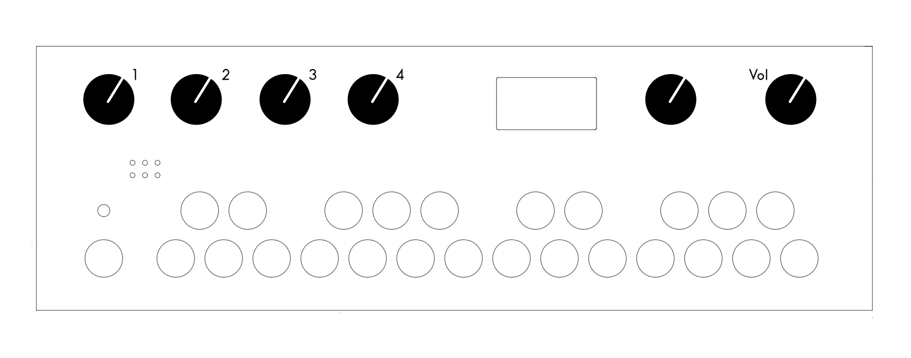

The main face is both Organelle's primary interface with you and the place that you will spend the most time. While the other panels are critical when Organelle is being setup or when you are altering its configuration, the main face is the operations center for when you are actively running the show. 

-   Knobs **1**, **2**, **3**, and **4** are available for parameter control within your patch. Each knob is typically assigned to a parameter that is then continuously altered across a preset range of values by movement of that knob. Movement of each knob can also send a corresponding continuous controller (CC) MIDI message. For information on the default MIDI operation of the Organelle, see Chapter 3. 

-   The Organelle's OLED screen provides a window into its microcomputer brain, serving as the on-board method of monitoring and adjusting both the system itself and your patches. After 10 minutes of operating without any activity on the *Selector*, a screen saver will start. To turn off the screen saver, simply turn the *Selector*.

-   The *Selector* encoder accompanies the Organelle's display because they are dependent upon one another. While a patch is loaded, turning the Selector causes the display to show the menu screen. By leaving the Selector alone for a few seconds, the display will revert to the patch information screen. 

> **NOTE:** In some of the patches, the Selector encoder is used to advance through additional pages of parameter assignments. This allows you to shift the the four knobs' mappings to additional (read: more than four) parameters. Patches with this behavior are often indicated by a message like *&lt;-- HOME* in the bottom line of the  Organelle's on-board display. This functionality can also be built into your own patches.  

-   The **Vol**(ume) knob governs the potential audio output level of the Organelle. The knob ranges from silence (in audio terms, -∞) at the far left to no attenuation (unity gain) at the far right. Any adjustments to the Volume knob take effect immediately. 

-	The small grille below Knobs **1** & **2** houses the built-in microphone. 

-   The maple key at the far left and its accompanying LED comprise one special unit: the *Aux button*. By default, the Aux button does nothing, but each patch can be configured to use the input from the key for any type of mode switch or anything else. The LED has eight static states (off plus seven color options) and is generally used to provide the user with visual feedback of the Aux button's status. As with so much about patches, the function of this control will be anything the patch designer deems appropriate. 

-   After the Aux button, the 24 other maple keys work together as a group. As their piano-style layout may have indicated, these keys are for playing notes. By default, each key triggers a "note on" MIDI message when it is pressed down and a corresponding "note off" MIDI message when it is released. For patches that use note messages to trigger or affect audio output, these keys will be your primary performance vehicle. 

### 2.2 A Few Configuration Ideas 

While the Organelle is an open platform that permits and encourages nontraditional setups, we will now look at a few potential configurations for the Organelle. Rather than suggested setups, treat these more as baselines or ideas; nearly all elements of any configuration can be mixed and matched. Of course, the Organelle will function on its own without any connections to other devices, but combination is so much fun!

The following setups are merely examples of how one might use the Organelle.  Each use case depends highly on the patch being run, for example audio input might be irrelevant in a simple synthesizer patch.  

#### Minimal Performance Setup 

Here we start with a variation on the setup proposed in the getting-started section. This bare-bones approach is the most compact performance configuration possible. 

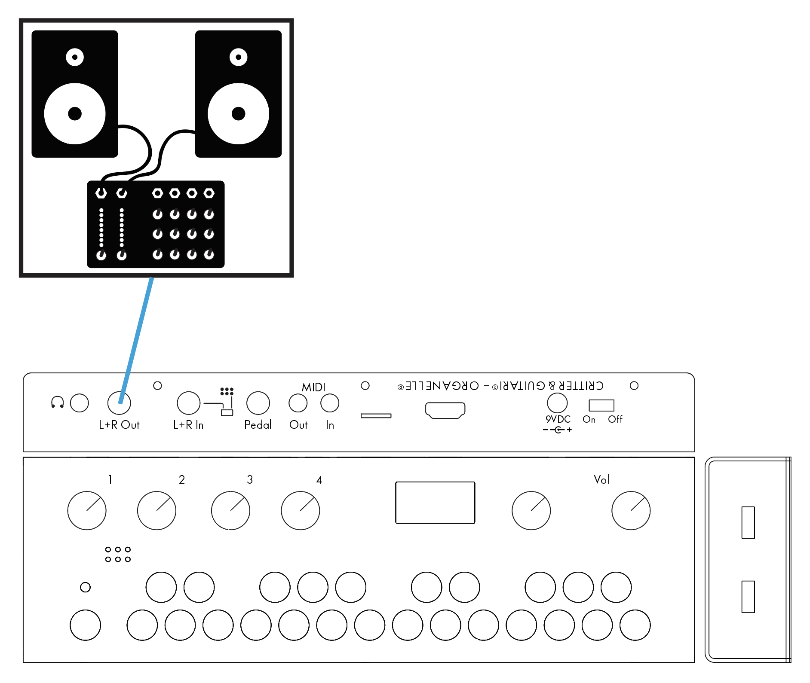

Note that the Organelle is running on battery power.    

The **L+R**(left and right) audio **Out**(put) ports are sending a stereo signal to a mixer, which assumably runs to studio monitors, a recording interface, a venue's PA system, etc. (Instead of going straight to a mixer, these ports could just as appropriately be connected to direct boxes (DIs). If there is a sound person controlling levels, you may want to leave the **Vol**(ume) knob most of the way up, providing optimal signal for them to work with. 

#### Audio Input from a Microphone 

This example uses a microphone as an audio source for the Organelle and a footswitch to control an effects patch. This setup is also fairly minimal. 

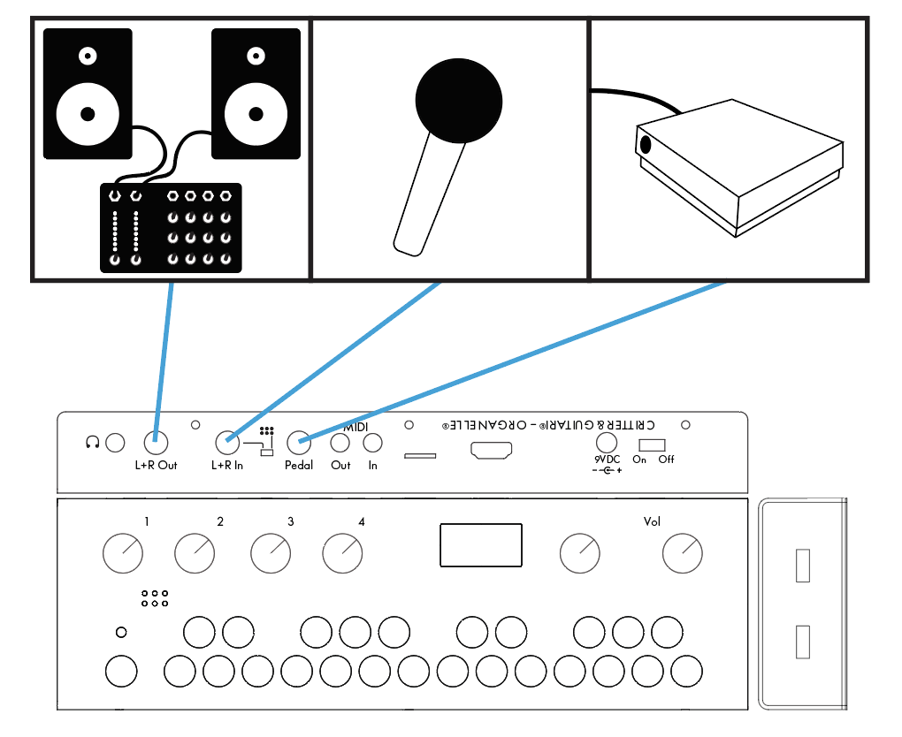

As the audio **In**(put) **L+R** port accepts a 1/4" cable, you will need something other than a regular XLR cable to use a microphone with the Organelle. This could mean a cable with the appropriate connection for your microphone (probably XLR) and a 1/4" plug on the other end for the Organelle, a standard XLR cable with a female XLR to 1/4" adapter attached, etc. 

As most microphones are monophonic, most patches that use audio input are likely to either sum the left and right inputs together or only use the left input. This is not problematic in and of itself, but it could affect your setup choices and expectations. 

#### A USB MIDI Controller and Audio Input from an Electric Guitar 

This example uses a guitar amplifier for audio output, an electric guitar as the source of audio input, and a USB MIDI controller to supplement the Organelle's own keys and knobs. 

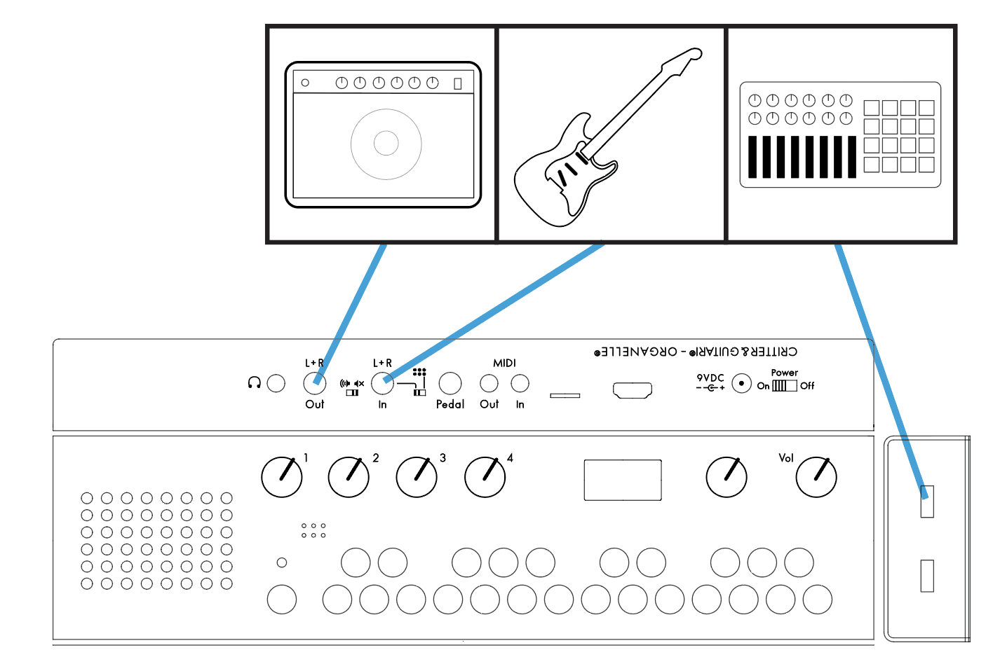

This setup demonstrates the Organelle's abilities as an effects processor. Use it like an entire pedalboard, controlling many parameters with a USB MIDI controller. Any incoming MIDI messages are sent directly to the current patch, which will determine how to use them. As long as it is class compliant, any device supporting MIDI over USB would work, whether it is an 88-key piano-style controller or a DJ-style controller, etc. Even MIDI-only controllers will work when connected to the Organelle via a USB class compliant MIDI interface. 

Note that this setup has a 9V DC power supply connected.

#### An External Monitor, a USB Hub, and Computer Peripherals 

This example uses the built-in speaker for audio output, two USB devices and an HDMI monitor to facilitate Pure Data programming.

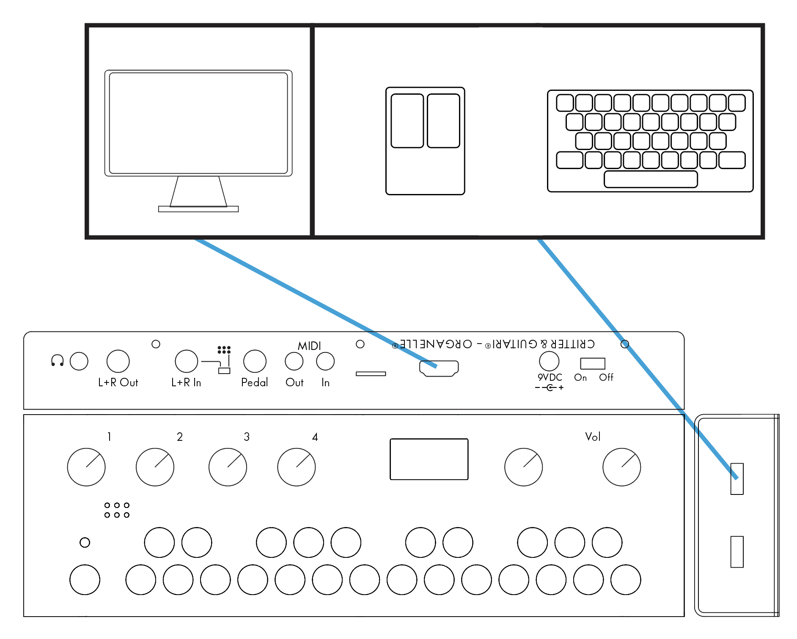

Connecting an HDMI monitor to the Organelle shows the internal microcomputer's command-line interface and graphical user interface. 

Connecting an HDMI monitor assumes that you want to operate the Organelle's microcomputer in a typical way, and this implies the use of peripherals, such as a mouse and keyboard. You may also make use of a USB hub, especially if you desire to use more than two USB devices at once.

#### MIDI Input, MIDI Output, and a USB MIDI Controller

This example uses the Organelle as part of a larger MIDI setup. 

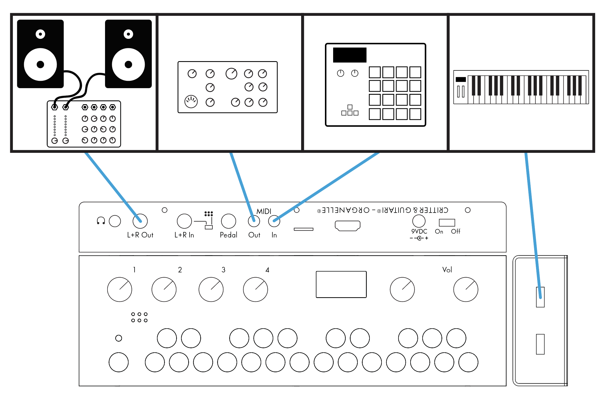

Receive an external MIDI clock sync, MIDI notes, MIDI CC controls, or MIDI program change messages with the 1/8" MIDI in jack. Send MIDI information to an external instrument, such as MIDI notes to a synthesizer. Control the Organelle's keyboard with a USB MIDI keyboard, expanding the number of playable notes within your patch.

------------------------------------------------------------------------ 

## 3. Operating the Organelle by Itself 

 As we stated early on and as the configuration ideas have shown, the Organelle is a fully capable stand-alone instrument. To use the Organelle in this fashion requires understanding the workings of its internal operating system. By learning the options provided by the Organelle's software along with the uses of the Selector encoder and the on-board display, you will be ready to travel and perform with the Organelle alone. 

In this chapter, we'll explore where this combination of the Selector and on-board display can go, and we will also go through the default MIDI operation of the Organelle and how connected USB MIDI devices interface with the Organelle. 

These topic areas will prepare you for general use of the Organelle. 

### 3.1 Main Menu Screen 

To interface with the Organelle, we will primarily work with two of its components. The Selector encoder allows us to navigate system options and execute functions, and the on-board display shows us the choices we have and provides feedback on our current patch and system. 

When the Organelle is powered up, it first runs through its boot sequence and then drops us into its *main menu screen*. 

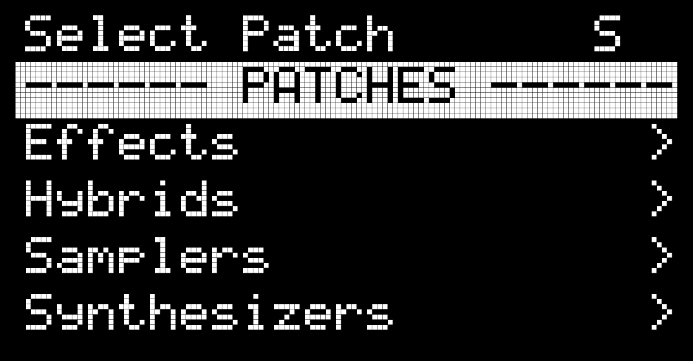

The menu screen itself comprises two sections: the system section (or system menu) at top and the patches section (or patches menu), which we see in the above image. 

The first line of the screen displays some information.  If no patch is currently playing it will say 'Select Patch'.  On the far right is a 'S' or a 'U' which indicates if patches are loaded from the micro SD card ('S') or a USB Drive ('U'). More on this in Chapter 4.2. To the left of the storage indicator letter is a WiFi connection icon.  When the Organelle is connected to WiFi this icon will appear.

#### Patches Menu 

After the Organelle first boots up, it places us directly in the *patches section*, which is helpfully labeled **PATCHES**. By turning the Selector to the left and right, we are able to move up and down respectively in the patch list. There may be both patches or folders of patches in the Patches Menu.  Folders are designated with a '&gt;' on the right. The Organelle comes with most of the patches organized into folders.  You can always put them in your own folders, see Chapter 4 for details.  Lets navigate to the Synthesizers folder:

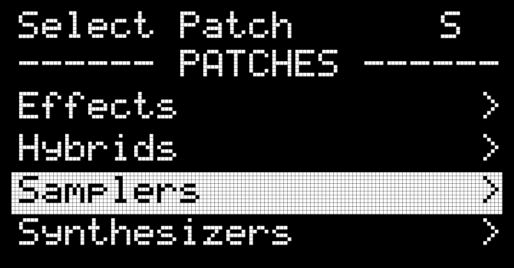

(If we scroll too far to the left, we will navigate past the patches menu and up into the system menu. In that case, simply move back down to the patches menu.)  

Then we can choose a synthesizer patch.

After the patch is successfully loaded, the Organelle's display shifts to show us the patch information screen, which we will discuss in a moment. To return to the menu screen, turn the Selector. The only difference is that the active patch is now displayed in the top line of the menu screen: 

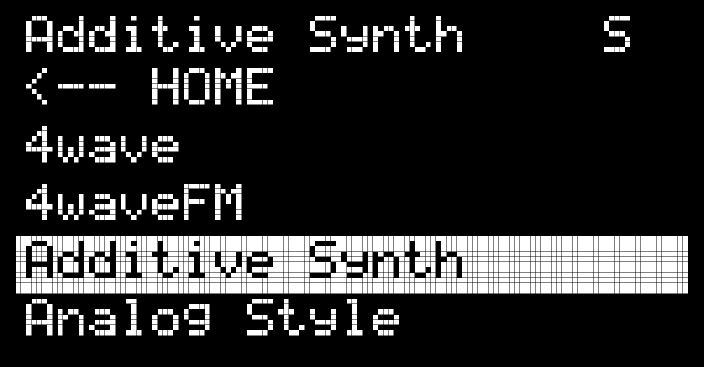

#### System Menu 

At the top of the menu screen is the *system menu*. The top of this section is labeled **SYSTEM**, and it contains several sub menus shown below. 

To enter one of these sub menus, follow the same procedure as loading a patch: select the desired option by turning the Selector and then pressing down on the top of the Selector. 

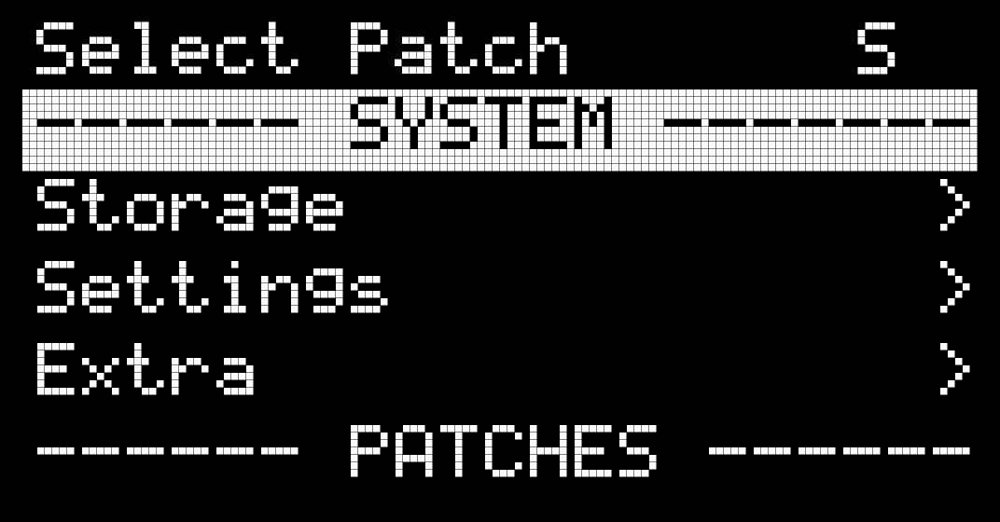 

-	**Storage** contains all options related to the microSD card or USB drive, such as ejecting and reloading.

-	**Settings** accesses options for MIDI, WiFi, and Footswitch settings. It also contains system information and Favourites.

-	**Extra** may contain additional user defined functions for the Organelle.

We will discuss these menus in a moment.

### 3.2 Patch Screen 

Once a patch is loaded, you will be taken to the *patch information screen*, which serves as your main performance interface. 

The Organelle treats this as your "home screen." You can return to the menu screen by turning the Selector knob, but after a few seconds of inactivity, the Organelle will automatically return to the patch information screen. 

Below is an example image and description of a typical patch screen.  The exact information displayed on the patch screen varies widely depending on the patch, and since version 3 of the Organelle OS, patches may utilize graphical elements on the patch screen in addition to text. Please see patch documentation, such as instructions found at [the patches page](https://www.critterandguitari.com/organelle-patches), for more information.

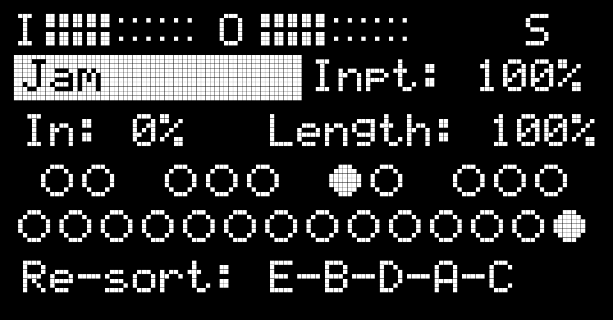

On this screen, each line tends to show particular information related to the current patch. Individual patches can vary this pattern when deemed appropriate.  

-   The top line provides storage location ('S' = microSD card, 'U' = USB drive) and level meters. These are representations of the audio levels that are reaching the device's **I**(nputs) and those that are ending up at its **O**(utputs). Each meter is actually a stereo representation, with the top rows showing left levels and the bottom rows showing those for the right channels. 

> **NOTE:** The on-screen output meter is operating in a "post fader" mode, where the displayed signal is scaled based on the unit's current volume setting. 

-   The next two lines are variables/settings (two per line) that are controlled by the four knobs. Sometimes patches are prefaced with **1**, **2**, **3**, and **4**, each representing that respective knob. Following the knob number is usually a short name for the parameter being altered and then a numeric representation of that parameter's current value. 
-   Next up: a graphic represenation of the Organelle's 24-key keyboard. This patch screen was used as this example to illustrate that graphics can be included in patch screens. 
-   The bottom line is prefaced with **Aux** as it tends to provide more information about the assignment and/or current state of the Aux button. In the example above, this patch seems to toggle the waveform being used an oscillator, with a **Sine Wave** currently in use. 

> **NOTE:** As was mentioned in the previous chapter, some factory patches use the Selector encoder to switch the knobs through pages of parameter assignments. In this case, the middle lines of the on-board display (starting with **1**, **2**, **3**, and **4**) will be updated as the Selector encoder is turned and the knob assignments shift. The bottom line of the on-board display may also suggest that the Aux button returns you to the *HOME* menu. 

### 3.3 System Menu Items

Lets take a closer look at the items in the System Menu.  This menu contains 3 sub menus: Storage, Settings, and Extra.  

#### Storage Menu

This menu contains all options related to the microSD card or USB drive, such as ejecting and reloading.

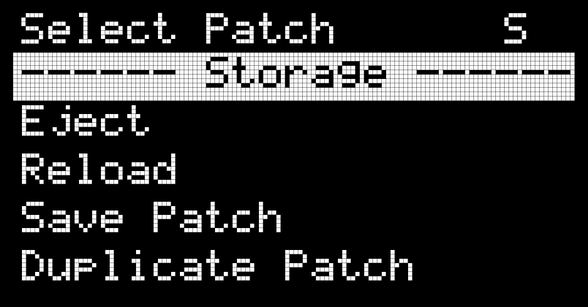

-   **Eject** safely un-mounts an attached USB drive. The display will notify you when it is safe to unplug the USB drive. 

-   **Reload** rescans the **Patches** folder of the microSD card (or an attached USB drive) and then refreshes the Organelle's patches menu. (This also unloads the current patch so note that all sound will stop until you load another patch.) Any time that you connect a USB drive to the Organelle while the unit is already powered up, you should run this function. Once the reload process has completed, you will be left in the patches menu in order to load an available patch. 

-   **Save (See Note Below)** stores the current parameter settings with the open patch, essentially printing the values that have been set with the knobs. Whenever this patch is reloaded, all of your previous parameters will be recalled regardless of the current knob positions. Once a knob is moved, however, its physical position will regain control. 

-   **Save New (See Note Below)** duplicates the current patch and all of its associated files into a new patch folder and then loads that patch. The new patch also stores the parameter values of the knobs, just as the **Save** function does. When recording sound to a sampler/recorder patch, **Save New** will save the new sound(s) to the new patch and preserve the default sound(s) in the original patch. The new patch takes the name of the original patch and adds an incremented number. So triggering **Save New** while a patch named **Basic Poly** is loaded would create (and load) **Basic Poly 2**. And selecting **Save New** again with either **Basic Poly** or **Basic Poly 2** loaded would spawn **Basic Poly 3**. 

> **NOTE:** Save and Save New depend highly on the patch. In other words, a patch must be coded to take advantage of these functions. Since some patches provide this funtionality and some do not, these functions might be moved out of the OS and made available as addons.

#### Settings Menu

This menu accesses options for MIDI, WiFi, and Footswitch settings. It also contains system information and Favourites.

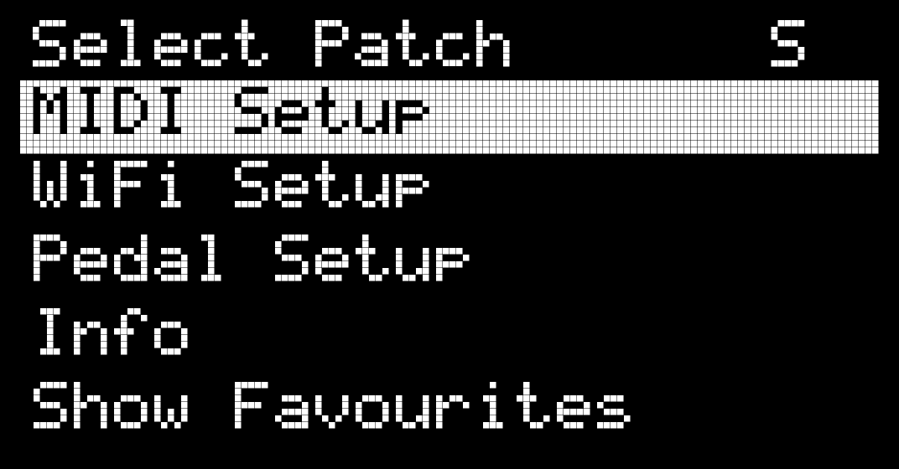

-	**MIDI Setup** - See section 3.2: The Organelle's Default MIDI Setup for information on using MIDI.

- 	**WiFi Setup** - See Chapter 5 for information on WiFi.

-   **Info** displays the *system information screen*, which presents information about the current hardware/software situation. Don't forget to use the *Selector* to scroll down to view more information. When done viewing this page, click the encoder to exit. The following information is displayed:

	- **CPU** - The amount of processing power currently being used by each of the four cores in the CPU. We try to keep this below 75% for optimal performance. These values are updated in near-real time. The numbers may skip around from one core to another as the CPU manages processing.

	- **TEMP** - The temperature of the CPU in centigrade. This is updated in near-real time.

	- **USB Drive** - The ID number of the attached USB drive. When no drive is connected, nothing will be shown. 

    - **IP**	- IP Address of your Organelle (see Chapter 5 for using WiFi on Organelle).

    - **WiFi Network**	- Network your Organelle is currently connected to.
 
    - **Patch**	- The name of the patch currently running.

    - **Patch Folder**	- The folder the patches are stored in (most likely 'Patches').

    - **User Root** - Where Organelle is looking for patches (sdcard or usbdrive).

    - **Version** - The currently installed operating system.

    - **Model** - Organelle hardware model, for example 'M' or 'S2'.

-	**Pedal Setup** will help you configure your expression pedal or footswitch function. By default, a footswitch will control whatever the current patch dictates (it may not have a programmed function). If patches have been added as Favourites, a press and release of the footswitch can jump to the next patch in that list. To enable this function, select the switch option in **Pedal Setup** and then save. The **Pedal Setup** can also be used to define the beginning and end of your expression pedal's range.  Select **Expr Min** and **Expr Max** and scroll to the desired value.  Select **Save** when finished.

-	**Show Favourites** will present you with a list of any patches you have saved as a Favourite.  With **Show Favorites** selected, the full list of patches will be hidden until you select **Show Patches** in **Settings**. To add patches to the Favourites list: 

	1. Launch a patch with Encoder.
	2. Turn the encoder to **Settings** and click **Show Favourites**. 
	3. Select **Add Current** to enter a patch to the list. Patches are saved in the order they were added (not alphabetically like in the main **Patches** folder).

	To remove a patch from Favourites: 
	
	1. Launch patch you want to remove.
	2. Select **Remove Current** from the Favourites menu.

	Adding a patch to Favourites or removing it only modifies the list of Favourites - no patch files are created or deleted in this process.

> **NOTE:** Favourites is a user-currated list from all patches loaded on the Organelle's currently selected patch storage location. By default this location is the microSD card. It can also be a properly formatted USB drive (not included). If you eject a USB drive containing patches and Favourites, your Favourites will be set to the microSD card's Favourites.

#### Extra Menu

This menu may contain additional user defined functions for the Organelle. Some extended techniques for the Organelle programming can be configured and accessed via the **Extras** section of the **System** menu. By default this section will be empty.

### 3.4 Organelle's Default MIDI Setup 

The way the Organelle handles MIDI will be relevant to anyone using MIDI, even if you are mainly pressing the unit's own maple keys to trigger note messages. There are certain default MIDI assignments in the Organelle patches that you should know. 
 
The most simple MIDI configuration is to use the 1/8" MIDI jacks to send or receive notes or MIDI clock with another instrument. By default a patch running on the Organelle will send and receive MIDI on the 1/8" jacks.  It is also possible to use class compliant USB MIDI devices.

> **NOTE:** As the Organelle is an open platform, it is possible for a patch to ignore these MIDI settings and send and receive MIDI directly as it pleases.  These are the settings by default, but if you are experiencing something different, please review any documentation about the patch you are running.

To see all available MIDI related options on the Organelle, navigate to **Settings** > **MIDI Setup**. In the MIDI Setup menu you can configure global MIDI settings.

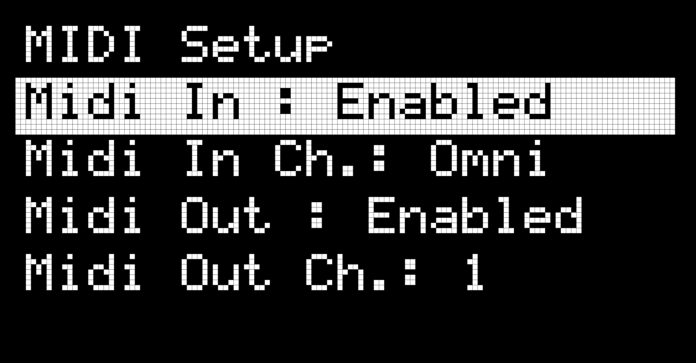

##### Outgoing MIDI 

With the exception of the Selector knob and the Volume knob, all of the Organelle's other interface elements send out MIDI messages when they are used. All outgoing MIDI messages are sent on the MIDI channel specified in the MIDI Setup menu. 

###### The Keys 

The 24 keys (not including the Aux button on the far left) transmit "note on" messages. The leftmost key uses note number **60** ("middle C," or "C3" in most MIDI systems), and the rightmost key uses note number **83** ("B4"), with all keys in between following this scheme. 

When a key is pressed down, a "velocity" of **100** is transmitted. When a key is released, a "velocity" of **0** (zero) is sent. 

###### The Knobs 

Knobs 1, 2, 3, and 4 transmit "control change" messages using controller numbers **21**, **22**, **23**, and **24**, respectively. The full range of controller values (from **0** to **127**) is utilized. 

###### The Aux Button 

The Aux button transmits momentary "control change" messages using controller number **25**. When the button is pressed down, a controller value of **100** is transmitted. When the button is released, a controller value of **0** (zero) is sent. 

###### The Pedal Port 

A pedal connected to the Organelle's **Pedal** port transmits two sets of "control change" messages. 

Controller number **64** transmits a controller value of **0** (zero) for any received signal below **64**, and a controller value of **127** is sent for any received signal of **64** or above. This discrete, threshold behavior is particularly good for sustain-/damper-style pedals. 

Controller number **26** transmits continuous values. While the general range would be from **0** (zero) to **127**, the exact range of values may vary based on the pedal connected. This continuous behavior is ideal for an expression-type pedal. 

No matter what type of pedal is connected, both of these control change messages will be transmitted, and there is nothing stopping you from using both sets of messages. 

##### Incoming MIDI Messages 

In general, the MIDI messages that are output by the Organelle (as outlined in the immediately previous section) are identical to the incoming messages recognized by the Organelle. This can be helpful, for example, if you want to record the movement of the Organelle's controls into a sequencer as automation data. In other words, the mappings are a bit of a mirror. So let's take particular note of how incoming MIDI messages interact with and can sometimes override the Organelle's on-board controls. 

And similar to the outgoing messages, incoming messages should be sent to the Organelle on MIDI input channel specified in the MIDI Setup menu. 

###### Note On Messages 

Incoming note messages can happen concurrently with note messages created by playing the Organelle's keys. If incoming and internal notes are occurring at the same time, these two streams are essentially merged together. 

###### Control Change Messages 

Incoming "control change" messages using controller numbers **21**, **22**, **23**, and **24** replace the current values set by Knobs 1, 2, 3, and 4, respectively. 

**To restore a knob's control:** simply turn the knob enough to register a new value. In the same way that "control change" messages are designed to work, the dominant message is always the last one received. 

Incoming "control change" messages using controller number **25** affect the internal status of the Aux button. A controller value between **64** and **127** simulates the Aux button being pressed down, while a controller value between **0** (zero) and **63** simulates a release of the Aux button. 

> **NOTE:** A momentary control source, such as a damper pedal or button, would work well with this sort of threshold behavior. In certain situations, controlling the Aux button from a external "sustain" pedal could be quite effective. 

Incoming "control change" messages using controller number **26** replace the current value used by the Organelle for an expression-style pedal. And incoming messages using controller number **64** replace the current value used by the Organelle for a sustain-/damper-style pedal. (This subtle distinction really only matters if you are making your own patches.) Similar to the knobs, using the pedal will reactivate it as the current control source, updating both controllers **26** and **64**. 

###### Program Change Messages 

Incoming "program change" messages are used to select the Organelle's current patch from the list of Favourites. 

Patches are stored in the Favourites list in the order they are added. Each patch is then dynamically assigned a "program number" based on its position. Let's say the Organelle had three patches added to Favourites in this order: **Proton Patch**, **Water Patch**, and **Acid Patch**. Sending the Organelle program number **1** would call up **Proton Patch**, program number **2** would call up **Water Patch**, and program number **3** would call up **Acid Patch**. (Since these are the only three patches in Favourites, program change messages for numbers **4** and above would do nothing.) If you have only one patch in Favourites, program number **1** will not cause a change.

###### Other MIDI Messages 

Any other MIDI message is passed directly to the current patch. If the patch is configured to handle that particular message, it will respond as configured. If the patch is not listening for that message, then nothing will happen. 

#### Using a USB MIDI Device 

 Using a USB MIDI device with the Organelle is rather painless but not "hot swappable." 

1.  **Connect your USB MIDI device.** As long as a USB MIDI device requires no special, proprietary driver, you need only to connect it to the Organelle. This can be done via a USB port either on the Organelle itself or on a USB hub that is connected to the Organelle. 

2.  **Select the MIDI device in MIDI Setup** In the MIDI menu select **Device**.  You can now scroll through a list of MIDI devices (if you have connected more than one, they will all be on the list).  The device name usually contains the manufacturer or model number. Press the encoder to make your selection, then select **Save**.
 
3.  **Load the patch you want to use. If it was already loaded, please reload it.** Reload the patch for the settings to take effect. 

That's about it. By remembering to reload your patch and knowing what MIDI messages are understood by the Organelle (see the immediately previous section) and/or those understood by the particular patch you have loaded, you should be all set to use MIDI with the Organelle. 

------------------------------------------------------------------------ 

## 4. Managing Patches 

#### Bringing additional patches from your computer to Organelle. 

One of the strengths of the Organelle is its depth. Included on your Organelle's microSD card are numerous patches that use the instrument in a plethora of fashions. These included factory patches represent what is possible with the Organelle, but are by no means the only patches you can use. 

As was mentioned in an earlier chapter, [the patches page](https://www.critterandguitari.com/organelle-patches) is the official repository of the Organelle patches. It is a great place to start when looking for new sounds, options, and performance approaches. In addition [Patch Storage](http://www.patchstorage.com) is a website that hosts many user created patches for the Organelle and also other open platforms. 

The Organelle can load patches from the internal microSD or a USB drive inserted into one of the USB ports on the side.  When you power up the Organelle (or choose **Reload** from the Storage menu), the Organelle will first check if a USB drive is present and contains patches.  If there is no USB drive, the Organelle will check the internal microSD card and use the patches there.

Finding and downloading Organelle-ready patches is easy enough. To use these patches, we need to get them from a computer to the Organelle's microSD card or USB drive. (And yes, that computer could be running Windows, Macintosh, Linux, or some other operating system. No additional software is required; the computer is just being used to download files, possibly decompress them, and then copy their folders to your Organelle.) 

Getting patches on a USB drive is simply a matter of inserting the drive in a computer and copying over the files.  To use the internal microSD card we need to connect to the Organelle over WiFi and transfer them using a web browser interface.  

### 4.1 Folder Structure 

Whether the Organelle is loading patches from the microSD card or USB drive, the patches have the same folder structure.  The patches live in a folder named **Patches** at the top level of either the microsD or USB drive.  Each patch is a folder itself and each patch's folder must contain a file named **main.pd**. A patch might require other files, such as sounds or sequences or sub patches, and these will all reside in the patch folder.

An example folder listing would start like this. You can see here at least four patches, each with a required **main.pd** file. 

    Patches/
		32 Oscillators/
			main.pd
		Analog Style/
			blsaw.pd
			distort.pd
			main.pd
			sequencer2.pd
			simple.pd
		Arpeggio - Double/
			counter-down.pd
			counter-up.pd
			counter-updown.pd
			delay2sec.pd
			main.pd
			master-metronome.pd
			sequencer2.pd
		Basic Poly/
			main.pd
			voice.pd 
			...

It is also possible to place patches in sub folders.  Generally a sub folder is a folder that contains other patch folders.  A sub folder should not have any additional files.  This is useful for organizing your patches into categories, for example Synthesizers or Effects.

### 4.2 Using a USB Drive for Patches

As has probably become clear by now the Organelle comes loaded with patches on the internal microSD card. A set of patches separate from that of the microSD card can also be loaded on a USB drive and used.

To have the Organelle load patches from the USB drive, the drive must either be connected to the Organelle before it powers up, or inserted while it is running.  If you insert a USB drive while running, you must select **Reload** in the Storage menu to refresh the list of patches. When the Organelle recognizes a properly formatted USB Drive with the expected folder structure (See Chapter 4.1) there will be a 'U' displayed in the top right corner of the OLED screen.  

#### General Information 

An attached USB drive must be appropriately configured. 

-   This USB disk should be formatted with a FAT32 file system, often associated with MS-DOS. This is most often the default for small USB flash drives. The ExFat file system will not work with the Organelle. 

-   This USB drive must contain a folder called **Patches** at its top-level. (This name is case-sensitive.)  
  
#### Working with your USB Drive on a Computer 

Rather than guide you through web browsing, we will assume that you have already downloaded some new patches either from [the patches page](https://www.critterandguitari.com/organelle-patches) or [Patch Storage](http://www.patchstorage.com) or another source. 

From here, we need to connect the USB drive you are using with the Organelle to your computer. **If the USB drive is currently connected to the Organelle, properly **Eject** the disk before removing it.** Select **Eject** from the Storage menu. Once the drive is connected and seen by your computer, we can proceed. 

#### Folder Structure Revisited 

Earlier in this chapter, we went over the required folder structure for a usable USB drive. Now that the drive is connected to a computer, let's see the same structure in a more familiar, graphical view. 

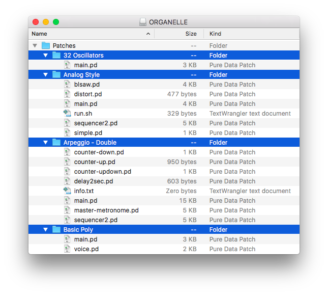

The top-level of my USB drive, whose disk name is **ORGANELLE**, is shown above. Inside of the top-level **Patches** folder, the folders for the first four patches are selected (with blue coloration), and their contents are exposed. 

Again, the requirement here is that each folder contains a **main.pd** file that serves as the primary file for that patch. As long as this file is in place, that patch will appear in the Organelle's patches menu as the folder name. So in the example shown above, the first four patches shown on the Organelle would be **32 Oscillators**, **Analog Style**, **Arpeggio - Double**, and **Basic Poly**. 

#### Making Changes to your USB Drive 

Assuming your USB drive is formatted correctly and the Patches folder is appropriately named and located, making changes to your available patches is as simple as working with files on your computer. 

**To add a patch to your Organelle's USB drive:** Patches you download are likely to be .zip files or .zop files. Copy these compressed files directly into your **Patches** folder. After reinserting drive in the Organelle and selecting Reload from **Storage** menu, the Patches menu will display an option below like **Install [Patch name].zip** (or .zop). Once selected, the Organelle will uncompress the patch into the **Patches** folder and then delete the .zip/.zop. This method will avoid any file corruption that may occur while transferring files across devices. 

> **NOTE:** While a downloaded zipped patch may be uncompressed and then the resulting patch folder copied to the USB, the recommended method is to have the Organelle unzip the patch by selecting Install from the Patches menu.  Patches in .zop format (ending in .zop) should never be uncompressed because they often contain additional installation instructions that the Organelle will process during installation.  

**To backup a patch:** copy the patch's folder to a location on your computer. 

**To rename a patch:** rename the patch's folder, just as you would rename any folder on your computer. 

**To delete a patch:** delete the patch's folder, just as you would delete any folder on your computer. 

Taken together, these basic functions make it easy for you to organize and sort your patches. 

### 4.3 Using internal microSD 

Patches are stored on the internal microSD in the same manner as the USB drive.  There is a Patches folder at the top level that contains patches or sub folders of patches.  In order to access the microSD card and manage the patches we need to use the web browser based file manager.  This process is detailed in the next chapter.

------------------------------------------------------------------------ 

## 5. Using WiFi with the Organelle

The Organelle ships with a USB WiFi adapter which allows it to connect a WiFi network or create its own WiFi 'hot spot.'

The two major WiFi features included in the Organelle are a web-based interface and the support for Ableton [LINK](https://www.ableton.com/en/link/), for wireless tempo synchronization.  The web-based interface allows you to access and manage the Organelle's patches and audio, MIDI, and similar files. You can access this interface from any web browser once the Organelle and your computer are on the same network.  

In order to get the Organelle connected we use a USB WiFi adapter.  To get started, insert the included WiFi adapter into one of the Organelle's USB ports.

> **NOTE:**  We have experimented with other WiFi adapters but we don't have a conclusive list of which adapters work and which do not. When in doubt, stick with the included adapter which has been proven to work very well.

The Organelle has two modes of WiFi operation: normal and AP mode. In normal mode the Organelle connects to an existing WiFi network.  In AP mode the Organelle creates its own network (Access Point, or hot-spot).  We'll cover joining an existing network first.

### 5.1 Joining Existing WiFi Network   

> NOTE: Please join only trusted networks!

It is fun to join an existing network in your home or studio. First connect the provided USB WiFi adapter to one of your Organelle's USB ports. Then navigate to the Settings/WiFi Setup page on your Organelle: 

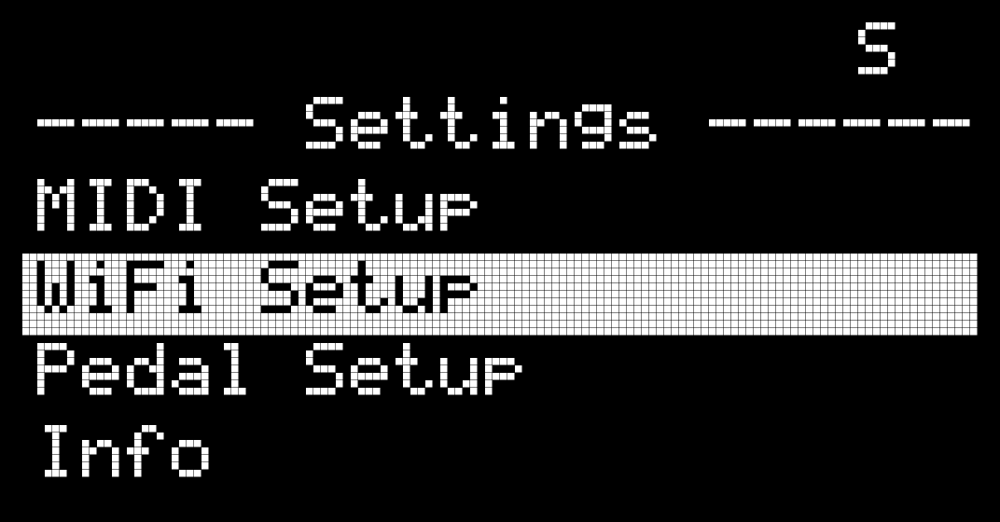

Choose 'Select Network' menu item: 

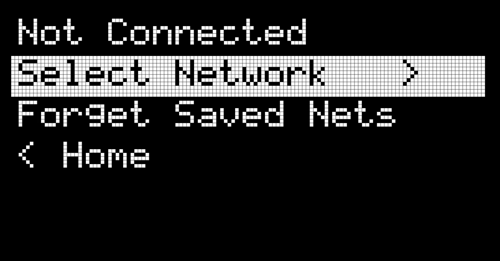

The screen will now list the networks the Organelle finds. Select your desired network with a press of the **Selector** knob. For this example we will choose '*The_Bassment*' network:

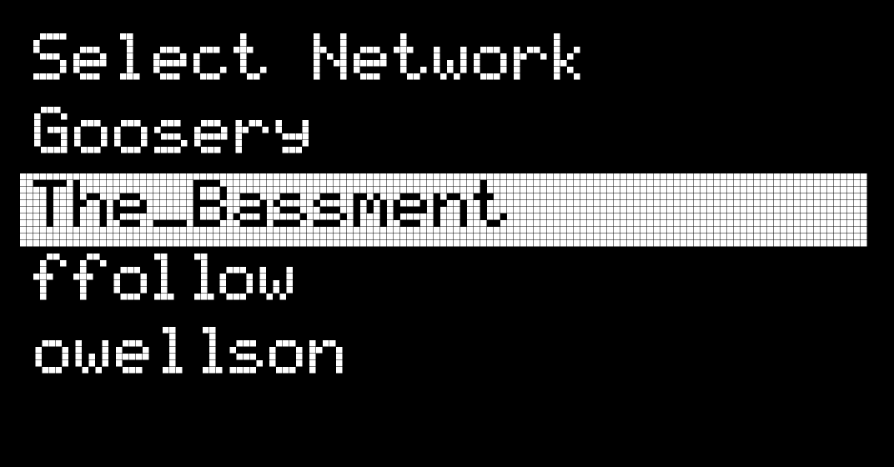

The next step is to enter your network's password. By turning the **Selector**, you will see ASCII characters (a, A, 1, !, etc) appear one at time in the middle of the screen. Press the **Selector** to add a chosen character to the password line which will appear at the bottom of the screen. In this example, we have typed out *coolmusic* for the password. At the end of the list of characters, there are three commands in this order: *Delete*, *Enter*, and *Cancel*. The *Enter* command is shown here. Select *Enter* when your password is correct and you are ready to join the network:

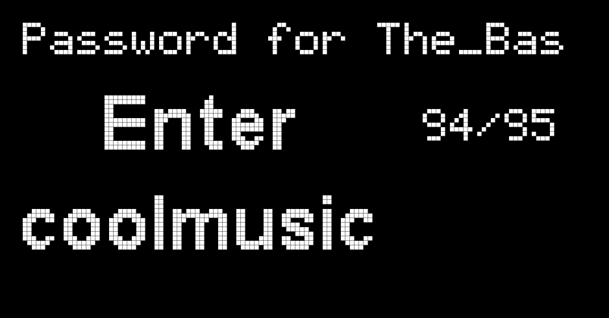

If the password was accepted by the network, the screen will say 'Connected' and the beginning of the network name. The Organelle's IP address will also be listed:  

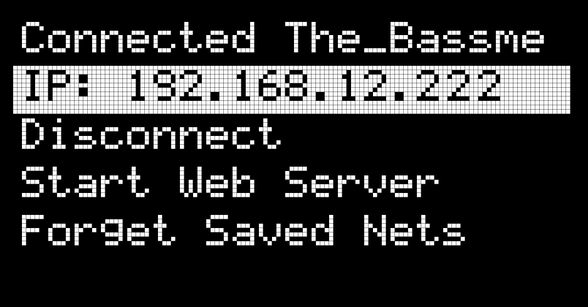

Your Organelle has successfully joined the network! If you navigate outside of the WiFi Settings menu, you will see an antenna icon displayed on the top right of the OLED screen: 

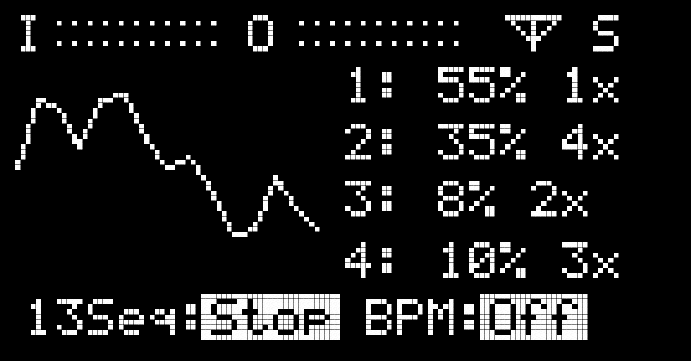

### 5.2 Using AP mode

If you're on the road or other situation where you don't have a trusted network to join, the Organelle's AP (Access Point) mode can be useful. AP mode allows you to connect to the Organelle with a computer and no other gear (such as a wireless router) is required.  

When AP is active, it functions just like an existing network: once both devices are connected you can run LINK session, access the web interface and transfer patches and other files, etc. This section will walk through the steps to launch AP mode.

From the Settings menu select WiFi Setup to launch the main WiFi Setup screen. Select **Start AP Mode**.  This will create a WiFi network named 'ORGANELLE'.

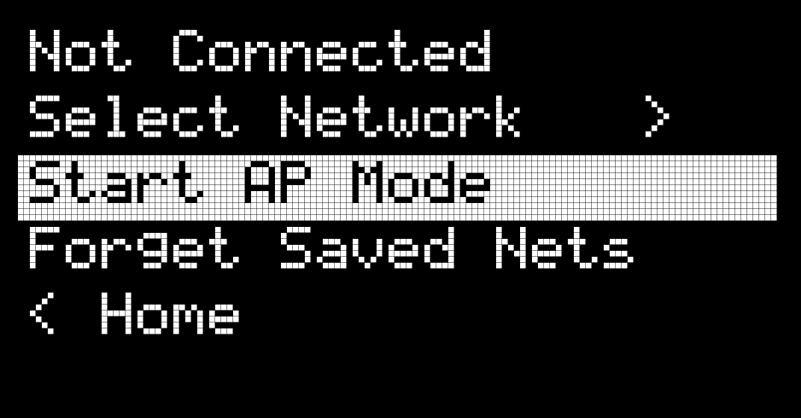

- - - - - -

The updated WiFi Setup screen will show new bits of information:

1. The top line now says *AP Mode* to indicate the WiFi network has been created with the name *ORGANELLE*.
1. The second line displays the IP address for the browser.
1. The third line shuts down *AP Mode*
1. The fourth line is a command to start the *Web Server* so you can view the browser. More on this in the section 5.4.

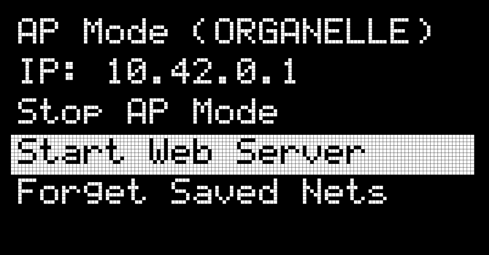

Now we can join this network from another device.  On your computer open WiFi settings and look for the network named 'Organelle'.

When you are prompted for a password type 'coolmusic'.  We are now connected to the Organelle's own WiFi network.

> NOTE: We have found that some devices will not connect to the 'ORGANELLE' network. "Your mileage may vary" in this regard.

### 5.3 Now That You're Connected

By joining an existing network or creating an AP, there are some new possibilities for your Organelle:

The first is that the Organelle has saved the network and password and will automatically join it if it is present the next time the Organelle boots up (and the USB WiFi adapter is connected). 

Next, Ableton Link-enabled patches will create a Link session. Not all user-contributed patches have this feature, so check the patch documentation when in doubt. If your network or AP has any devices (phones, computers, groove boxes, etc.) connected to it that also have Link capabilities, they will be in tempo sync. If there are more than one LINK devices on the network/AP, Link-enabled Organelle patches will automatically display 'LINK' next to the tempo as shown here:

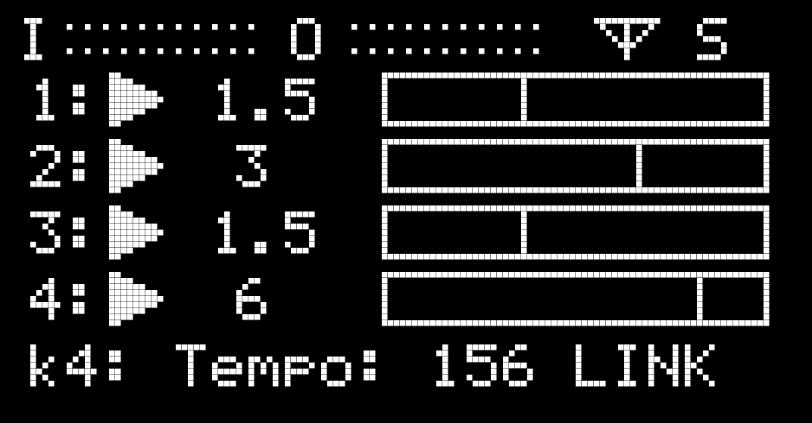

The next is that you can select 'Forget Saved Net[work]s' from the WiFi menu and it will delete the name and password of existing networks you have joined. Deleting this information will be complete the next time the Organelle is shut down.

Lastly, you can now use the Organelle's web interface to manage patches, back up recordings, and other file management opportunities! This topic requires its own section, so please proceed to section 5.4!

### 5.4 Web Interface

> NOTE: This section assumes 1. the Organelle is connected to an existing network or running in AP mode, and 2. that your computer is on the same network. Please see the earlier sections of this chapter for any questions about WiFi. 

In order to wirelessly manage patches and other files, we use the Organelle's web interface. The Organelle's web interface is disabled by default, so first we need to turn it on. In WiFi Setup select **Start Web Server**:

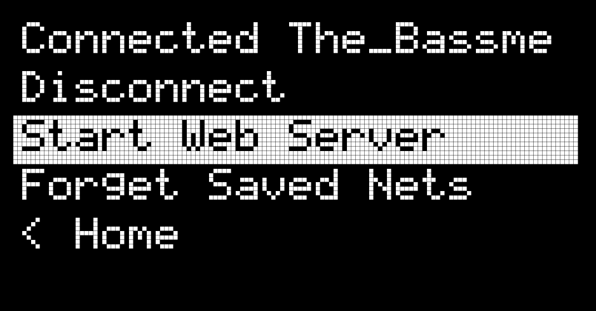

On your computer open a web browser and navigate to the IP address listed on the WiFi Setup page. Be sure your browser is connecting with 'http://' and not 'https://'. This will bring you to the Organelle's page:

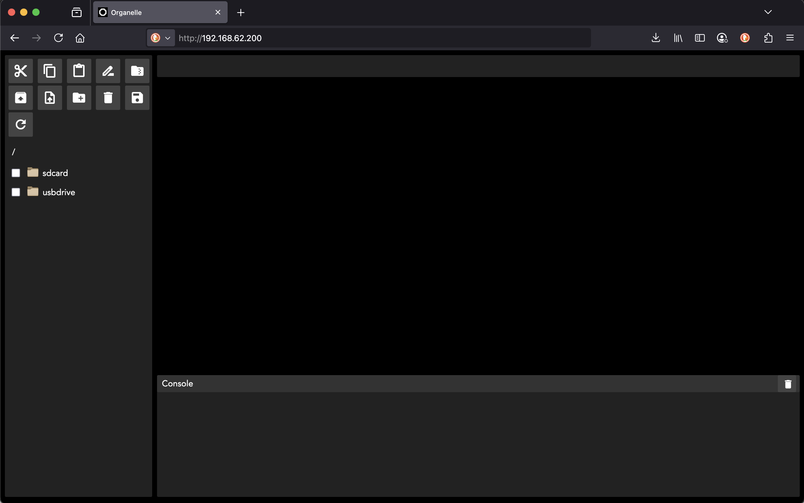

From this screen you can manage files and preview audio files just like you can with your computer's Finder/File Explorer. You can upload, download, move, add, delete, and copy files and folders on both the storage partition of the microSD card and the USB drive (if one is connected). It is also possible to move files between a USB drive and microSD. First, we'll discuss the elements of the web interface and then move on to how to manage patches. 

#### Elements of the Web Interface

This page is divided into three sections/panes: 

1. `Control` - narrow strip on the left side
1. `Code` - largest pane in the middle
1. `Console` - along the bottom

Let's break these down:

##### The Control Pane

There are eleven command icons for standard file management processes. If you hover over them with your mouse, their label will appear. The commands are:

-    - *Cut* - cuts selected files/folders.

-    - *Copy* - copies selected files/folders.

-    - *Paste* - pastes cut/copied files/folders into the current folder.

-    - *Rename* - renames selected file/folder.

-    - *Zip* - zips a selected folder.

-    - *Unzip* - unzips into the current folder.

-    - *Upload* - uploads a file to the current folder.

-    - *New Folder* - creates a new folder in the current folder.

-    - *Delete* - deletes selected file(s)/folder(s).

-    - *Save* - saves changes to file currently displayed in the `Code` pane. 

-    - *Refresh Patches* - refreshes file list on the Organelle's OLED screen.

Below the command icons is a file browser. Click into folders to view their contents. Click the file path above the file list to go 'back'. If you click into a file, it will be displayed in the `Code` pane. 

##### The Code Pane

If you click through the file browser and end up in, say: `sdcard/Patches/Synthesizers/Chordi/chord-list.txt`, it would open that text file in the `Code` pane (the largest pane). This code is editable! In this example, you could change the chords for that patch:

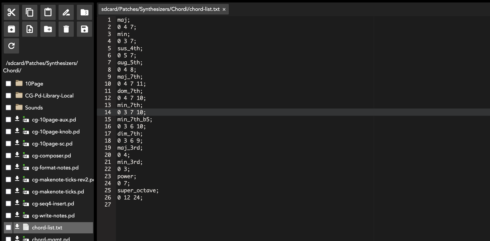

After you made your changes, simply click the `Save` icon in the `Control` pane and relaunch the patch on your Organelle. 

> NOTE: Editing files is a powerful feature so please be careful!

> NOTE: Some files cannot be opened in the `Code` pane. Examples of this are: .mid (MIDI files), and .pd_linux. 

Another useful aspect of the `Code` pane is to preview audio files. Simply navigate to a sound file like `/scard/Patches/Samplers/Breno/stems/stems-1` and click it to open. You will see it displayed like this: 

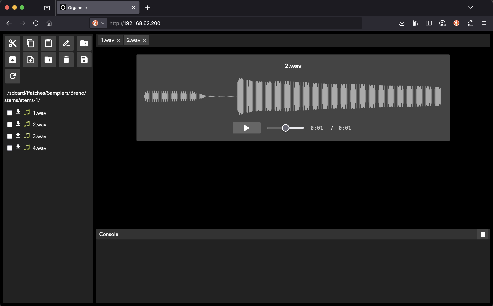

Click the 'play' button below the waveform and it will play on your computer. This feature is helpful if you're reorganizing samples in a patch, uploading new samples, downloading recordings. etc. 

##### The Console Pane

To assist with with programming, the editor has a `Console` so you can view some of the processes on the Organelle. The `Trashcan` icon on the top right corner of this pane clears the pane.

#### Managing Patch Files

The web interface provides all the functions you will need to manage files. Uploading new patches, moving them around, archiving and downloading backups are all possible.  The following are some common operations you can perform with the web interface.

**Uploading a New Patch:** The web interface supports uploading one or more files at a time, but you can't upload unzipped folders. For this reason we want to upload patches in the .zip or .zop format.  This is convenient because patches are distributed in this format anyway.  

After you download a patch from [the patches page](https://www.critterandguitari.com/organelle-patches) or [Patch Storage](http://www.patchstorage.com) or another source, press the **Upload** button in the web interface. Select the .zip or .zop patch file and click OK. A progress bar will indicate upload progress.  

Next click the **Refresh Patches** icon in the `Control` pane. Now on the Organelle's Patch Menu you should see **Install [Patch name].zip** (or .zop). For example, after uploading a patch named 'New_Patch' in .zip format you should see:

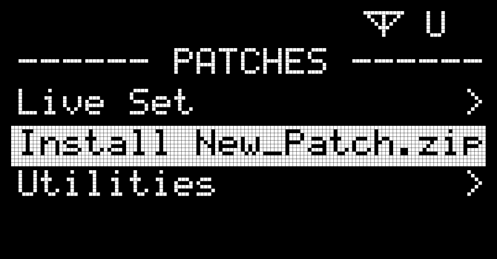

Select this and it will uncompress the patch and remove the .zip or .zop file.  

**Categorizing Patches in Sub Folders:** You can move patches around on the storage device (or even between USB and microSD). In this example we will create a sub folder and then move in some patches.  

First navigate to the **SD Card** in the file browser in `Control` pane.  Then click into the 'Patches' folder. Now press the **New Folder** button to create a new sub folder and give it a name. To move patches into the new folder is a two part operation.  First select one or more patch folders by checking the Select box next to the desired folder.  Then press the **Cut** button.  Navigate to the folder you want to move the items into and press the **Paste** button.

Hit the **Refresh Patches** icon to update the patch menu on the Organelle.

**Renaming a Patch**: Select the the patch folder you wish to rename and hit the **Rename** button.  

**Downloading a Patch:** The Patch Manager supports downloading single files by pressing the download icon next to any file in the browser.  To download an entire patch we must first zip into a single compressed file.  Select the patch folder you wish to download and press **Zip**.  This will create a .zip file of the same name that you can download.  

**Deleting a Patch:** Select one or more patch folders and press the **Delete** button. 

------------------------------------------------------------------------ 

## 6. Editing and Creating Patches

See [Organelle Programming](organelle_programming.md) for details on editing and creating patches.

## 7. Additional Info

### 7.1 Burning SD Card Disk Image 

In addition to storing patches, the micro SD card also stores the Organelle's operating system.  

Burning a new disk image on the micro SD card will reset your Organelle to the factory state.  This is useful to update to the latest Organelle OS, or to fix a problem with the micro SD card.  

This will completely wipe the micro SD card clean, so make sure to backup anything on there that you need. See Chapter 5 for information on downloading your patches and files or moving them to a USB drive. You can also use a brand new card if you wanted to keep your old OS available.   

Follow these steps to burn a new SD card:

1. Download the microSD card disk image to your computer: 

	- Current OS release: [OGM-5.0](https://cgdiskimages.nyc3.digitaloceanspaces.com/OGSMS2_v5.0.img.zip). Requires 8GB or larger microSD card.

 
2. Download the flasher program to your computer: https://www.balena.io/etcher/  
3. Power down the Organelle
4. Locate the thin slit in the rear of the enclosure (between the MIDI In port and the HDMI Port.)
5. Use a pin or paperclip to press in on the black SD card to eject it and it will spring out gently.
6. Insert microSD into your computer (you may need an adapter or card reader)
7. Use the Etcher program to burn the OS file to the SD Card. It is best to select the **zipped** file to burn (i.e. do not unzip the downloaded disk image). When Etcher is finished your computer may display a message similar to 'This disk is not readable.' This message is normal and you may click 'Eject' to proceed.
8. Remove the microSD card from your computer and reinsert it in Organelle. Make sure that the SD card is going into the socket on the circuit board. If you can wiggle it a lot, it probably is not in socket. Use the same pin/paperclip to press it in until you hear/feel a 'click.'
9. Restart the Organelle. Check your OS version in Settings/Info. 

