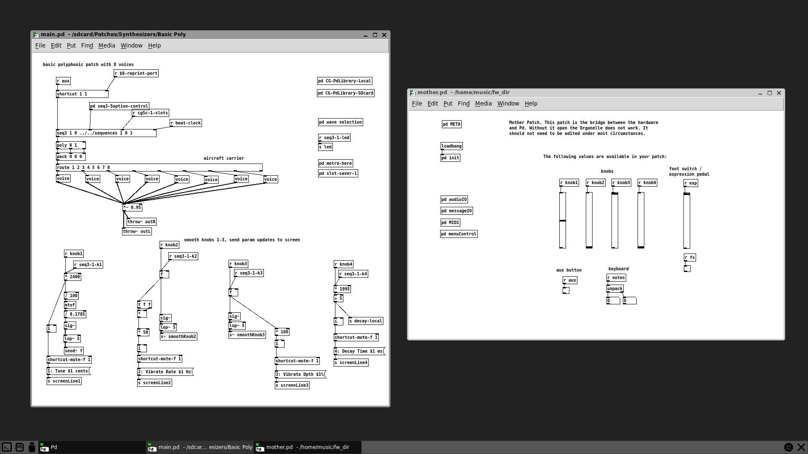

# Organelle Programming

The Organelle is an open platform that allows you to customize and create your own patches. Traditionally this has been accomplished using the graphical music programming environment Pure Data (Pd). More recently, other programming languages are making their way into Organelle patches, for example the DSP language Faust, and the scripting language Lua. 

There are several ways to edit patches on the Organelle: through the built-in web editor, remotely via VNC, or natively by connecting a monitor, keyboard, and mouse. The best method depends on what you are editing — text-based languages like Faust and Lua work great in the web editor, while graphical Pure Data patches are best edited via VNC or natively.

This manual is written for Organelle OS 5. The Pd and native editing sections apply to all Organelle versions.

------------------------------------------------------------------------

## 1. Editing Methods

### 1.1 Native (HDMI + Keyboard + Mouse)

You can connect a monitor, keyboard, and mouse directly to the Organelle for a traditional desktop editing experience. This provides a straitforward way to edit patches. 

#### 1.1.1 Keyboards and Mice

Just about any USB mouse should work with the Organelle, and most PC-style USB keyboards should also be fine. Additionally, mice and keyboards that have their own USB wireless dongles should also work with the Organelle. So long as the data is coming across a USB port, your peripherals will probably work.

> **NOTE:** While we have aimed to support regular USB keyboards, not all manufacturers implement the general USB standards in the same way. Accordingly, some keyboards may not work with the Organelle. Please report any finding of incompatibility on [our forum](http://forum.critterandguitari.com).

A USB hub can be connected to the Organelle if you need more ports.

#### 1.1.2 Starting the Desktop

After you have connected an HDMI monitor and powered it on, you will see a terminal window for text entry. To optimize performance, the Organelle runs in this fashion (with no graphical user interface, or GUI) by default.

**To start the Organelle's graphical operation mode:** type **startx**, and then press the \[ENTER\] / \[RETURN\] key.

> **NOTE:** Booting the Organelle's graphical operation mode causes the system itself to be reloaded. This means that any currently loaded patch will be unloaded, and any audio output being produced will cease.

After typing **startx** you will see an empty desktop screen.

The operating system has been stripped down in favor of achieving the most stable audio performance. There are five icons along the bottom of the screen. If you hover over the icons with your mouse, their labels will appear on screen. From left to right:

-    - *Open Terminal* - represents a command-line interface (CLI). A terminal emulator instance starts when you click this icon.

-    - *Open SD Card* - opens a file browser window to the **SD card's** storage partition. Among other items, you will see the **Patches** folder here.

-    - *Open USB Drive* - opens a file browser window showing the contents of a connected **USB Drive**. If no drive is connected, no files will be displayed. If you connect a **USB Drive** after boot up, be sure to select **Reload** from the Organelle's **Storage** menu. It may take a few seconds for the files to be displayed on the desktop so feel free to click the icon & close the window until the window is updated.

-    - *Restart OG Menu* - This will close out all open windows and unload the current the Organelle patch, interrupting any ongoing audio output and restarting the menu on the **OLED Screen**.

-    - *Exit GUI* - This will close out all open windows and unload the current the Organelle patch, interrupting any ongoing audio output. When you are done working in this graphical operation mode, you should click this icon. It is better to revert the Organelle to its normal CLI mode and keep the processor focused on audio tasks.

While you can navigate the file system with the keyboard and mouse, the best way to load a patch is to do it from the Organelle's hardware. By using the **Selector** encoder to choose and load a patch, you will then see the patch visually loaded by the Organelle along with a crucial helper patch. If we launch the **Basic Poly** patch using the **Selector** you will see a screen similar to this:



The Organelle unit itself is now functioning as we would normally expect it to: the patch has been loaded, the Organelle's hardware display has shifted to the patch information screen, and audio can now be produced.

Within the computer interface, we are now seeing the behind-the-scenes implications of loading a patch. Our patch has been loaded, and its main.pd file is taking up most of the screen. But sitting to the right of the patch we expected is one we did not — **mother.pd** (see [Under the Hood](#the-motherpd-helper-patch) below).

By clicking on your loaded patch, it will move **mother.pd** to the background (without closing it) and allow you to focus on working with your patch.

The Linux file browser can be used as you would *File Explorer* (on Windows) or *Finder* (on Mac) to navigate, rename, or delete files.


### 1.2 Web Editor

The Organelle has a built-in web editor for editing patch files over WiFi. See [Section 5.4 Web Interface](og_sms2.md#54-web-interface) in the Organelle M/S/S2 manual for setup and usage instructions.

### 1.3 VNC

VNC allows you to remotely view and control the Organelle's desktop from another computer. This is especially useful for editing Pure Data patches graphically without needing to connect a monitor directly to the Organelle.

To use VNC you must first be connected to a local network. See the Organelle manual for getting your Organelle connected using WiFi. To enable the VNC server navigate to Settings -> VNC Server in the System menu of the Organelle. Select **Start VNC Server**. Now you should be able to connect remotely from any computer on the same WiFi network using a VNC client. We use the VNC viewer from RealVNC. You can download this software for free from RealVNC: [VNC Viewer](https://www.realvnc.com/en/connect/download/viewer)

After starting the VNC viewer, you will need to use the IP address of the Organelle to connect. You can see the Organelle's IP address in the WiFi screen or the Info screen of the Settings menu.

Once you are connected you should see the Organelle desktop appear in a window on your computer. You can now launch a patch on the Organelle and edit Pd files just as you would using a monitor, keyboard, and mouse.


------------------------------------------------------------------------

## 2. Patch Languages & Environments

### 2.1 Pure Data

Pure Data (Pd) is the original and most common patching environment on the Organelle. Pd patches are graphical — you connect objects with virtual patch cables. Each patch lives in its own folder and contains a **main.pd** file.

Pd patches can be edited natively (with HDMI + keyboard + mouse) or remotely via VNC. The web editor can be used for quick text edits to Pd files, but the graphical patching experience requires a full desktop.

The actual process of creating and editing Pd patches is covered in a series of [tutorial videos](https://youtu.be/wMmq8n2iq8U?list=PLsGeYhHwePZjYOvyj7xcMxFs-hO95L1ju).

### 2.2 The Faust-Lua-Jam Patch

In this section we'll use the [Flutetine](files/Flutetine.zip) patch as an example. Download it and install it on your Organelle to follow along.

This patch features a hybrid architecture that combines three software systems: Faust, Lua, and Pd. It might seem excessive to use three environments, but each one excels at what it does. Faust synthesizes the sound, which is exactly what it was designed for. Lua, via the Jam system, handles all the control-rate logic: notes, knobs, sequencing, arpeggiation. Pd ties everything together and manages communication with the Organelle hardware. The other [PLAY](og_sms2.md#12-play-and-explore-patches) patches use the same architecture.

This separation of roles follows clear conceptual lines: the Lua code is the "mind" deciding what notes to play and how to play them, while the Faust code describes the musical instrument that plays those notes.

Using the web editor, you can edit source files, compile where necessary, and reload the patch, all without leaving the browser. You can change the entire musical behavior and sound characteristics of the instrument from the same editor. This setup also works well with LLM-assisted programming, since the Lua and Faust source files are self-contained and text-based.

#### 2.2.1 Architecture Overview

A PLAY patch folder contains the following key files:

| File | Language | Role |
|------|----------|------|
| `main.pd` | Pd | Loads the Jam object and Faust synth, routes audio and messages |
| `jam.lua` | Lua | Main Jam script: defines instrument behavior (notes, knobs, sequencing, presets) |
| `fsynth.dsp` | Faust | Synthesizer DSP definition (oscillators, filters, envelopes, effects) |
| `patterns/*.lua` | Lua | Selectable arpeggio/pattern sub-jams |
| `lib/` | — | Compiled externals, helper modules, and utilities |

<!-- TODO: add architecture diagram image -->
<!--  -->

The signal flow is:

1. The **Jam script** (`jam.lua`) receives input from the Organelle hardware (keys, knobs, encoder) and generates note and control messages.
2. These messages are sent to the **Faust synth** (`fsynth.dsp`), a compiled Pd object that synthesizes audio.
3. **Pd** (`main.pd`) connects everything and handles audio I/O.

#### 2.2.2 Faust: Defining the Sound

The `fsynth.dsp` file defines the synthesizer using the [Faust](https://faust.grame.fr/) DSP language. Faust is a functional language purpose-built for audio signal processing. A typical Organelle Faust synth defines a set of standard controls and a `process` function that produces stereo audio output.

Every PLAY synth receives the same set of inputs from the Jam system:

```
freq  — note frequency (Hz)
gain  — note velocity (0–1)
gate  — note on/off trigger
knob1 — mapped to Organelle knob 1 (0–1)
knob2 — mapped to Organelle knob 2 (0–1)
knob3 — mapped to Organelle knob 3 (0–1)
knob4 — mapped to Organelle knob 4 (0–1)
```

The `process` function combines oscillators, filters, envelopes, and effects to produce the final audio. Here is a simplified excerpt from the Flutetine patch:

```faust
freq = hslider("freq", 440, 20, 2000, 1);
gain = hslider("gain", 0.5, 0, 1, 0.01) : si.smoo;
gate = button("gate");
knob1 = hslider("knob1", 0.5, 0, 1, 0.001) : si.smoo;

// Envelope
ampEnv = gate : en.adsre(0.006, 0.28, 0.55, 0.22);

// Oscillator body
f0 = freq;
body = os.osc(f0) * 0.55 : fi.lowpass(1, lpCut) : *(ampEnv);

// Stereo output
process = (body, body) : (*(gain), *(gain));
```

**Editing and compiling Faust:**

1. Open `fsynth.dsp` in the web editor.
2. Make your changes to the DSP code.
3. Save the file.
4. Press the **Compile** button in the web editor. This runs the `compile.sh` script, which calls `faust2puredata` to compile the `.dsp` file into a Pd external (`fsynth~.pd_linux`).
<!-- TODO: add compile button screenshot -->
<!--  -->
5. Press **Reload** to reload the patch and hear your changes.
<!-- TODO: add reload button screenshot -->
<!--  -->

A good workflow is to save different synth variations as separate `.dsp` files, or duplicate the entire patch folder to preserve a version you like before experimenting further.

#### 2.2.3 Lua: Programming Musical Behavior

The control logic for PLAY patches is written in Lua using the [Jam](https://github.com/owenosborn/jampd) system. Jam is a Pd external that loads and runs Lua scripts, providing a timing and message framework for composing musical behavior. A Jam script defines functions like `init`, `tick`, and `notein` that respond to events and produce musical output. The best place to start is the arpeggio pattern scripts.

#### 2.2.4 Arpeggio Patterns

Each PLAY patch ships with 14 selectable arpeggio patterns stored in the `patterns/` folder. These are selected by pressing the white keys while holding the Aux button. Each pattern is a short, self-contained Jam script that transforms held notes into rhythmic patterns.

A pattern script defines three functions:

- **`init(jam)`** — called once when the pattern loads. Set up any state you need here.
- **`tick(jam)`** — called on every rhythmic tick. This is where the pattern generates notes.
- **`notein(jam, note, velocity)`** — called when a note is pressed or released. Use this to track which notes are held.

The `jam` object passed to these functions provides timing and output:

- `jam.bpm` — current tempo
- `jam.every(interval)` — returns true at regular beat intervals (e.g., `jam.every(1/4)` for sixteenth notes, `jam.every(1)` for quarter notes)
- `jam.noteout(note, velocity, duration)` — send a note with automatic note-off after the given duration (in beats)

Here is the simplest pattern, "None", which just passes notes straight through with no arpeggiation:

```lua
function init(jam)
end

function tick(jam)
end

function notein(jam, note, velocity)
    jam.noteout(note, velocity)
end
```

And here is a more interesting arpeggio pattern that cycles through the notes being held down:

```lua
function init(jam)
    notes = {}  -- held notes in order pressed
    index = 1
end

function tick(jam)
    if #notes > 0 and jam.every(1/4) then
        if index > #notes then index = 1 end
        jam.noteout(notes[index], 100, 0.2)
        index = index + 1
    end
end

function notein(jam, n, v)
    if v > 0 then
        -- Add note and sort ascending
        table.insert(notes, n)
        table.sort(notes)
    else
        -- Remove note
        for i, note in ipairs(notes) do
            if note == n then
                table.remove(notes, i)
                if index > #notes then index = 1 end
                break
            end
        end
    end
end

```

The pattern files are a great place to start experimenting. They are short and self-contained, and you don't even need to reload the patch to hear your changes. Just edit and save the file, then re-select the pattern on the Organelle (Aux + white key) and the updated Lua file is loaded immediately. Try changing the timing (`jam.every(1/4)` to `jam.every(1/8)`), the octave logic, or the note selection to hear how it affects the musical output.

<!-- TODO: add screenshot of pattern files in web editor -->
<!--  -->

#### 2.2.5 The Main Jam

The arpeggio patterns live inside a larger Jam script, `jam.lua`, that manages the overall instrument behavior. This main Jam handles all the things you see when you play a PLAY patch: responding to knobs, managing latch, recording and playing back sequences, saving presets, transposing octaves, and loading the arpeggio patterns as sub-jams.

You can edit `jam.lua` too if you want to change how the instrument works at a deeper level. It uses the same Jam functions, just with more of them and more complex state management. See the [Jam documentation](https://github.com/owenosborn/jampd) for the full API.

------------------------------------------------------------------------

## 3. Under the Hood

### 3.1 The **mother.pd** Helper Patch

**mother.pd** exists at the root (or top) directory of the Organelle, which is located on the microSD that comes preloaded within the Organelle hardware. This helper patch is the other half of the data handshake between the Pure Data patches we run and the Organelle's hardware.

In short, this helper patch is executing the raw communications with the Organelle hardware. (This is done using the *Open Sound Control* \[*OSC*\] protocol.)

Accordingly, **mother.pd** is necessary for the general operation of the Organelle. That is why this patch is loaded concurrently with any patch that you call up.

> **NOTE:** In general, you should not edit **mother.pd**. That being said, the Organelle will use any file named **mother.pd** that it finds within the **Patches** folder of your microSD card or USB drive. By copying the root directory's **mother.pd** to your **Patches** folder, you could experiment with editing this patch while keeping the master version clean. Again, you probably don't want to do this.

### 3.2 The Patch Load Sequence

Anytime a patch is loaded, the Organelle goes through a sequence of steps.

1.  If a patch is currently loaded, it receives a quitting message. This allows any "cleanup" processes to be executed.
2.  If a patch is currently loaded, it then prompts the Pure Data application to quit. This effectively closes any and all open patches, including the **mother.pd** helper patch.
3.  The Pure Data application is relaunched, and the patch we have requested is then opened, specifically the file main.pd in the patch's folder.
4.  The **mother.pd** helper patch is loaded.

Once this sequence completes, all assets needed for your patch to communicate with the Organelle will be loaded and ready to go. So the general flurry of windows closing and opening that you see in the Organelle's graphical operation mode is both expected and proper.

------------------------------------------------------------------------

## 4. Tips

### 4.1 Creating a New Patch

Duplicate a simple patch in your **Patches** folder, rename the new folder, and then open the contained **main.pd** patch for editing. (You could also create your own "new patch" template for this purpose.)

### 4.2 Using Externals

Explore the factory patches — in addition to finding ideas and platforms that you can build upon, you will also encounter some external objects that are not part of the Vanilla Pd distribution. To use an external in a patch of your own, copy it to your patch's folder.

> **NOTE:** Externals that you encounter here are built for the Linux operating system that the Organelle is running. If you are building patches on your own computer, these externals will only work if you are also running Linux (these compiled externals are platform-specific).
