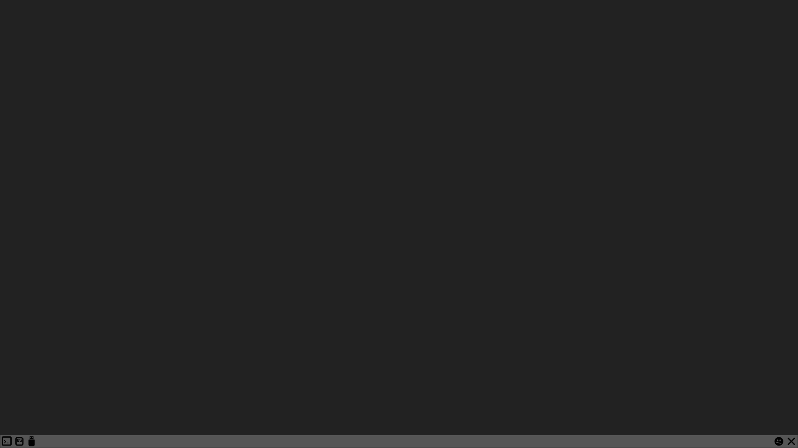

# Organelle Programming

The Organelle is an open platform that allows you to customize and create your own patches. Traditionally this has been accomplished using the graphical music programming environment Pure Data (Pd). More recently, other programming languages are making their way into Organelle patches, for example the DSP language Faust, and the scripting language Lua. 

There are several ways to edit patches on the Organelle: through the built-in web editor, remotely via VNC, or natively by connecting a monitor, keyboard, and mouse. The best method depends on what you are editing — text-based languages like Faust and Lua work great in the web editor, while graphical Pure Data patches are best edited via VNC or natively.

------------------------------------------------------------------------

## 1. Editing Methods

### 1.1 Native (HDMI + Keyboard + Mouse)

You can connect a monitor, keyboard, and mouse directly to the Organelle for a traditional desktop editing experience. This provides a straitforward way to edit patches. 

#### 1.1.1 Keyboards and Mice

Just about any USB mouse should work with the Organelle, and most PC-style USB keyboards should also be fine. Additionally, mice and keyboards that have their own USB wireless dongles should also work with the Organelle. So long as the data is coming across a USB port, your peripherals will probably work.

> **NOTE:** While we have aimed to support regular USB keyboards, not all manufacturers implement the general USB standards in the same way. Accordingly, some keyboards may not work with the Organelle. Please report any finding of incompatibility on [our forum](http://forum.critterandguitari.com).

A USB hub can be connected to the Organelle if you need more ports.

#### 1.1.2 Starting the Desktop

After you have connected an HDMI monitor and powered it on, you will see a terminal window for text entry. To optimize performance, the Organelle runs in this fashion (with no graphical user interface, or GUI) by default.

**To start the Organelle's graphical operation mode:** type **startx**, and then press the \[ENTER\] / \[RETURN\] key.

> **NOTE:** Booting the Organelle's graphical operation mode causes the system itself to be reloaded. This means that any currently loaded patch will be unloaded, and any audio output being produced will cease.

After typing **startx** you will see a screen like this:

The operating system has been stripped down in favor of achieving the most stable audio performance. There are five icons along the bottom of the screen. If you hover over the icons with your mouse, their labels will appear on screen. From left to right:

-    - *Open Terminal* - represents a command-line interface (CLI). A terminal emulator instance starts when you click this icon.

-    - *Open SD Card* - opens a file browser window to the **SD card's** storage partition. Among other items, you will see the **Patches** folder here.

-    - *Open USB Drive* - opens a file browser window showing the contents of a connected **USB Drive**. If no drive is connected, no files will be displayed. If you connect a **USB Drive** after boot up, be sure to select **Reload** from the Organelle's **Storage** menu. It may take a few seconds for the files to be displayed on the desktop so feel free to click the icon & close the window until the window is updated.

-    - *Restart OG Menu* - This will close out all open windows and unload the current the Organelle patch, interrupting any ongoing audio output and restarting the menu on the **OLED Screen**.

-    - *Exit GUI* - This will close out all open windows and unload the current the Organelle patch, interrupting any ongoing audio output. When you are done working in this graphical operation mode, you should click this icon. It is better to revert the Organelle to its normal CLI mode and keep the processor focused on audio tasks.

While you can navigate the file system with the keyboard and mouse, the best way to load a patch is to do it from the Organelle's hardware. By using the **Selector** encoder to choose and load a patch, you will then see the patch visually loaded by the Organelle along with a crucial helper patch. If we launch the **Basic Poly** patch using the **Selector** you will see a screen similar to this:

The Organelle unit itself is now functioning as we would normally expect it to: the patch has been loaded, the Organelle's hardware display has shifted to the patch information screen, and audio can now be produced.

Within the computer interface, we are now seeing the behind-the-scenes implications of loading a patch. Our patch has been loaded, and its main.pd file is taking up most of the screen. But sitting to the right of the patch we expected is one we did not — **mother.pd** (see [Under the Hood](#the-motherpd-helper-patch) below).

By clicking on your loaded patch, it will move **mother.pd** to the background (without closing it) and allow you to focus on working with your patch.

The Linux file browser can be used as you would *File Explorer* (on Windows) or *Finder* (on Mac) to navigate, rename, or delete files.

### 1.2 Web Editor

<!-- TODO: describe the web editor — how to access it (WiFi / IP address), what it looks like, what languages/file types it works well for -->

### 1.3 VNC

VNC allows you to remotely view and control the Organelle's desktop from another computer. This is especially useful for editing Pure Data patches graphically without needing to connect a monitor directly to the Organelle.

To use VNC you must first be connected to a local network. See the Organelle manual for getting your organelle connected using WiFi. To enable the VNC server navigate to Settings -> VNC Server in the System menu of the Organelle. Select start VNC server. Now you should be able to connect remotely from any computer on the same WiFi network using an VNC client. We use the VNC viewer from RealVNC. You can download this software for free from RealVNC: [VNC Viewer](https://www.realvnc.com/en/connect/download/viewer)

After starting the VNC viewer, you will need to use the IP address of the Organelle to connect. You can see the Organelle's IP address in the WiFi screen or the Info screen of the Settings menu.

Once you are connected you should see the Organelle desktop appear in a window on your computer. You can now launch a patch on the Organelle and edit Pd files just as you would using a monitor, keyboar, and mouse.

<!-- TODO: VNC setup instructions — enabling VNC, connecting from a VNC client, recommended clients -->

------------------------------------------------------------------------

## 2. Patch Languages & Environments

### 2.1 Pure Data

Pure Data (Pd) is the original and most common patching environment on the Organelle. Pd patches are graphical — you connect objects with virtual patch cables. Each patch lives in its own folder and contains a **main.pd** file.

Pd patches can be edited natively (with HDMI + keyboard + mouse) or remotely via VNC. The web editor can be used for quick text edits to Pd files, but the graphical patching experience requires a full desktop.

The actual process of creating and editing Pd patches is covered in a series of [tutorial videos](https://youtu.be/wMmq8n2iq8U?list=PLsGeYhHwePZjYOvyj7xcMxFs-hO95L1ju).

### 2.2 Faust

<!-- TODO: brief description of Faust on the Organelle, how patches are structured, best editing method (web editor) -->

### 2.3 Lua + Faust

<!-- TODO: brief description of Lua on the Organelle, how patches are structured, best editing method (web editor) -->

Other programming environments can be installed on the Organelle, such as SuperCollider.

<!-- TODO: brief notes on installing additional environments -->

------------------------------------------------------------------------

## 3. Under the Hood

### 3.1 The **mother.pd** Helper Patch

**mother.pd** exists at the root (or top) directory of the Organelle, which is located on the microSD that comes preloaded within the Organelle hardware. This helper patch is the other half of the data handshake between the Pure Data patches we run and the Organelle's hardware.

In short, this helper patch is executing the raw communications with the Organelle hardware. (This is done using the *Open Sound Control* \[*OSC*\] protocol.)

Accordingly, **mother.pd** is necessary for the general operation of the Organelle. That is why this patch is loaded concurrently with any patch that you call up.

> **NOTE:** In general, you should not edit **mother.pd**. That being said, the Organelle will use any file named **mother.pd** that it finds within the **Patches** folder of your microSD card or USB drive. By copying the root directory's **mother.pd** to your **Patches** folder, you could experiment with editing this patch while keeping the master version clean. Again, you probably don't want to do this.

### 3.2 The Patch Load Sequence

Anytime a patch is loaded, the Organelle goes through a sequence of steps.

1.  If a patch is currently loaded, it receives a quitting message. This allows any "cleanup" processes to be executed.
2.  If a patch is currently loaded, it then prompts the Pure Data application to quit. This effectively closes any and all open patches, including the **mother.pd** helper patch.
3.  The Pure Data application is relaunched, and the patch we have requested is then opened, specifically the file main.pd in the patch's folder.
4.  The **mother.pd** helper patch is loaded.

Once this sequence completes, all assets needed for your patch to communicate with the Organelle will be loaded and ready to go. So the general flurry of windows closing and opening that you see in the Organelle's graphical operation mode is both expected and proper.

------------------------------------------------------------------------

## 4. Tips

### 4.1 Creating a New Patch

Duplicate a simple patch in your **Patches** folder, rename the new folder, and then open the contained **main.pd** patch for editing. (You could also create your own "new patch" template for this purpose.)

### 4.2 Using Externals

Explore the factory patches — in addition to finding ideas and platforms that you can build upon, you will also encounter some external objects that are not part of the Vanilla Pd distribution. To use an external in a patch of your own, copy it to your patch's folder.

> **NOTE:** Externals that you encounter here are built for the Linux operating system that the Organelle is running. If you are building patches on your own computer, these externals will only work if you are also running Linux (these compiled externals are platform-specific).
