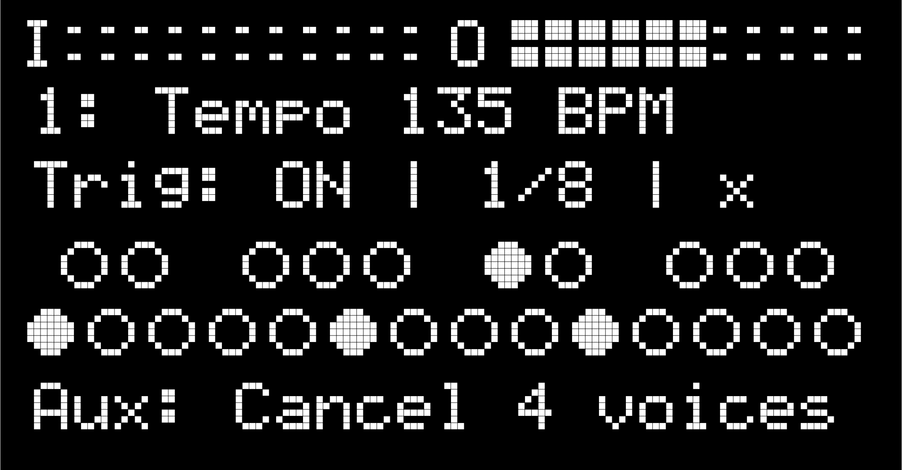

# Jeraphy

<iframe width="560" height="315" src="https://www.youtube.com/embed/SdG4pZu7NGI" title="YouTube video player" frameborder="0" allow="accelerometer; autoplay; clipboard-write; encrypted-media; gyroscope; picture-in-picture" allowfullscreen></iframe>

**Tags:** Sample Player, Looper, Link Enabled, Rhythm Maker

**[Download Patch](https://patchstorage.com/wp-content/uploads/2018/11/Jeraphy.zip)**

Loop samples in various synchronizations. Keep samples lockstep, retriggered on a given beat division, looping at different playback speeds, and more!

## Details

This is a multipage patch - each knob will have different roles depending on page. Link enabled for syncing with other devices on a shared wireless network.

Jeraphy loops samples endlessly until you turn them off. It loads 24 samples from the patch folder numbered 1.wav-24.wav, corresponding to each key. Replace with your own samples for customization. Visual keyboard shows which keys are currently looping.

A Global Metronome sends beats at the set Tempo and Beat-Division (e.g. at 120BPM and eighth notes the Global Metronome bangs every 250ms.) When a sample is turned on by pressing the corresponding Organelle key or an external MIDI note is received, the sample waits for the next Global Metronome beat to trigger. Then the sample loops forever based on the file's length in ms for WAVs at 16-bit depth and 44.1 samples. When the note is pressed again the loop stops. The Aux/Foot Switch cancels all loops.

With Sync-Mode ‘OFF’ the Speed knob will set the playback rate of the samples globally like a record player: the pitch and speed of sample playback are ‘Synced.’ If your sample files are different lengths they will loop at different periods, causing them to go out of phase (which could be cool, or not, depending on your samples).

With Sync-Mode ’ON’ samples are resized to the bar length of Tempo (for example: at 120BPM a bar length is 2000ms). This ensures that samples will loop in phase (AKA ‘synced’) with one another regardless of sample length.

If Re-Trigger mode is set to ‘ON’ samples re-trigger according to the Global Metronome. This is helpful when Sync-Mode is ‘OFF.’ But keep in mind that if Re-Trigger mode is set to ‘ON’ the samples may not play in their entirety (regardless of the Decay setting).

You can manual trigger all currently looping samples again by turning the Manual Trigger knob. If the loops were turned on with the same Beat-Division, they will all re-trigger at the same time. This also happens when switching over from Sync-Mode ‘OFF’ to Sync-Mode ‘ON.’ If the loops were turned on with different Beat-Divisions, they will re-trigger according to their individual beat divisions.

Decay is a volume envelope for each sample. It’s a percentage of the length of the sample.

The Filter is a low-pass filter to the left, no filter in the middle, and a high-pass filter to the right.

For the best ‘musical’ results make sure that each of your samples loops seamlessly. You can do the work easily in any DAW. Or use loops from libraries online. Samples are rounded up to the nearest bar based on 120BPM as a standard. so if a sample is closer to 4000ms it will loop for two bars(4000ms) not 2000ms, to avoid radical pitch warps. Or you could use whatever samples you have lying around and see what happens! Enjoy!
