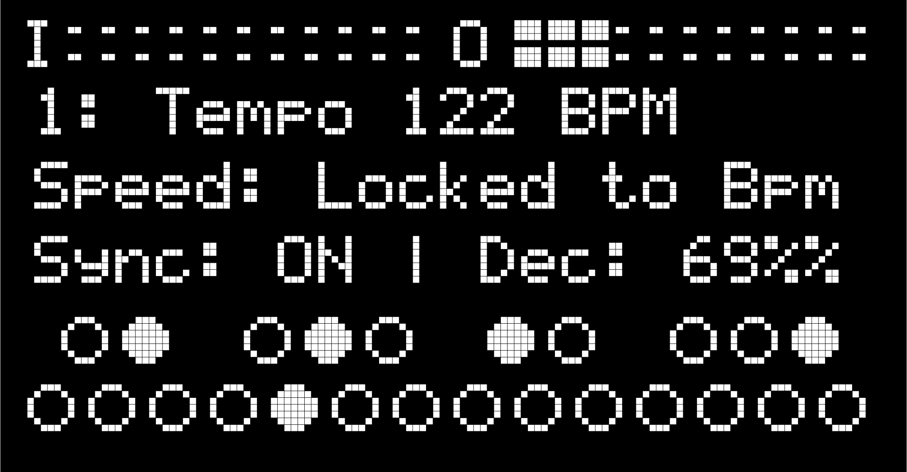

# Jeraphy Simple

**Tags:** Sample Player, Looper, Link Enabled, Rhythm Maker

**[Download Patch](https://patchstorage.com/wp-content/uploads/2018/11/Jeraphy-Simple.zip)**

This is a simpler version of *Jeraphy Visual*. Loop samples in various synchronizations. Keep samples lockstep, retriggered on a given beat division, looping at different playback speeds, and more!

## Details

This is a single page patch. For more options see *Jeraphy Visual Keyboard*. Link enabled for syncing with other devices on a shared wireless network.

It loops samples endlessly until you turn them off. It loads 24 samples from the patch folder numbered 1.wav-24.wav, corresponding to each key. Replace with your own samples for customization.

For the best ‘musical’ results make sure that each of your samples loops seamlessly. You can do the work easily in any DAW. Or use loops from libraries online. Samples are rounded up to the nearest bar based on 120BPM as a standard. so if a sample is closer to 4000ms it will loop for two bars(4000ms) not 2000ms, to avoid radical pitch warps. Or you could use whatever samples you have lying around and see what happens!
