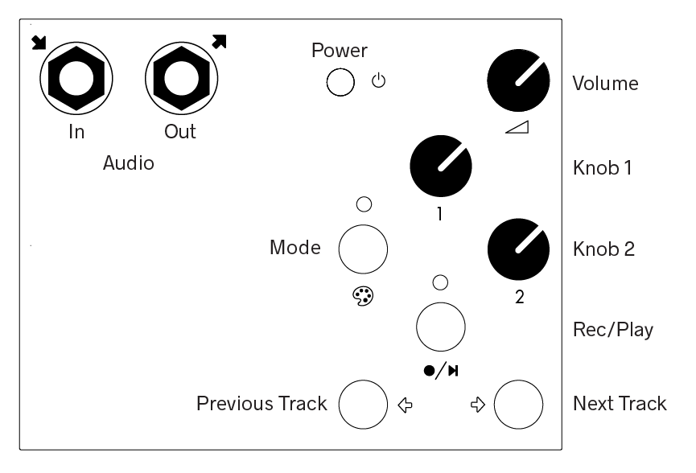
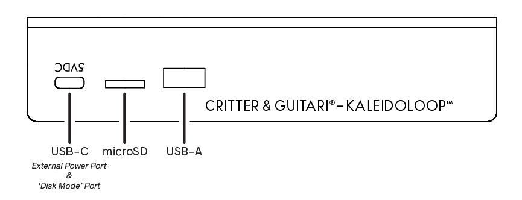
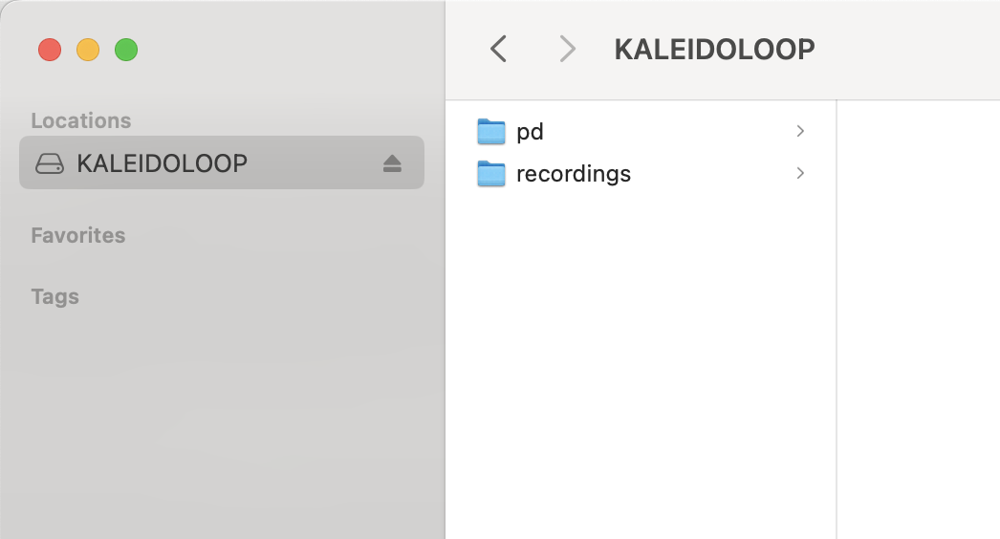
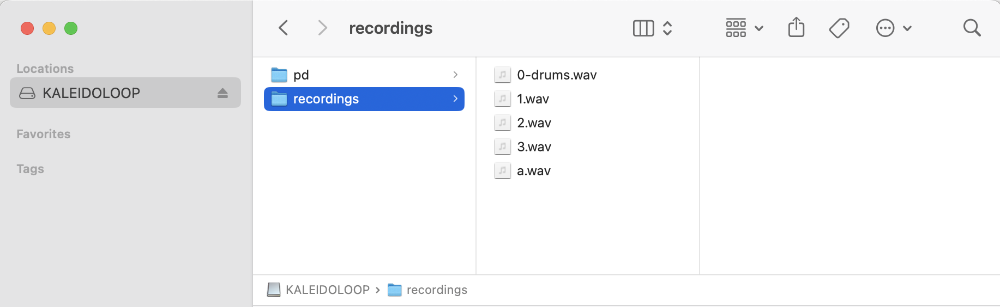
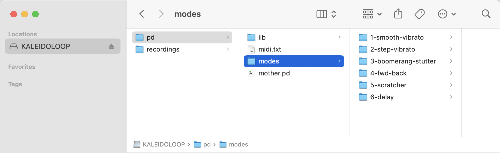

# Kaleidoloop User Manual

Kaleidoloop is portable sound recorder manipulator! Use this manual to help record and play back sounds!

## Getting Started

### Safety First!
As with all audio devices, it is important to protect your ears! Before using the Kaleidoloop, turn the volume knob down (all the way to the left). Then make all cable connections, turn it on, and *then* slowly turn up the volume. This will avoid unexpected bursts of sound from your speakers or headphones. 

### Quick Setup
You probably want to get started right away! Here are a few steps to get you making music.
   
1. Get power connected: Install batteries (see below) or connect the USB-A end of the cable to the USB power supply, the power supply to an outlet, then connect the other end to the USB-C jack on rear panel.  
1. Connect the microphone to the audio input jack - the top left jack.
1. Power on by pressing and holding the top-right button until the LEDs flash.
1. Record a sound by pressing the center button. The LED above the center button turns red during recording. 
1. Press the button again to stop recording.
1. Playback begins. The newly recorded sample will loop.
1. Press the mode button (top left button) to change playback mode and adjust Knobs 1 & 2 to manipulate plaback.
1. When additional recordings have been made, press the previous/next track buttons to select different tracks.

## The Top Panel

Here are the controls, LED indicators, and audio input and output jacks found on the top of your Kaleidoloop:

## The Rear Panel

Two USB ports and a microSD slot are found on the rear of your Kaleidoloop:

## Using Your Kaleidoloop

### Power

#### USB Power

First connect the USB-C power adapter. Connect the adapter to a power outlet, and then connect its plug to the leftmost port on the back of Kaleidoloop. 

Once Kaleidoloop is connected to power it will automatically power on. The LEDs will flash green, red, and red again, which means the unit is powered. If Kaleidoloop is already connected to power, press the Power Switch for one second, or until the LEDs turn on. 

The same button is used to power down. Hold the button for one second, or until the LEDs flash purple. Don't fret! Everything you've recorded is saved.

#### Batteries

To use your Kaleidoloop portably, add three 'AA' batteries to the battery compartment. To access the battery compartment, flip your Kaleidoloop over and remove the screw holding the battery door in place. With the door off, insert batteries so that the negative end (-) of the batteries are connected to the springs; the positive end (+) of the batteries are connected to the flat tabs. Replace the door and screw when finished.

When the batteries are running low, the Power button will turn red. You may notice that the power button briefly flash red when a louder sound is played. This is normal and just means that the batteries are starting to get low. 

Warnings for battery use:  

- **Do not** mix battery types (such as NiMH & Alkaline).  
- **Do not** mix old & new batteries.  
- **Do not** mix used & fresh batteries.  

### Sound Output

Kaleidoloop outputs audio from the speaker or the right 1/4" monophonic audio Output Jack. Connect a 1/4" patch cable to speaker or mixer. The speaker is disabled when a cable is connected to the output jack.

Audio format: 48 kHz, 16-bit.

### Sound Input

The Kaleidoloop features a 1/4" monophonic microphone input jack.

This input is specifically designed for the Kaleidoloop microphone and provides a small amount of bias voltage to power the mic, so the Microphone will only work with the Kaleidoloop.

Audio format: 48 kHz, 16-bit, monophonic.

### Navigating Tracks

Everytime you record a loop it is stored in a growing list of loops. Navigate these sounds using the Next Track and Previous Track buttons. 

### Volume Control

Turn it up! This knob sets the volume for the speaker and output jack. 

### Record

Press the center button to begin recording. Press again to stop recording. When you stop recording the sound will immediately being looping. Playback will continue during record, so if you are recording with the mic and don't want it bleeding thru, turn the Volume knob down.

The LED above the Record button is green during playback, red during recording.

### Mode Select

This button cycles through six playback modes. The LED above the Mode button cycles through colors in this order: purple, pink, blue, green, orange, white.

### Knobs 1 & 2

These knobs control different parameters depending on the playback Mode. Please see the chart below to see what the knobs control in the 'stock' modes.

Some modes use a knob to control the playback speed of the recordings. When this knob crosses   the threshold of 100% forward playback, the two LEDs quickly flash red-green-blue. 

### Harnessing 100% of Your Kaleidoloop

As mentioned above, playback continues during recording. This opens up all kinds of possibilities for creating new sounds. During recording you can do any/all of the following:

* Adjust the volume of the playback
* Select a different playback Mode
* Adjust Knobs 1 & 2 to change playback speed, direction, or other mode parameters
* Use Previous / Next Track select buttons to play different recordings

Things may get out of hand fairly quickly. Embrace it! - you never know what you might create!

## Default Playback Modes

The 'stock' **Modes** are:  

|Mode |Mode LED Color | |Name |Knob 1 |Knob 2 |
|:---:|:---:|:---:|:---:|:---:|:---:|
|1|Purple |  |Smooth & Vibrato |Speed Modulation Rate (vibrato)|-4x to +4x Playback Speed|
|2|Pink |  |Step & Vibrato |Speed Modulation Rate (vibrato)|-4x to +4x Playback Speed in 0.5x intervals|
|3|Blue | |Simultaneous Forward & Backward Playback | Mix of two playback tracks|-4x to +4x Playback Speed|
|4|Green | |Distortion & Filter|Distortion Amount|Filter Cutoff Frequency|
|5|Orange | |Reverb|Room Size|Wet/Dry Mix|
|6|White | |Delay|Feedback Amount|Delay Time: 0-2000ms|

## File Management 

### Disk Mode 

Let's say you like the loops you've made and would like to hear them / save them on a computer. The Kaleidoloop has a built-in file managment function called *Disk Mode* to facilitate saving and uploading sound files, customizing playback modes, and backing up your Kaleidoloop.

### Entering Disk Mode

If Kaleidoloop is powered from a power outlet, turn it off. If it is powered from a computer's usb port, you're halfway there! Connect a USB-C cable (like the one used to power the unit) to a computer's USB port). 

While Kaleidoloop is on and connected to the computer, press the **Next Track** button and while holding it down press the **Mode** button.  Release both buttons and the Kaleidoloop will enter disk mode. The LEDs will flash red/green/blue to indicate disk mode.

In Disk Mode, Kaleidoloop itself is no longer in its default 'recording mode' and no new recordings can be made.  The buttons will not have their normal functions. Instead each will emit a test tone when pressed. This is purely for testing procedures. Do not be alarmed if you press a button and hear a beep. 

### File Management in Disk Mode

On your computer, open a file browser (Finder for Mac, Explorer for Windows). In the disks, select 'KALEIDOLOOP'. In the 'recordings' folder are all the recorded loops.

**Important**: When you are done using Disk Mode, first eject the KALEIDOLOOP drive from your computer as you would for a standard USB drive or external hard drive. 

Exit Disk Mode with the same key combo: pressing NEXT and while holding it down pressing MODE.

### Loading Your Own Loops
The Kaleidoloop will save its monophonic recordings with numbers: 1.wav, 2.wav, and so on. You can add your own files to the SD card using Disk Mode. The files can be named whatever you would like, but know that the Kaleidoloop will sort the files by number first and then letter as shown here:

Some file tips:

* Please avoid 'spaces' in file names. Use hyphens and/or underscores instead: *0_cool-drums.wav*. 
* Files must be monophonic and in the 48KHz 16-bit .wav format.

### Customizing Playback Modes

You can also use Disk Mode to reorder, remove, and/or upload new playback modes to the Kaleidoloop. The playback modes can be found here:

The Kaleidoloop needs each mode to be in its own folder. Each folder name needs to begin with a number 1-6 (no repeats). Modes are writen in Pure Data. Each folder needs to have a 'module.pd' file and a copy of the 'waveplayer~.pd-linux' file.

## Specifications	

### Audio Settings

Kaleidoloop records and plays back audio at 16-bit 48kHz. Recorded audio files are in the WAV format.

### MicroSD Card

The operating system and all recordings are stored on the Kaleidoloop' microSD card. Each unit comes with an 8 GB card installed. This card can be inserted into a Windows computer to browse files and make changes, just like in Disk Mode. This feature is not supported on Mac, but using Kaleidoloop in Disk Mode will accomplish the same task. 

There is a 1 GB partition for the operating system and a 7 GB partition for audio recordings. At 16-bit 48khz, that's about 20 hours of record time. 

If a larger partition for audio recordings is desired, you may use a larger microSD card as long as it is first flashed with the operating system. Kaleidoloop will detect the remaining space upon its first boot up. The remaining space will become the new audio recording partition. 

### USB-A Jack

There is a USB-A port on the rear next to the microSD card slot. This port does not have a specific purpose at the time of this release. Stay tuned for future OS updates.

## Burning microSD Card Disk Image

Burning a new disk image on the micro SD card will reset your Kaleidoloop to the factory state. This is useful to update to the latest Kaleidoloop OS, or to fix a problem with the microSD card.

This will completely wipe the microSD card clean, so make sure to backup anything on there that you need. See **Disk Mode** for information on downloading your files or moving them to a USB drive. You can also use a brand new card if you wanted to keep your old OS available.

Follow these steps to burn a new microSD card:

1. Download the microSD card disk image to your computer: 
  [kaleidoloop-v1.0.img.zip](https://cgdiskimages.nyc3.digitaloceanspaces.com/kaleidoloop-v1.0.img.zip)
  Current OS release: Kaleidoloop v1.0. Requires 8GB or larger microSD card.

1. Download the flasher program to your computer: https://www.balena.io/etcher/
1. Power down Kaleidoloop. Disconnect the USB-C cable. 
1. Locate the thin slit in the rear of the enclosure (between the USB-C port and the USB-A port.) This is the microSD card slot.
1. Eject the microSD card: Use a flathead screwdriver, paperclip, guitar pick, or similar tool to first press the black microSD card in, then let spring out gently.
1. Insert microSD into your computer (you may need an adapter or card reader)
1. Use the Etcher program to burn the OS file on to the SD Card. When Etcher is finished your computer may display a message similar to 'This disk is not readable.' This message is normal and you may click 'Eject' to proceed.
1. Remove the microSD card from your computer and reinsert it in Kaleidoloop. Make sure that the microSD card is going into the socket on the circuit board, as it is easy to drop it into the device. If you can wiggle it a lot, it probably is not in socket. Use the same tool to press it in until you hear/feel a 'click.'
1. Restart Kaleidoloop to confirm your new card is working. The first time it boots from a newly flashed SD card, the OS will resize the storage partition to the available space on the card. The LEDs will be red during this brief process. 
