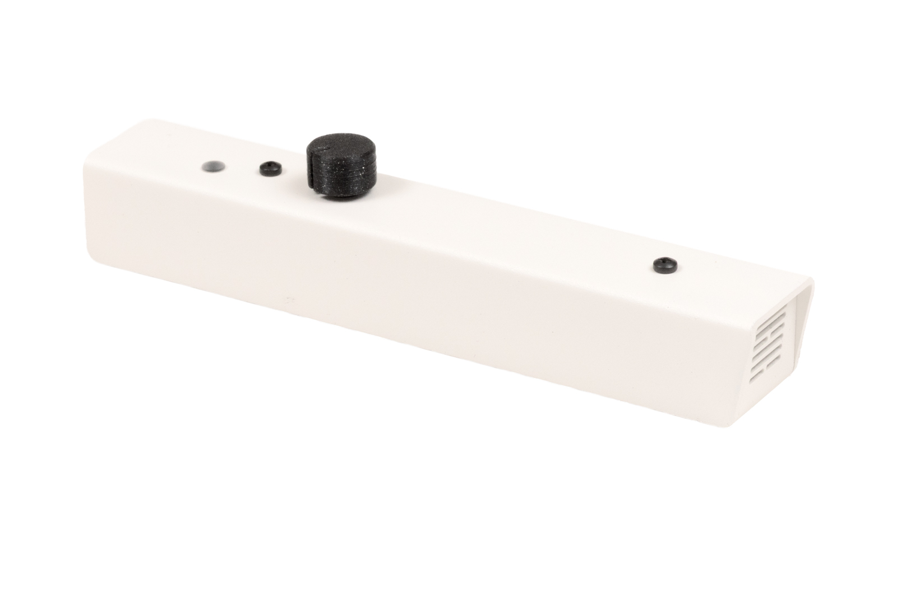
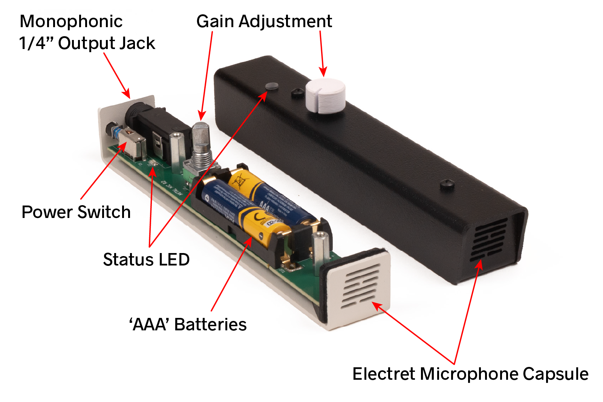

# Microphone 3 Manual

©2026 Critter & Guitari. All Rights Reserved.

Thank you for getting a **Critter & Guitari® Microphone 3** This is the place to begin your sound capturing journey.

> Warning: As with all microphones, this mic is may generate 'feedback' if pointed at an amplified speaker which is amplifying the output of the microphone. **Please take care to avoid feedback and thus protecting your hearing! Safety first!**

## Specifications

##### Components:

##### Ins & Outs:

* The `Electret Microphone Capsule` is a monophonic input. It transduces sound pressure waves from the air into an electric signal. It has an omnidirectional pickup pattern. The capsule cannot be seen directly - black felt covers the capsule. 
* The silver `Monophonic 1/4" Output Jack` jack can be found on the end opposite the microphone capsule. This jack has a TS (tip/sleeve) connection for an unbalanced signal.
* Two `'AAA' Batteries` provide power for the microphone. While installing batteries, please note the battery polarity markings embedded in the black plastic battery holder (not shown in the above photo). **Do not mix battery types: alkaline, rechargeable (e.g. NiMH), lithium, etc.**

##### Controls:

* `Power switch` The mic can be powered on by pushing the switch towards the felted mic capsule. It will 'click' into the on position. To turn the micrphone off, push the switch again and it will spring out.

* `Gain Adjustment` This potentiometer sets the gain for the signal generated by the mic capsule. Turning to the right amplifies the signal.   

* `Status LED` When power switch is turned on, the LED briefly flashes red. The LED remains off even though the microphone is operational. 

##### Hardware Connection

1. The bottom of the microphone has a built-in nut with standard 1/4"-20 threads.

## How to Use
1. The microphone is shipped with batteries installed. 
2. Connect a monophonic cable with a 1/4" plug to the microphone's 1/4" jack and to the subsequent device in your signal chain (mixer, recorder, pedals, etc.)
3. Turn the gain knob all the way to the left. Basic rule of thumb: start with the gain low and once powered on, increase gain until your sound is heard at an agreeable level. Going from a low-to-high signal will help prevent unexpected loud volume entering your ears. (Please see PDF link below!)
3. Use power switch to turn microphone ON. 
4. Ready to capture sound! 
4. If you need to connect microphone to a mic stand or similar device, turn microphone OFF and then attach it. 
4. Be sure to turn microphone OFF to save battery life! 

####Replacing Batteries
Steps to Replace the batteries:

1. Turn the microphone OFF.
1. Remove audio cable from the 1/4" output jack. 
1. Remove the microphone from any mic stand, etc. that it may be attached to.
1. Remove the knob. Grasp the knob firmly and pull straight up. 
1. Use the included phillips screwdriver ('+' shape) to unscrew the two black pan head screws from the top enclosure.
1. Separate the top enclosure from the bottom enclosure. (*There is NO need to unscrew the flat head screws found on the bottom of the microphone!*)
1. Remove old batteries. You may need a slotted (flathead) screwdriver ('-' shape) to help release the 'AAA' batteries from the battery holder. 
1. Insert new batteries. As mentioned elsewhere in this manual: 
	1. Do not mix battery types (alkaline, rechargeable, etc. 
	1. Be sure to match the polarity markings on the black plastic battery holder before inserting batteries.
1. Reconnect the top and bottom enclosures. 
1. Reinsert the pan head screws and tighten. The screws should be tight, but do not overtighten.
1. Check that batteries are working: while looking at the LED lens, turn power switch to the ON position. You should see a red flash on the lens if batteries are working. 
1. Once operation is confirmed, turn OFF and reattach the knob. The 'D'-shaped knob hole must align with the 'flat' of the potentiometer shaft.

## Warnings

Safety First!

1. This mic is may generate 'feedback' if pointed at an amplified speaker which is amplifying the output of the microphone. This can result in a louder-than-expected output from the speaker(s). Please take care to avoid feedback and thus protecting your hearing! (PDF from NIOSH: [Reducing the Risk of Hearing
Disorders among Musicians](https://www.cdc.gov/niosh/docs/wp-solutions/2015-184/pdfs/2015-184.pdf))

2. Battery Safety: 
	1. Follow battery replacement instructions listed above. 
	1. Do not mix battery types: alkaline, rechargeable (e.g. NiMH), lithium, etc.
	2. Do not install batteries with the polarity reversed. Please double check the polarity markings on the black plastic battery holder before inserting batteries. 

3. Do not operate the microphone with the top removed/circuitry exposed!
4. When using the microphone's built-in 1/4"-20 nut be sure the microphone is fully threaded onto the mic stand or whatever you may be connecting to. 