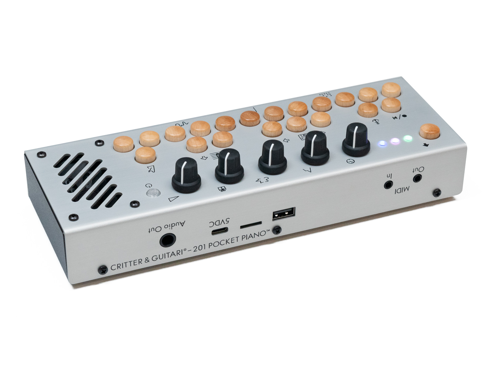
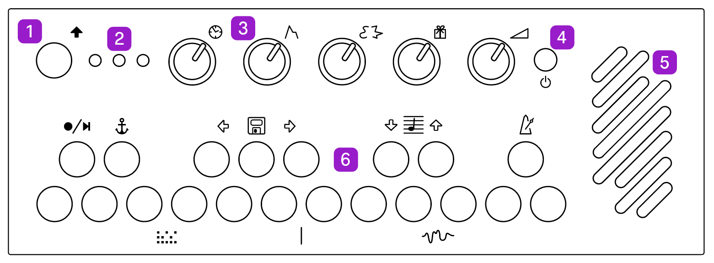
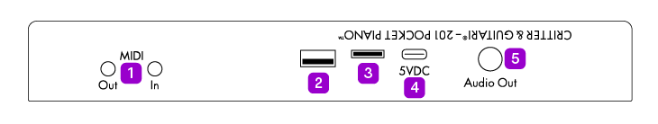
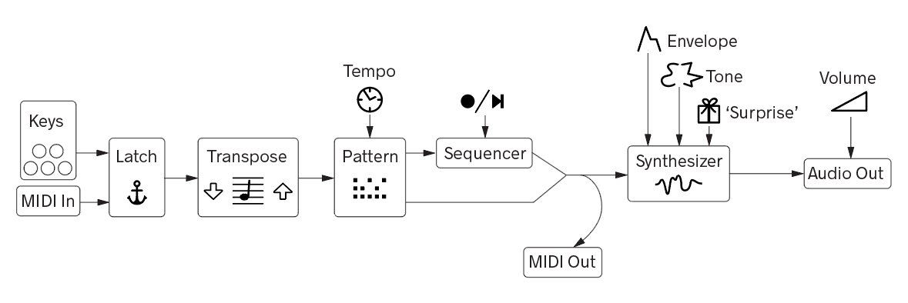
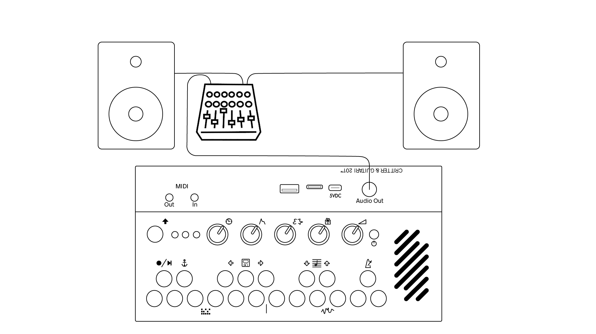
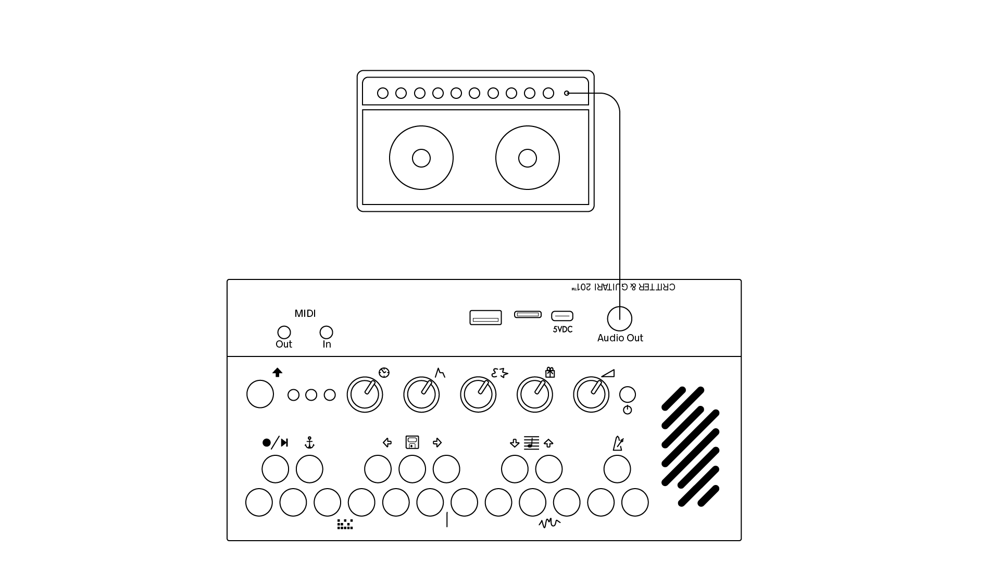
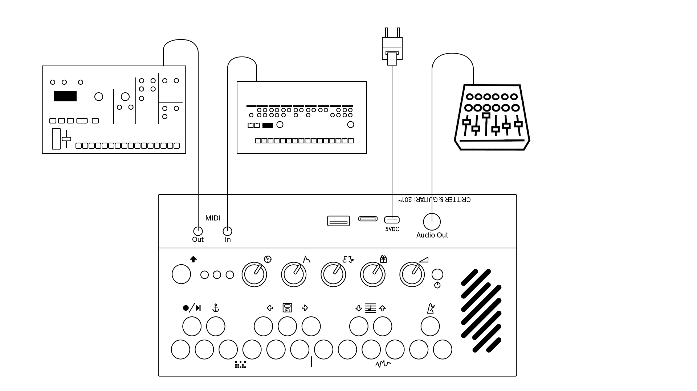
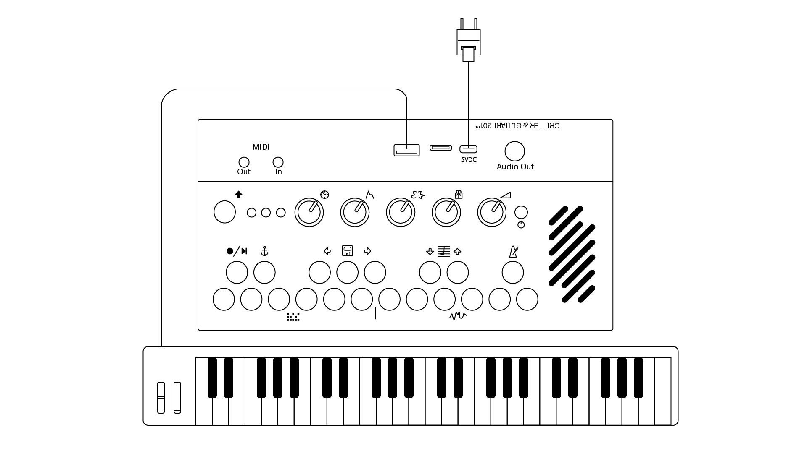
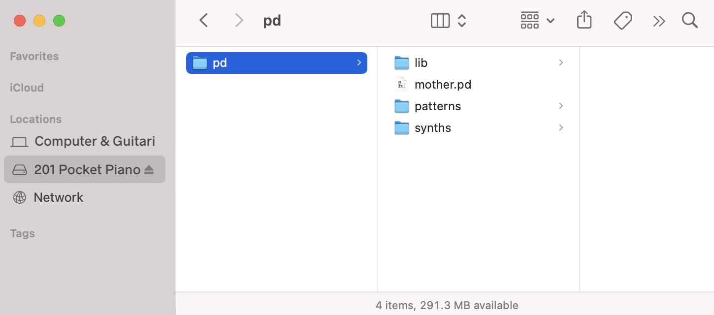
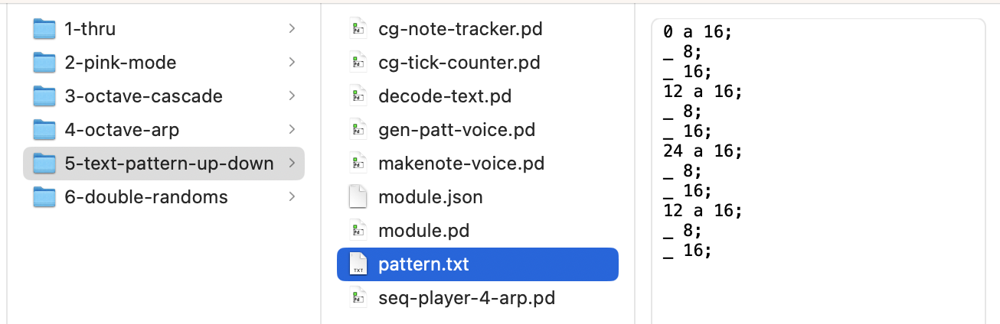

# Pocket Piano 201 User Manual  

©2023 Critter & Guitari. All Rights Reserved. 

## 1. Getting Started

Thank you for getting a **Pocket Piano 201**! This first chapter is meant to be a brief 'quick start' guide. Subsequent chapters offer more in-depth information. Congratulations - you are on your way to becoming an expert!

### Package Manifest

There are three items in the box you just opened:

- **Your 201**. Ready to go!
- **Power Adapter**. This power adapter has input prongs for US-style wall sockets, but it will work with input voltages from 100 to 240VAC at 50/60Hz. You may need an adapter for the shape of your wall socket. The output socket is USB-A. 
- **USB Cable**. Used to power the unit. It has plugs for USB-A and USB-C connections. This cable also connects your 201 to a computer to manage files. More on file management in Chapter 6.

### Warnings

1. Heed all warnings and cautions in this user guide and warranty. The warranty is found in Chapter 10.
2. Unit is not user serviceable. Contact manufacturer if damaged.

### Let there be sound!

Follow these steps to make your first sounds with your brand new 201 Pocket Piano:

1. Connect the USB-A plug of the `USB Cable` to the `Power Adapter`. Then connect the smaller, USB-C end of the cable to the 201's USB-C port on the rear panel. This port is found between the text 'POCKET' and '5VDC'. 
2. Press the Power button next to the speaker and wait for the three LED lights to cycle through the boot sequence.
3. Play the keyboard, making sure the Volume knob is turned up.

## 2. The Hardware Unit

### 2.1 Acquainting yourself with the box.

Let's take a minute to get to know the hardware. We will cover three sides of the 201: the top, the rear, and the bottom. 

#### Top Side

1. `Shift`**⇧** Use this key in combination with any key on the keyboard to perform its secondary function. These functions are depicted with images near each key. More on this in the *Shift Controls* section below.
2. `Status LEDs` There are three LEDs to communicate the status of the sequencer (left LED), and the selected Pattern (center LED) and Mode (right LED). 
3. `Knobs` Adjust the note-play settings and the sound in each mode.  
4. `Power` To turn on or off, press and hold until the Status LEDs change. If the 201 becomes unresponsive, press and hold the power button for 5 seconds to force shutdown.
5. `Speaker` Output sound. *Note: Speaker is disabled when a 1/4" cable is connected to Audio Out jack.*
6. `Keys` Play the keyboard! Make music!

#### Rear Panel  

 

1. `MIDI In/Out` Send and receive MIDI notes, MIDI clock, and MIDI CC data. These ports use the MIDI Manufacturers Association TRS 3.5mm Type A standard.
2. `USB` Connect an external USB MIDI device.
3. `Micro SD` A storage card that holds everything from presets to the 201's operating system.
4. `USB-C` This port is used for power and/or for data transfer. Use it to manage files used for audio generation.
5. `Audio Output Jack` Monophonic 1/4" output ready to send your audio signal. Inserting a cable into this jack will disconnect the speaker.

#### Bottom

1. `Label` Use this for quick reference for modes and connections.
2. `Battery Compartment` Use 3 AA batteries to power your 201. 

#### Using Batteries

To use your 201 portably, add three 'AA' batteries to the battery compartment. To access the battery compartment, flip 201 over and remove the screw holding the battery door in place. With the door off, insert batteries so that the negative end (-) of the batteries are connected to the springs; the positive end (+) of the batteries are connected to the flat tabs. Replace the door and screw when finished.

When the batteries are running low, the Power button will turn red. You may notice that the power button briefly flash red when a louder sound is played. This is normal and just means that the batteries are starting to get low. 

Warnings for battery use:  

- **Do not** mix battery types (such as NiMH & Alkaline).  
- **Do not** mix old & new batteries.  
- **Do not** mix used & fresh batteries.  

## 3. Operational Concepts

This chapter covers two topics paramount to utilizing the 201 to its fullest: **Shift Controls** and overall **signal flow**. 

The Shift Controls are the 201's method for turning the musical keyboard into controls for sequencing, chosing the synth engine, note behavior (arpeggio), etc. The signal flow is built into the operating system and therefore less 'top of mind.' However, you will be interacting with the signal flow with each knob turn and keypress so it is important to know what parameters have effects downstream.  

We'll start with the Shift Controls since you are probably wondering what the icons mean. 

### 3.1 Shift Controls

The keys play musical notes, but each key has its own secondary function when combined with the `Shift` key. Each icon represents a different function. These secondary functions control the sequencer, presets, transposition, metronome, play pattern, and synth mode. To engage any of these functions, press and hold `Shift`. While holding, press another key. Here's a list of all the functions:

| Icon | Name | Function | 
| :---: | --- | --- |
|  | Shift | Use this key in combination with other function keys.   |
| | Sequence Record/Play/Stop | Long Press and hold to arm sequence recording. Play notes to start recording. Press Shift again to stop recording and play the sequence.     |
| | Latch | When enabled, key presses will be sustained until the next key press. Latch will not sustain sounds with a pre-determined release such as drum sounds or a synthesized string pluck.   |
| | Preset | Store either a sequence or Pattern & Mode combination. Use the arrow keys on either side to go to the previous or next preset. |
| | Transpose | Shift the octave up or down (-2 octaves to +2 octaves).  |
| | Metronome | Monitor the internal clock. When recording a sequence, play along to the metronome! |
| | Pattern | These six patterns determine type of arpeggiation, note repeat, etc.  |
| | Mode | Select one of six synth engines or sampler players.   |

#### Status LED States

As you use `Shift` to change the state of the 201, the LEDs will become different colors to reflect the new state.   Using the sequencer and selecting Pattern and Mode will change the color of the LEDs. 

The Pattern (center) and Mode (right) LED colors are set to the following colors:

Here are the colors of the Sequencer (left) LED: 

| Left LED | Status |
| :---: | :---: | 
|  Off | Sequencer Stopped |
| Pink | Sequencer Record Enabled |
| Red | Recording Sequence |
| Green | Playing Sequence |
| Dim White | Latch Enabled |
| Bright White Flash | Quarter Note Indication. This flash occurs regardless of Sequencer in use or not.|

### 3.2 Signal Flow

It is important to understand where your sound begins and ends. This section explains the order of events from keys to speaker. 

> **NOTE**: At this point it is important to note that the 201 Pocket Piano has a default set of Patterns, Modes, samples, knob functions, etc... Every function of the 201 can be reprogrammed. The contents of this manual depict how your 201 will perform as a brand new instrument directly from the manufacturer. Please see Chapter 6 for more information about customization.

The following flow chart illustrates the steps a note takes on its way to becoming synthesized sound. A note can come from the keyboard or external MIDI device. 

Let's break this chart down:

1. **Keys & MIDI Note Input** - Everything starts with a note played on the built-in keyboard and/or from MIDI input. 
1. **Latch** - Automatically hold a note or notes. 
1. **Tranposition** - Shift notes up or down in octaves. Use low octaves for bass notes and higher octaves for lead melodies.
1. **Pattern** - Choose how notes from the keyboard and/or MIDI input are interpreted. See section 4.1 for more details on the different Patterns.
1. **Sequencer** - Capture notes and play them back.
1. **Synthesizer Mode** - Set the synth program, which determines the functions of Knob3 and Knob4. See section 4.1 for more details on the different Modes.
1. **Audio Output Volume** - Turn it up, turn it down! (Probably turn it up tho. Real talk.)

Key takeaways from this chart:

* 201 is unique because it has independent Patterns and Modes. Dial up a perfect synth voice and then explore different patterns and vice versa!
* A sequence can be recorded with one pattern. As the sequence is looping, change the pattern, and hear the new pattern overlayed on top of the pattern recorded in the sequence!
* A sequence can be recorded at one octave transpostion. As the sequence is looping, change the transpostion, and hear the new octave range mix with the sequenced note range! Use the octave transpose to set the range of the notes you want to record into the sequencer. Then change the octave to play in a different register on top of the sequence.

#### Potentiometers (AKA Knobs)
There are five potentiometers (pots) on the 201. Colloquially known as 'knobs' (probably because that's what we touch when turning the pot), they control parameters for the Pattern and Mode as well as Volume. They are an important part of the signal flow. Here are their functions:

|Knob| Icon | Name | Function | 
|:---:| :---: | --- | --- |
|1| | Clock | Set the tempo of the internal clock and patterns.  |
|2| | Envelope | Control the volume contour of your sound. You might not notice a change until the next note press.  |
|3| | Tone | Change the timbre of the Mode.  |
|4| | Surprise | A second tonal setting, also varies by Mode.    |
|5| | Volume | Set 201's output volume for the speaker or output jack.   |

## 4. Making Sounds / Having Fun

Now that we have covered the secondary keyboard controls and flow of the signal, let's get into making music!

The basics of the 201 are to use `Shift` to select the Pattern and Mode, and then use the knobs to adjust your sound. Once you have gotten familiar with the basics, try out sequencing, transposition, and presets!

### 4.1 Setting the Pattern  & Mode 

As we covered in section 3.1, the bottom row of keys (the 'white' keys) are used with the `Shift` button to select the Pattern and Mode. Enjoy exploring Pattern and Mode combinations to find the best for your sound! We hope you have many happy accidents along the way!

The **Patterns** set the note behavior and are:  

|Pattern|Name|Description|Keyboard Key| Center LED Color | |
|:---:|:---|:---|:---|:---:|:---|
|1|Thru|No Pattern (just key presses)|Low C|Purple |  |
|2|Pink Mode|Notes Repeat as 16th Notes  |Low D|Pink |  |
|3|Octave Cascade|Multi-Octave Arpeggiator |Low E|Blue | |
|4|Octave Arp |Two-Octave Arpeggiator |Low F|Green | |
|5|Up Down|Arpeggiates: Root, 1 Octave Above, 2 Octaves Above, 1 Octave Above, Root... |Low G|Orange | |
|6|Double Randoms|Random Notes|Low A|Red | |

The **Modes** are the synth voices or sample players and are:  

|Mode|Name|Description|Keyboard Key|Right LED Status| |
|:---:|---|---|---|---|:---|
|1|Red Mode |Simple Waveform with Vibrato  |Middle B|Purple |  |
|2|AddMono|Monophonic Additive Synth |High C|Pink |  |
|3|Synth Drums|Synthesized Drums  |High D|Blue | |
|4|String Synth|Physical-Modeling Plucked String Synth |High E|Green | |
|5|Vocal2|Duophonic Voice Synthesizer|High F|Orange | |
|6|Sample|Each key plays a different sample|High G|Red | |

These are the default configuration of the 201 Pocket Piano. The **Pattern** and **Mode** options can be customized when connected to a computer. See section 5 for more information. 

### 4.2 Understanding the Sequencer

201's sequencer can record and loop notes played on the keyboard. While the sequencer is playing, adjust knob settings, Play Pattern and Mode for evolving music-making. 

To record a sequence:  
1. `Shift` + . Long Press and hold to arm sequence recording. The status LED will turn purple. Now the sequencer is ready and waiting for you to play your first note.  
2. Play one or several notes into the sequencer. The status LED will turn red. (Red = Record)  
3. Tap `Shift` to finish recording and hear the sequence play. The status LED will turn green.  
4. Press `Shift` +  to stop your sequence.   
5. Press `Shift` +  again to hear the sequence again.

There is an internal clock that is always running. The Metronome will guide you as you record sequences. Use `Shift` + Metronome to turn on the metronome click. When you stop recording the length of the sequence will be quantized to the nearest quarter note.

Change the speed of a recorded sequence. Knob1 controls tempo. This will change the rate at which the sequence plays. This will also change arpeggiator speed. If 201 is sending MIDI clock to an external instrument, the speed change will be reflected on the 'downstream' device.

**Tip**: Use the Metronome to set a slow steady tempo to record your sequences.  When you finish recording, turn the Tempo up to your desired speed. 

### 4.3 Tranposition

Despite the keyboard being limited to 20 notes, many more are available. Use `Shift` + Octave Transpose to shift up or down 2 octaves. There are five octaves of playable notes. 

By default, the transpose setting comes before the sequencer. Set the octave, record a sequence, then change octaves to play notes in a different range.

In the Sampler Mode, each note plays a different sample. Changing the octave will give you access to more samples.

### 4.4 Presets

If you make a sound or sequence that you like, you can save it as a preset! Presets store the Pattern, Mode, knob settings, and sequence. 

To save a preset, press `Shift` +  .  
To navigate to a different preset, press `Shift` + or . If a preset was saved with a sequence, it will begin playing as soon as the preset was selected. 

You can have as many presets as the available storage on the SD card will allow. You cannot record over an existing preset. You can use Disk Mode to manage and back up presets.

**Note**: If you want to save a Preset without a sequence, just record enable a sequence and then cancel it by pressing Shift. This will delete the currently-loaded sequence. Then save the preset.

## 5. MIDI Connectivity

Want to use your 201 to play another instrument? Or, do you want to play your 201 with another instrument? Use the TRS MIDI In and Out jacks on the back of the 201! Want to use a USB MIDI controller to play the 201? That's also possible! 

### 5.1 Hardware Connections

The MIDI Out and In ports are stereo 1/8" jacks. The Out port sends MIDI information to other instruments and the In port receives MIDI information from other instruments. These ports meet the MIDI Manufacturers Association Specification for TRS MIDI Type A connectors. An adapter may be used to convert the 1/8" MIDI jack to standard 5-pin MIDI.

The USB-A port can be used to send and receive MIDI as well. A connected device must be 'class compliant' and not require any drivers to be installed on the 201. The 201 functions as a USB 'Host' and can therefore only connect to a 'Device'. You will not be able to connect the USB-A port to your computer or similar device because your computer functions as USB Host too. Two Hosts cannot be connected together. 

It is recommended that a USB MIDI device is connected *after* powering up the 201. Then relaunch the main patch by pressing and holding the high E, F, and G keys and then press Shift. 

### 5.2 Setting MIDI Configuration

All of the MIDI configuration is set with a file called 'midi.txt' in the 'pd' folder. You will need to enter 'Disk Mode' to access and modify this file (See Chapter 6). The defaults are as follows:

input-channel 1;  
output-channel 1;  
cc-knob1 21;  
cc-knob2 22;  
cc-knob3 23;  
clock-in-enable 1;  
clock-out-enable 1;  
transport-in-enable 1;  
transport-out-enable 1;  
note-in-enable 1;  
note-out-enable 1;  
cc-in-enable 1;  
cc-out-enable 1;  
pc-in-enable 1;  
pc-out-enable 1;  

Setting input-channel to '0' in the config file is omni.
cc-knob1 is envelope knob. cc-knob2 is tone knob. cc-knob3 is surprise knob.
For the items that end in 'enable': a '1' means enable and a '0' is disable. 

## 6. A Few Configuration Ideas

### 6.1 
**Minimal Performance Setup**

Connect your 201's audio output to monitors, a PA system, or an amplifier. Use batteries to reduce cable build up.

**MIDI Input, MIDI Output, USB MIDI Controller**

Want to use your 201 to play another instrument? Or, do you want to play your 201 with another instrument? Use the TRS MIDI In and Out jacks on the back of the 201! 

A USB MIDI controller can be connected to the USB jack. 

## 7. Understanding USB Conections and the role of the microSD card

### 7.1 USB-C Disk Mode

Disk Mode is a way for you to modify the contents of the microSD card's storage partition. To enter Disk Mode: 

1. Connect a USB cable to the 201's USB-C port to your computer's USB-A port. *Please note*: The 201's USB-A port **will not** allow access to Disk Mode!
1. Allow the 201 to boot up. 
1. Press and hold the high C#, D#, and F## keys and then press Shift.
1. The 201 will soon appear as a hard drive on your computer. See screen shot below.
1. You can now perform file management such as rearranging modes or patterns, adding new modes or patterns, changing MIDI settings, etc. 
1. To hear changes to Patterns and Modes or their samples/supporting files/etc. you need to relaunch. To relaunch: press and hold the 201's high E, F, and G keys and then press Shift. The relaunch process will reset the Pattern and Mode LEDs back to purple. This might take a several seconds.
1. **NOTE**: while in Disk Mode, do *not* attempt to save a preset or record a sequence!

To exit Disk Mode:

1. Eject the *201PP* drive from your computer's Finder/File Explorer/Device Manager. *Please note*: It is imperative to eject the 201's drive from your computer first, and give your computer time to complete this software operation before proceeding to the next step. If not, the 201's drive may become corrupted.
1. Press and hold the high C#, D#, and F## keys and then press Shift. This will put the 201 back in its regular mode. 

This video demonstrates entering, leaving, and using Disk Mode for file management: [https://youtu.be/G4tocCKlst4](https://youtu.be/G4tocCKlst4)

### 7.2 Adding Your Own Samples  

The Sampler mode is the best place to start when adding your own samples. When viewing 201 on your computer, follow the file path to the sampler mode. Duplicate the folder to make changes and preserve the original version of the mode. Find the sample folder and change out the sounds with your own WAV files. Please note that the 201 is expecting samples to be recorded at 48KHz / 16-bit. 

### 7.3 Changing Patterns and Modes

The Patterns and Modes available correspond to the folders in 201's microSD card. The folders need to have numbers 1-6 followed by a hyphen for the 201 to find them. Aside from the number- convention, the folders can be named whatever you would like. 

### 7.4 Program in Pure Data 

Not only can you swap out Patterns and Modes, you can write your own! If you have any experience with Pure Data and Faust you can have a lot of fun re-writing the functions of 201. If not, you can learn bit by bit and master the environment.

### 7.5 Program Your Own 'Text Patterns'

Some patterns use a simple text file (.txt) to set the pattern. These patterns are great because you can program a pattern without needing to know any Pure Data. Here's an example of a text pattern - the right column shows the pattern:

Let's break down what's in *pattern.txt*. Notes and Rests are possible. 

##### Note 

The first line contains three elements:
> 0 a 16;

The first element, `0`, tells the 201 to play the root note (the note you are physically playing or sending via MIDI). The second element, `a`, specifies the volume (velocity) of the note. The third element, `16`, specifies the note duration. 

A text pattern's note element can be the root note `0`, or any note above or below the root. A positive number specifies a note above root. For example, a `12` will play a note an octave above root. A negative number will play below root - so a `-12` will play a note an octave below the root. 

The volume (velocity) is always indicated by letters `a` through `j`. `a` is the loudest setting and `j` is the quietest. 

The note duration is a number that is ultimately relative to the 201's tempo setting. A `1` is the longest duration and will play a whole note at the tempo setting. A `2` will play a half note. In the example above, the `16` specifies a sixteenth note. This parameter is flexible - you can put 'any' number here, even one with a decimal such as `8.02`. You can even specify less regular note durations like `9` or `51`. A `;` is needed at the end of every line.

##### Rest 

The second line in the example above is: 
> _ 8;

The `_` specifies a rest. The number after the underscore specifies rest duration. In this example, the rest is one eighth note long. Like a note, this duration is relative to the 201's tempo setting. The specifications of the duration of a rest are identical to the specifications of a note duration listed above. A `;` is needed at the end of every line.

##### File Settings
A text pattern file must be named `pattern.txt`.

Please make sure your pattern.txt file is in 'plain text' format (rather than 'rich' text). 

In theory, a text pattern can have as many notes and rests as you'd like. The real constraint is the file size (in bytes) with regards to the available space on the 201's storage disk. 

##### Demo Video
This video demonstrates the creation of text pattern: [https://youtu.be/JQ9sZipSpkM](https://youtu.be/JQ9sZipSpkM)

## 8. FAQ / Troubleshooting

**Q: Can I use headphones with my 201?**

A: The 1/4" output jack is monophonic.  

**Q: Can I use any USB cable with my 201?**

A: It depends on how you want to use the 201 and what type of cable you have. 

The cable that is provided with your 201 is capable of carrying power and data, so you can use it with the external power adapter or with your computer for 'Disk Mode' (mode/pattern management, etc.). 

Some cables only carry power. These cables would be fine to use with the power adapter, but obviously they will not work to carry the necessary data for Disk Mode. 

## 9. Appendix

### 9.1 Burning SD Card Disk Image

In addition to storing samples, Play Patterns, and Modes, the micro SD card also stores 201's operating system.

Burning a new disk image on the micro SD card will reset your 201 to the factory state. This is useful to update to the latest 201 OS, or to fix a problem with the micro SD card.

This will completely wipe the micro SD card clean, so make sure to backup anything on it that you need. 

Follow these steps to burn a new SD card:

1. Download the current OS release: 201-PocketPiano-v1.1. Requires 8GB or larger microSD card: https://cgdiskimages.nyc3.digitaloceanspaces.com/201-PocketPiano-v1.1.img.zip

1. Download the flasher program to your computer: https://www.balena.io/etcher/
1. Power down 201 (if on).
1. Locate the thin slit in the rear of the enclosure (between the USB port and the USB-C Port.)
1. Use a pin or paperclip to press in on the black SD card to eject it and it will spring out gently.
1. Insert microSD into your computer (you may need an adapter or card reader)
1. Use the Etcher program to burn the OS file on to the SD Card. When Etcher is finished your computer may display a message similar to 'This disk is not readable.' This message is normal and you may click 'Eject' to proceed.
1. Remove the microSD card from your computer and reinsert it in 201. Make sure that the SD card is going into the socket on the circuit board, as it is easy to drop it into the device. If you can wiggle it a lot, it probably is not in socket. Use the same pin/paperclip to press it in until you hear/feel a 'click.'
1. Restart 201 by pressing Power.

### 9.2 Software 

The software for the 201, inlcluding the Pd patches, is located here: https://github.com/critterandguitari/201-PocketPiano

## 10. Warranty

Limited One (1) Year Warranty 

Critter & Guitari Inc. (“C&G”) warrants to the original consumer purchaser ("you") that C&G products ("Products") will be free from defects in material and workmanship for one (1) year from the date of purchase.  The start of the warranty period is the documented date of your purchase of the Product.  The warranty herein is made to and for the benefit of the original consumer purchaser of the Product and is non-transferable. 

**Warranty Coverage**  
In the unlikely event you discover a defect in material or workmanship during the warranty period, and C&G agrees that the defect exists, C&G will, at its option, repair or replace the Product at no charge to you, provided it is returned during the warranty period, with transportation and insurance charges prepaid, to the facility designated by C&G.  The Product must be properly packaged, with the RMA (Return Merchandise Authorization) clearly displayed on the outside of the packaging, to obtain warranty service. 

The warranty covers defects that C&G determines are no fault of the user. This warranty does not cover normal wear and tear. This warranty will be void under the following circumstances:  

• if all WARNINGS are not heeded;  
• if instrument enclosure is opened;    
• if the incorrect power supply is used and/or if improper battery or battery configuration is used (see Warning #2);  
• if damaged by user (i.e., it has been dropped, or had something dropped on to it, exposed to moisture or spills, lightning strikes, acts of god or gods, or other physical abuse)  .   

**WARNINGS:**  
1.  Read and keep these instructions.  
2.  If built-in battery power is an option: Use correct battery size. Do not mix ‘new’ and ‘old’ batteries. Do not use damaged or worn batteries. Do not mix battery types (alkaline, rechargeable, etc.).
3.  To reduce the risk of fire and/or electric shock:  
	• Keep Products dry and away from sources of moisture (sinks, humidifiers, rain, snow, spills, drinks, etc.).  
	• Unplug Products during electrical storms.  
	• Remove from power source when not in use.  
4.  Do not operate Products near heat sources (radiators, stoves or other device that produces heat) to reduce the risk of damage to
user, Products & surroundings.  
5.  No user serviceable parts contained inside Products. Refer all servicing to C&G.  

This warranty does not cover any of the following conditions:  
• Abuse, unreasonable use, mistreatment, or neglect.  
• Unusual physical or electrical stress or power fluctuations.  
• Damage caused by the equipment or system with which the Product is used.  
• Damage caused by hardware and/or software modification or repair not made or authorized by C&G.  
• Products that are determined to be stolen.  

Moreover, the warranty applies only to the Products that can be identified by the original, unaltered C&G trademark, trade name or logo 
axed to them. C&G does not warrant any product that is not manufactured by, for, or with permission from C&G.  
The warranty period on replacement Products is the remainder of the warranty on the original Product or 30 days, whichever is longer.  
If C&G elects to repair a Product, C&G owns all parts removed from the repaired Product.  

C&G uses new and reconditioned parts made by various manufacturers in conjunction with warranty repairs and replacement Products.   
Repair parts or replacement Products may, at C&G option, include an equal or better model or features.  

Returning your product to C&G:  
If you believe your instrument is defective, please contact C&G to receive an RMA number before sending it in. Please contact us through 
our website: critterandguitari.com/contact.  Once C&G determines that a repair is required, C&G will issue an RMA number.   
A copy of the receipt or a bill of sale bearing the appropriate name and location and the C&G model number of the Product for which the defect 
has been reported may be required as a proof of purchase for warranty service. 

The Product must be carefully packed for shipment to our factory.  Damage occurring due to improper shipment will void the warranty.

TO THE EXTENT PERMITTED BY LAW, THIS WARRANTY AND THE REMEDIES SET FORTH HEREIN ARE EXCLUSIVE, NON-TRANSFERABLE AND IN LIEU OF ALL OTHERS, WHETHER ORAL OR WRITTEN, EXPRESSED OR IMPLIED. C&G SPECIFICALLY DISCLAIMS ANY AND ALL IMPLIED WARRANTIES AS TO THE PRODUCTS OR ANY OTHER MATTER WHATSOEVER.  IN PARTICULAR, BUT WITHOUT LIMITATION, C&G SPECIFICALLY DISCLAIMS ANY AND ALL IMPLIED WARRANTIES OR CONDITIONS OF SATISFACTORY QUALITY, MERCHANTABILITY, FITNESS FOR A PARTICULAR PURPOSE AND NON-INFRINGEMENT OF THIRD PARTY RIGHTS OR ANY OTHER WARRANTY ARISING 
FROM A COURSE OF DEALING OR USAGE OF TRADE.  IF WE CANNOT LAWFULLY DISCLAIM STATUTORY OR IMPLIED WARRANTIES, THEN TO THE EXTENT PERMITTED BY LAW, ALL SUCH WARRANTIES SHALL BE LIMITED IN DURATION TO THE DURATION OF THIS EXPRESS 
LIMITED WARRANTY AND TO REPAIR OR REPLACEMENT SERVICE. 

C&G IS NOT RESPONSIBLE FOR SPECIAL, INCIDENTAL, INDIRECT OR CONSEQUENTIAL DAMAGES HOWEVER CAUSED AND WHETHER OR NOT C&G WAS ADVISED OF THE POSSIBILITY OF SUCH DAMAGES, INCLUDING BUT NOT LIMITED TO, LOSS OF DATA OR PROGRAMS, LOST PROFITS, DOWNTIME, GOODWILL, DAMAGE OR REPLACEMENT OF EQUIPMENT AND PROPERTY, AND ANY COSTS OF RECOVERING.

No C&G distributor, reseller, dealer, agent or employee is authorized to make any modification, extension or addition to this warranty.

This Statement of Limited Warranty shall be exclusively interpreted in accordance with the English language with the meaning of its terms. Should a translation of this Limited Warranty deviate from the English language version, only the English language version shall apply and be binding.

---

CRITTER & GUITARI     

©2023. Critter & Guitari, Inc. All Rights Reserved.
