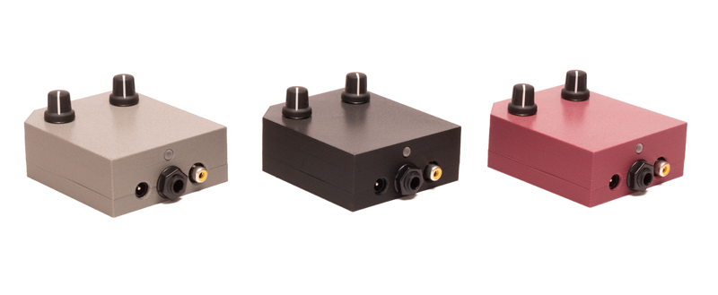

# Video Scopes User Manual  

©2022 Critter & Guitari. All Rights Reserved. 

# 1. Getting Started

Thank you for getting a `Video Scope`, `Rhythm Scope`, and/or `Black & White Video Scope`! This manual is a great starting point– you are on your way to becoming an expert. No matter what Video Scope you have, this is the manual for you.

## Package Manifest

There are two items in the box you just opened:

- **Your Scope**. Ready to go!
- **A Power Adapter**. This power adapter has prongs for US-style wall sockets, but it will work with input voltages from 100 to 240VAC at 50/60Hz. You may need an adapter for the shape of your wall socket.

## Warnings

1. Heed all warnings and cautions in this user guide and [warranty](https://www.critterandguitari.com/warranty).
2. Unit is not user serviceable. Contact manufacturer if damaged.
3. *These devices may generate imagery which can trigger photosensitive seizures. Immediately stop use and consult a doctor if you experience any form of discomfort, disorientation, or adverse physical reaction.*

## Let there be visuals!

Follow these steps to make your sound visual as quickly as possible.

1. Connect your Scope's `Composite Video Output` port (yellow RCA port) to a powered-up monitor, projector (beamer), video mixer, video capture device or other display.
2. Connect a 1/4” mono audio cable to the `Audio In` port. 
3. Connect the power adapter to a power outlet, and then connect its plug to the `9VDC` power port. 
4.  To transmute audio to video, send audio from the device connected to the connect a 1/4" audio cable to the `Audio In` port. Change visuals with the `Mode Selector` knob. If you need to adjust the amplitude of the signal, you can increase volume on your sound source and/or you can adjust gain with the `Gain` knob. 
5.  When you have had enough fun for now, disconnect the power cord from the video scope. 

# 2. General Operation

## 2.1 Hardware

As you are aware, there are 3 types of Video Scope: The original Video Scope, the Rhythm Scope, and the Black & White Video Scope. Their visuals are different, but from a hardware and user-control perspective, they are identical. They all have the following:

1. `Power Jack`  This port is expecting the following: 9VDC, minimum 300mA, 2.1mm barrel connector with center-positive polarity. 
2. `Audio Input Jack` Monophonic 1/4" input ready to receive your audio signal.
3. `Composite Video Output Jack` This port sends out an NTSC-formatted composite video signal.
4. `Status LED` Shines red when power is connected. 
5. `Label` located on the bottom. Use this for quick reference for modes and connections.
5. `Mode Select Knob` Cycles through modes and, if applicable, sets the Random mode select beat counter or timer.
6. `Audio Input Gain Control Knob` This adjusts the gain for the incoming audio. This is useful way to get the level 'just right.' It is also helpful to make sure that your incoming audio sets the 'trigger' in certain modes running on the `Black & White Video Scope` and all of the modes running on the `Rhythm Scope`. This knob scales the incoming audio level before it is processed by the video scope for use in the current visual mode. The purpose of this knob is to adjust the strength of the audio signal and scale it into an appropriate range for visualization.

The appropriate setting for the Gain Control knob will depend on the type of signal you are connecting and the mode you are using. For example:

-   Are you connecting a guitar or microphone directly to EYESY’s `Audio In` port? Then you will probably need a higher gain setting for this relatively weak signal.
-   Are you connecting a powered instrument (such as a synthesizer) output, or even the full band’s output from a mixer? Then the *Audio Input Gain* setting can probably be a bit lower.
-   Are you doing something we can’t imagine? Good job! Adjust the gain setting until you find an appropriate setting.

## 2.2 Explanation of Specific Scopes 

### Video Scope 

The Video Scope directly visualizes the incoming audio signal. This takes the form of a classic “oscilloscope” signal representation or a modified version of it. Either way, an animation is continuously updated with the received audio.

The `Mode Knob` is divided into four sections, one per mode. As you sweep the knob within a mode's section, you will be changing a given mode's parameters. For example, if you selected *Trapezoid* mode, and moved the knob within the *Trapezoid* mode's section, the *Width* of the trapezoid will grow or shrink according to the direction of travel. Here are the modes and their parameters (shown turning knob from maximum left position to maximum right position).  

Mode | Parameter
:--- | ---
**Basic Line** | *Color* 
**Color Shifter** | *Speed*
**Trapezoid** | *Width*
**Random** | *Rate*

### Rhythm Scope 

The Rhythm Scope visualizes the incoming audio signal, but it doesn’t draw continually as an oscilloscope mode would. Instead, if the audio input’s volume crosses a certain threshold (for example, imagine a snare drum hit), it will trigger a new visual. These thresholds are known as `triggers`.

There are a total of 15 unique modes. A Random mode will cycle through the other modes at a user-determined, 'trigger-based' interval. It can take as few as 1 and as many as 16 `triggers` before the Random mode will choose a new mode to display. To set the interval, turn the `Mode` knob to your desired interval and leave knob there for more than one second. Then, immediately turn the `Mode` knob to maximum right postion to enter Random mode!

Here are the modes and their parameters (Shown turning knob from maximum left position (at top of table) to maximum right position (at bottom of the table)).

Mode | Number of Triggers before Random setting choosing a new mode:   
:--- | ---
**Strobe** | *16 triggers* 
**Two-Tone**  | *15 triggers* 
**Brackets** | *14 triggers* 
**Square Slopes**  | *13 triggers* 
**Continuous**  | *12 triggers* 
**Thick Neon**  | *11 triggers* 
**Containers** | *10 triggers* 
**Blinds**  | *9 triggers* 
**Timer** | *8 triggers* 
**Timer 2** | *7 triggers* 
**Thin Neon**  | *6 triggers*
**Solitary**  | *5 triggers* 
**Bits**  | *4 triggers*
**Printer** | *3 triggers*
**Puzzle** | *2 triggers*
**Glyphs** | *1 triggers*
**Random** | n/a

### Black & White Video Scope

The Black & Video Scope has both trigger and scope modes. There are 15 unique modes. A Random mode will cycle through the other modes at a user-determined, 'time-based' interval. The interval range is between 30 seconds at its longest and one video frame at its shortest before the Random mode will choose a new mode to display. To set the interval, turn the `Mode` knob to your desired interval and leave knob there for more than one second. Then, immediately turn the `Mode` knob to maximum right postion to enter Random mode!

Mode | Time Before Random Setting Picks a New Mode
:--- | ---
**Strobe** | *30 seconds*
**Timer** | *20 seconds*
**Timer Two** | *15 seconds*
**Blinds** | *10 seconds*
**Brackets** | *8 seconds*
**Bits** | *5 seconds*
**Squares** | *4 seconds*
**Birds** | *3 seconds*
**Plaid** | *2 seconds*
**Paper** | *1 second*
**Many Lines** | *0.5 second*
**Wide Lines** | *0.25 second*
**Alternator** | *0.13 seconds (8 frames)*
**Zooming** | *0.07	seconds (4 frames)*
**10 Wide** | *0.03 seconds (2 frames)*
**1 Wide** | *0.02 second (1 frame)*
**Random** | n/a

# 3. FAQ / Troubleshooting
**Do the Video Scope / Rhythm Scope / B&W Video Scope work with European televisions or projectors?**

A: Our video scopes only generate a NTSC-formatted signal. However, most newer TVs and projectors can auto-detect and sync to NTSC or PAL signals. So you may not need a NTSC/PAL converter. Please check the input specifications of the display device. 

**Will a Video Scope / Rhythm Scope / B&W Video Scope work with a television or projector that only has an HDMI input?**
You will need a composite-to-HDMI converter between your video synth and the display unit.

**My Video Scope (or Rhythm Scope) is showing up in black & white (no color). What gives?**
Some projectors have  "3-D" setting that needs to be turned off. 

**What is the best way to connect my Video Scope / Rhythm Scope / B&W Video Scope to my audio setup?**

One way to connect an instrument to the video synthesizer is to first connect it to a mixer and then run the signals you wanted separately to the video scope. This allows for maximum level control across all devices. Here's a diagram:

Depending on your amp's set up you could also try connecting your instrument to your amp first and then running a line from the amp's aux-out jack (effects, headphones, etc.) to a Video Scope.

**My Scope won't turn on when I try to power it with a different power supply. It is broken, right?**

If you are uncertain whether a power supply will work with your scope, do *not* plug it in to find out. First, please double check the power supply's specifications. An external power supply must have the following output specifications: 9VDC, a minimum of 300mA (0.3Amperes) and a 2.1mm barrel connector with center-positive polarity. The center-positive polarity diagram looks like this:

Many guitar pedals use power supplies that are very similar to these specifications. However, they often have a tip with center-negative polarity. These will not work unless you get a reverse-polarity adapter for it. One-Spot, Boss and Roland supplies are typically center-negative.

You may use a power supply that outputs more than 300mA, but not less. Only 9VDC should be provided to the instrument. Voltages above or below 9VDC will cause damage to the instrument.

