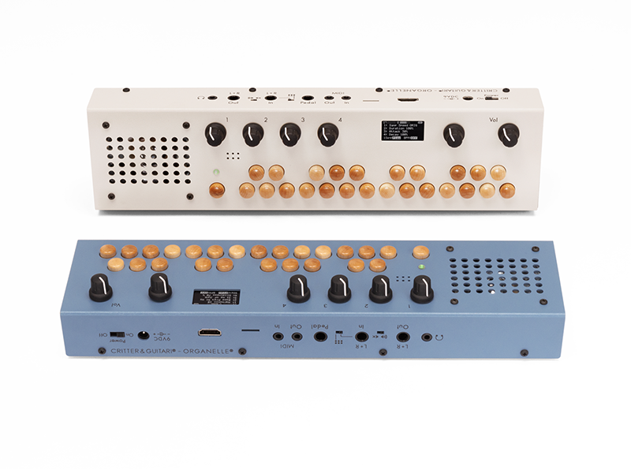
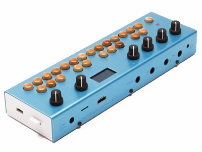
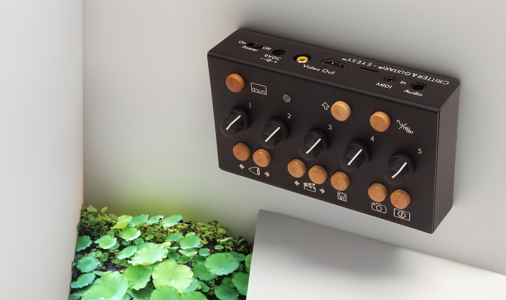
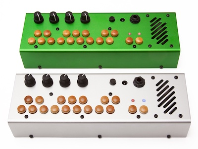
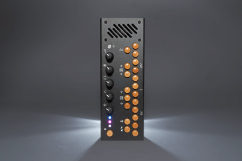
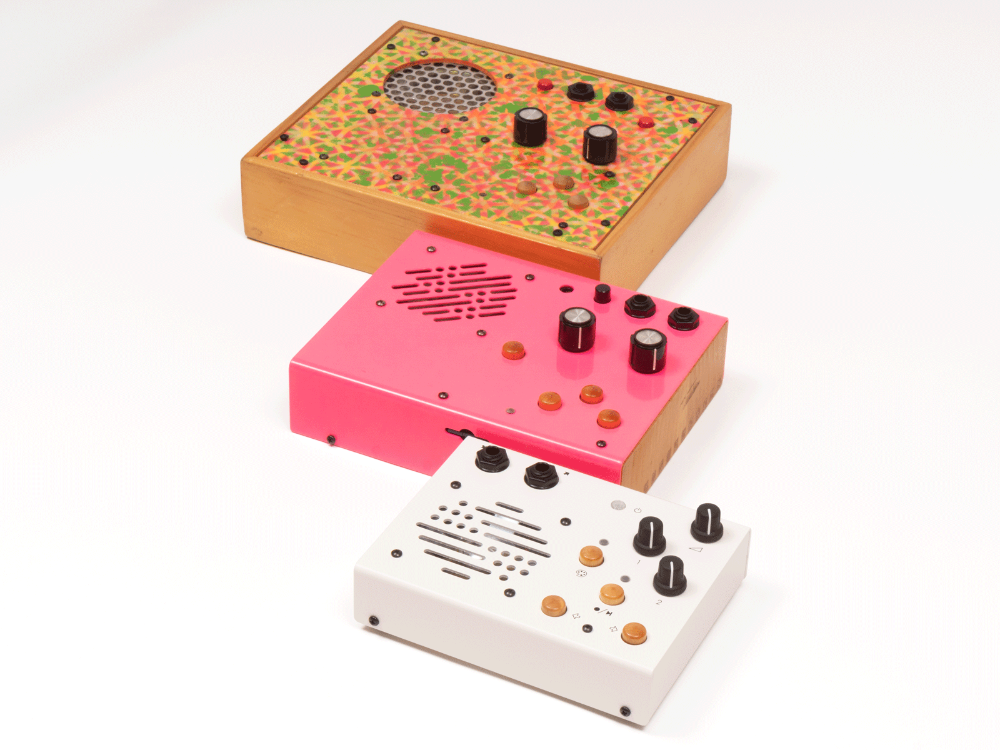
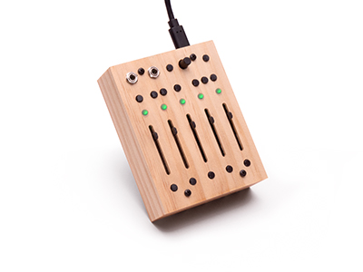
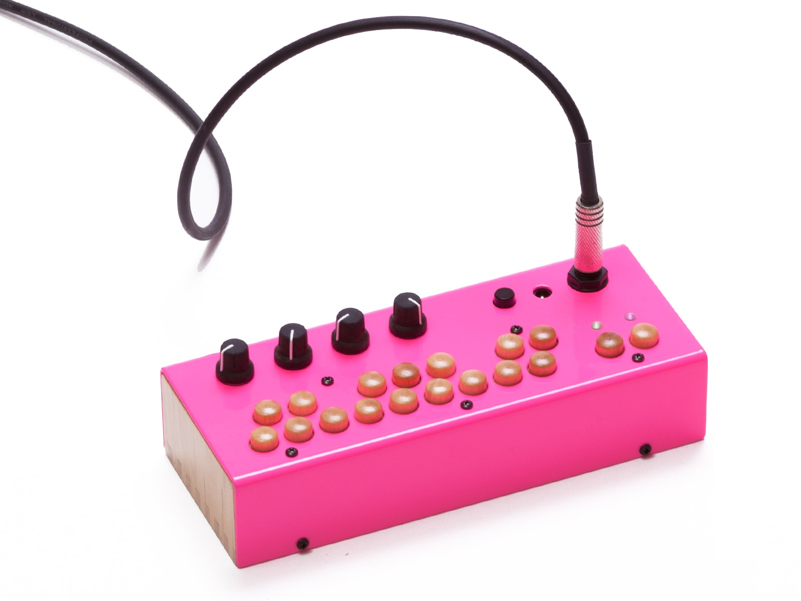
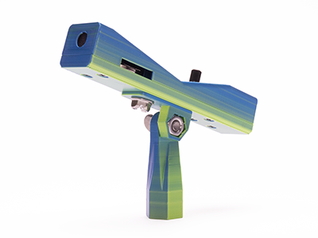
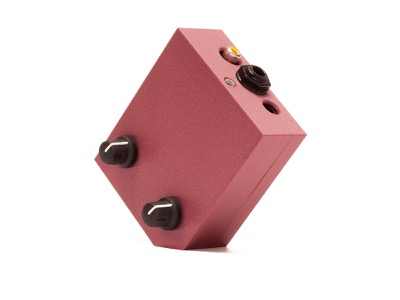

Welcome to the Critter & Guitari Information Center. Select an instrument below, or use the menu on the left, to view resources.

  <a class="cg-card" href="Organelle/og_sms2/">
    
    Organelle M / S / S2
  </a>

  <a class="cg-card" href="Organelle/og1/">
    
    Organelle 1
  </a>

  <a class="cg-card" href="EYESY/ey_os_3/">
    
    EYESY
  </a>

  <a class="cg-card" href="Other%20Instruments/pp_midi/">
    
    Pocket Piano MIDI
  </a>

  <a class="cg-card" href="Other%20Instruments/pp201/">
    
    Pocket Piano 201
  </a>

  <a class="cg-card" href="Other%20Instruments/kloop/">
    
    Kaleidoloop
  </a>

  <a class="cg-card" href="Other%20Instruments/5moons/">
    
    5 Moons
  </a>

  <a class="cg-card" href="Other%20Instruments/bolsa_bass/">
    
    Bolsa Bass
  </a>

  <a class="cg-card" href="Other%20Instruments/microphone_manual/">
    
    Microphone
  </a>

  <a class="cg-card" href="Other%20Instruments/video_scopes/">
    
    Video Scopes
  </a>

